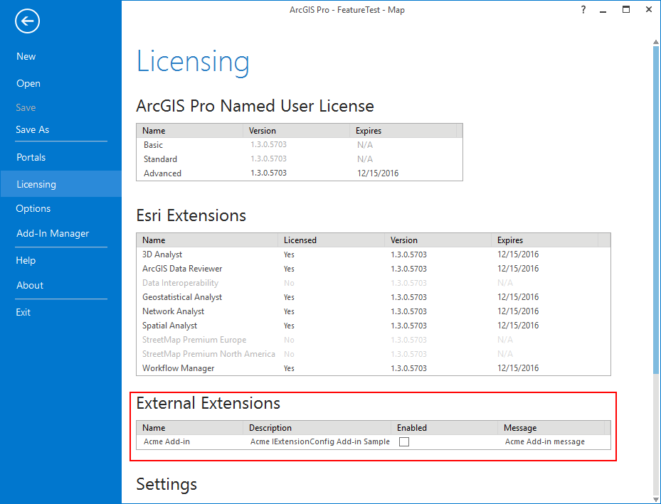
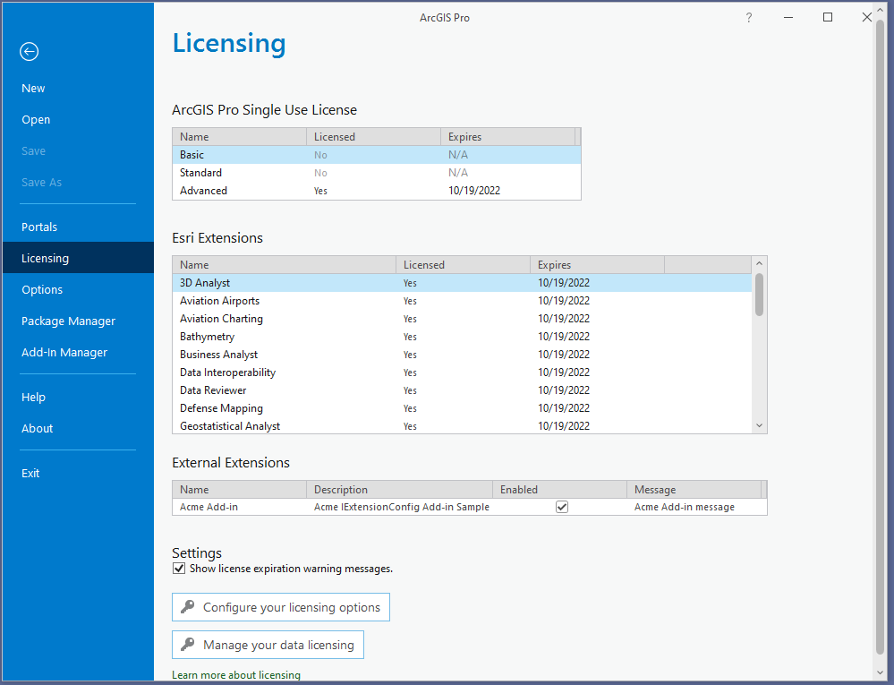

## Licensing

<!-- TODO: Write a brief abstract explaining this sample -->
Show how to make a "Configurable Extension" that can be added to the Pro Backstage Licensing Tab  
  


<a href="http://pro.arcgis.com/en/pro-app/sdk/" target="_blank">View it live</a>

<!-- TODO: Fill this section below with metadata about this sample-->
```
Language:              C#
Subject:               Framework
Contributor:           ArcGIS Pro SDK Team <arcgisprosdk@esri.com>
Organization:          Esri, http://www.esri.com
Date:                  4/20/2017
ArcGIS Pro:            2.0
Visual Studio:         2015, 2017
.NET Target Framework: 4.6.1
```

## Resources

* [API Reference online](http://pro.arcgis.com/en/pro-app/sdk/api-reference)
* <a href="http://pro.arcgis.com/en/pro-app/sdk/" target="_blank">ArcGIS Pro SDK for .NET (pro.arcgis.com)</a>
* [arcgis-pro-sdk-community-samples](http://github.com/Esri/arcgis-pro-sdk-community-samples)
* [ArcGISPro Registry Keys](http://github.com/Esri/arcgis-pro-sdk/wiki/ArcGIS-Pro-Registry-Keys)
* [FAQ](http://github.com/Esri/arcgis-pro-sdk/wiki/FAQ)
* [ArcGIS Pro SDK icons](https://github.com/Esri/arcgis-pro-sdk/releases/tag/1.4.0.7198)
* [ProConcepts: ArcGIS Pro Add in Samples](https://github.com/Esri/arcgis-pro-sdk-community-samples/wiki/ProConcepts-ArcGIS-Pro-Add-in-Samples)


### Samples Data

* Sample data for ArcGIS Pro SDK Community Samples can be downloaded from the [repo releases](https://github.com/Esri/arcgis-pro-sdk-community-samples/releases) page.  

## How to use the sample
<!-- TODO: Explain how this sample can be used. To use images in this section, create the image file in your sample project's screenshots folder. Use relative url to link to this image using this syntax:  -->
At 10.x, add-ins implemented the IExtensionConfig interface to create a "configurable extension".  
A configurable extension in 10.x is listed on the ArcMap Extensions dialog box where users can toggle its enabled state on or off. Configurable extensions can execute their own proprietary licensing logic to determine their enabled state within their respective IExtensionConfig implementations.    
In ArcGIS Pro, the configurable extension mechanism is likewise supported. Add-ins that implement  the configurable extension pattern in Pro are shown on the licensing tab on the ArcGIS Pro application backstage in the list of "External Extensions".    
- When a user attempts to enable a configurable extension from backstage, the 3rd party developer can execute custom licensing code via IExtensionConfig (same as at 10x) to determine whether or not the enabling action is authorized.  
- This Add-in mimics implementation of a proprietary licensing scheme that is activated whenever the user attempts to enable the Add-in from the Pro Licensing tab. When the user clicks the "Enabled" check box (for the sample's external extension list entry on the licensing tab), a pop-up prompts the user for a valid Product ID to enable the extension. A valid Product ID will be any number that is divisible by 2. If a valid id is provided the extension is enabled. If a valid id is not provided then the Add-in remains disabled.  
  
- The extension state (Enabled, Disabled) is propagated to the UI and functionality of the Add-in (in this case a button that does a feature select) via a custom condition. The state that controls the condition is activated and deactivated in conjunction with the Enabled, Disabled extension state of the Add-in.  
  
- Please also refer to the companion ProGuide at [ProGuide: License Your Add-in](https://github.com/Esri/arcgis-pro-sdk/wiki/ProGuide-License-Your-Add-in) for more information  
  


<!-- End -->

&nbsp;&nbsp;&nbsp;&nbsp;&nbsp;&nbsp;
&nbsp;&nbsp;&nbsp;&nbsp;&nbsp;&nbsp;&nbsp;&nbsp;&nbsp;&nbsp;&nbsp;&nbsp;
[Home](https://github.com/Esri/arcgis-pro-sdk/wiki) | <a href="http://pro.arcgis.com/en/pro-app/sdk/api-reference" target="_blank">API Reference</a> | [Requirements](https://github.com/Esri/arcgis-pro-sdk/wiki#requirements) | [Download](https://github.com/Esri/arcgis-pro-sdk/wiki#installing-arcgis-pro-sdk-for-net) | <a href="http://github.com/esri/arcgis-pro-sdk-community-samples" target="_blank">Samples</a>
