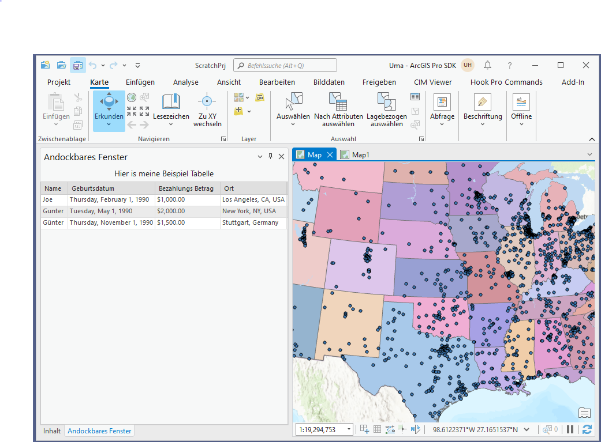
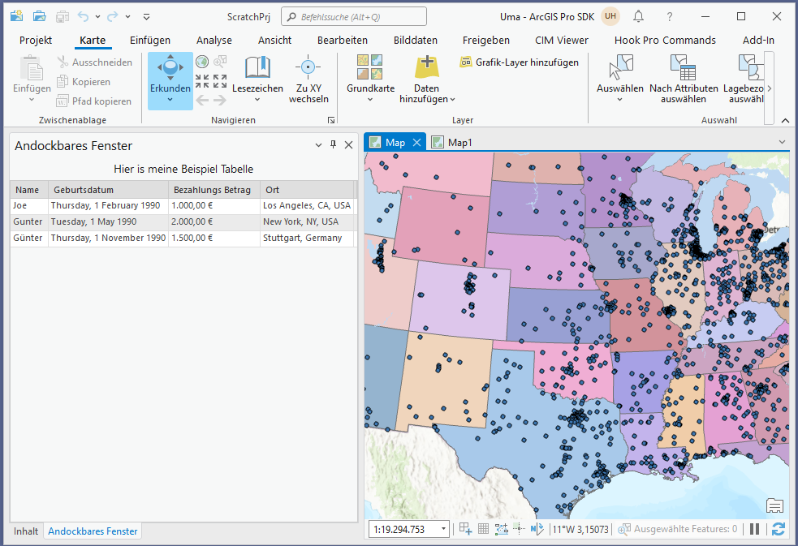

## Localization

<!-- TODO: Write a brief abstract explaining this sample -->
This localization sample shows how to 'Globalize' an add-in by providing an add-in with  text translated into different languages and showing support for different regions (locale).  
A ProTutorial based on this sample is also available.  
  


<a href="http://pro.arcgis.com/en/pro-app/sdk/" target="_blank">View it live</a>

<!-- TODO: Fill this section below with metadata about this sample-->
```
Language:              C# 6.0
Subject:               Framework
Contributor:           ArcGIS Pro SDK Team <arcgisprosdk@esri.com>
Organization:          Esri, http://www.esri.com
Date:                  6/28/2017
ArcGIS Pro:            2.0
Visual Studio:         2015, 2017
.NET Target Framework: 4.6.1
```

## Resources

* [API Reference online](http://pro.arcgis.com/en/pro-app/sdk/api-reference)
* <a href="http://pro.arcgis.com/en/pro-app/sdk/" target="_blank">ArcGIS Pro SDK for .NET (pro.arcgis.com)</a>
* [arcgis-pro-sdk-community-samples](http://github.com/Esri/arcgis-pro-sdk-community-samples)
* [ArcGISPro Registry Keys](http://github.com/Esri/arcgis-pro-sdk/wiki/ArcGIS-Pro-Registry-Keys)
* [FAQ](http://github.com/Esri/arcgis-pro-sdk/wiki/FAQ)
* [ArcGIS Pro SDK icons](https://github.com/Esri/arcgis-pro-sdk/releases/tag/1.4.0.7198)
* [ProConcepts: ArcGIS Pro Add in Samples](https://github.com/Esri/arcgis-pro-sdk-community-samples/wiki/ProConcepts-ArcGIS-Pro-Add-in-Samples)


* [ProSnippets: 2.0 Migration](http://github.com/Esri/arcgis-pro-sdk/wiki/ProSnippets-Migrating-to-2.0)  
* [ProSnippets: 2.0 Migration Samples](http://github.com/Esri/arcgis-pro-sdk/wiki/ProSnippets-2.0-Migration-Samples)  
* [ProConcepts: 2.0 Migration](http://github.com/Esri/arcgis-pro-sdk/wiki/ProConcepts-2.0-Migration-Guide)  

### Samples Data

* Sample data for ArcGIS Pro SDK Community Samples can be downloaded from the [repo releases](https://github.com/Esri/arcgis-pro-sdk-community-samples/releases) page.  

## How to use the sample
<!-- TODO: Explain how this sample can be used. To use images in this section, create the image file in your sample project's screenshots folder. Use relative url to link to this image using this syntax:  -->
1. In Visual Studio click the Build menu. Then select Build Solution.  
2. Click Start button to open ArcGIS Pro.  
3. Open the "Add-ins tab" on the ArcGIS Pro ribbon to see the sample button and dockpane in English.  Close ArcGIS Pro.  
  
__4. Testing other languages__: in order to test other languages you need to install the proper language pack in ArcGIS Pro first.  Once you have additional languages installed you can change ArcGIS Pro's default language in the ArcGIS Pro Options dialog:   
  
  
In order to view this sample you have to install the German language pack for ArcGIS Pro and Windows.  Change the language option to German and restart ArcGIS Pro.  Open the 'Registrierkarte Add-in' tab and verify that the language of you add-in is correct.  
  
  
Please note that the date and the currency field does not reflect he language change.  The reason is that their settings are not defined by the language but instead by the region.  
  
__5. Testing other region settings__: in order to change your region please use the Windows control panel's Region settings dialog and change the format to 'German' (please note that you might have to install a language pack for this to work):    
  
  
After you change your region setting, debug your add-in (with the language setting for German still in place) and verify that the date and currency columns are now defined consistently with the region settings of Windows.   
  
  


<!-- End -->

&nbsp;&nbsp;&nbsp;&nbsp;&nbsp;&nbsp;
&nbsp;&nbsp;&nbsp;&nbsp;&nbsp;&nbsp;&nbsp;&nbsp;&nbsp;&nbsp;&nbsp;&nbsp;
[Home](https://github.com/Esri/arcgis-pro-sdk/wiki) | <a href="http://pro.arcgis.com/en/pro-app/sdk/api-reference" target="_blank">API Reference</a> | [Requirements](https://github.com/Esri/arcgis-pro-sdk/wiki#requirements) | [Download](https://github.com/Esri/arcgis-pro-sdk/wiki#installing-arcgis-pro-sdk-for-net) | <a href="http://github.com/esri/arcgis-pro-sdk-community-samples" target="_blank">Samples</a>
