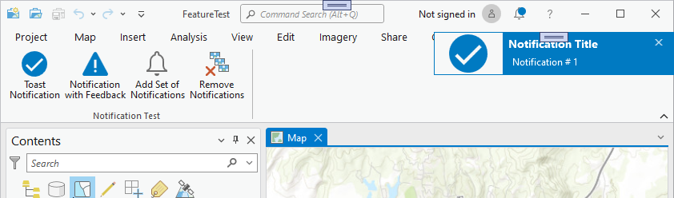
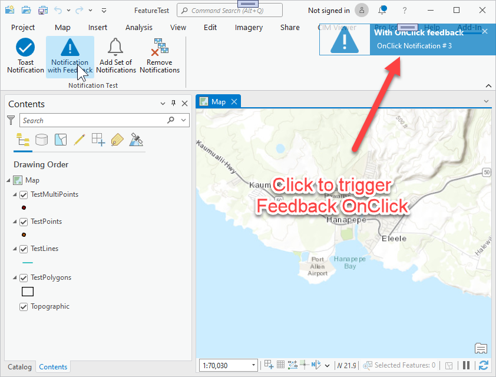
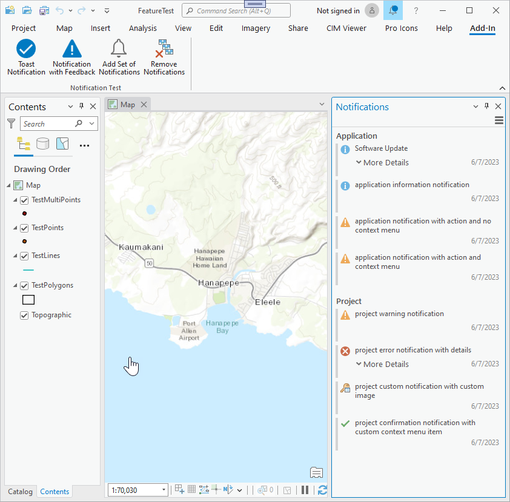
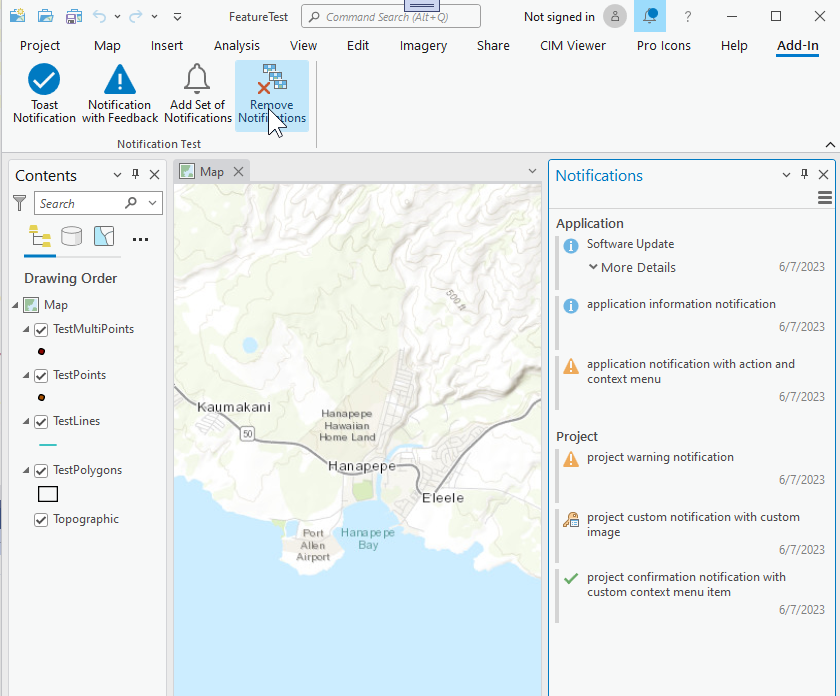

## Notifications

<!-- TODO: Write a brief abstract explaining this sample -->
This sample illustrates notifications in the application.  There are two main categories of notifications - toast notifications which are transient message to the user that contains relevant, time-sensitive information and provides quick access to related  content in an application; these appear in the top right hand corner of the display and last for a few seconds. The second category  of notification are more permanent and are displayed in the notification dock pane.  These type of notifications can be further  classified into application and project notifications.   
  


<a href="https://pro.arcgis.com/en/pro-app/sdk/" target="_blank">View it live</a>

<!-- TODO: Fill this section below with metadata about this sample-->
```
Language:              C#
Subject:               Framework
Contributor:           ArcGIS Pro SDK Team <arcgisprosdk@esri.com>
Organization:          Esri, https://www.esri.com
Date:                  10/01/2023
ArcGIS Pro:            3.2
Visual Studio:         2022
.NET Target Framework: net6.0-windows
```

## Resources

[Community Sample Resources](https://github.com/Esri/arcgis-pro-sdk-community-samples#resources)

### Samples Data

* Sample data for ArcGIS Pro SDK Community Samples can be downloaded from the [Releases](https://github.com/Esri/arcgis-pro-sdk-community-samples/releases) page.  

## How to use the sample
<!-- TODO: Explain how this sample can be used. To use images in this section, create the image file in your sample project's screenshots folder. Use relative url to link to this image using this syntax:  -->
1. In Visual studio click the Build menu. Then select Build Solution.
2. Click Start button to open ArcGIS Pro.  
3. ArcGIS Pro will open, open any project or create a new project.  
4. Activate the Add-In tab.   
  
5. Click the 'Toast Notification' button and see a toast notification appear in the upper right of the application.  
  
6. Click the 'Notification with Feedback' button and see a toast notification appear in the upper right of the application.  Click on that toast notification and a messagebox saying 'This message was just removed' will appear.   
  
7. Click the 'Add Set of Notifications' button and see a number of notifications added to the notification dock pane.  This button will also open the notification dock pane if it's now already open.  
  
8. Click the 'Remove Notifications' button and see two of those notifications be removed from the notification dock pane.  
  
  

<!-- End -->

&nbsp;&nbsp;&nbsp;&nbsp;&nbsp;&nbsp;
&nbsp;&nbsp;&nbsp;&nbsp;&nbsp;&nbsp;&nbsp;&nbsp;&nbsp;&nbsp;&nbsp;&nbsp;
[Home](https://github.com/Esri/arcgis-pro-sdk/wiki) | <a href="https://pro.arcgis.com/en/pro-app/latest/sdk/api-reference" target="_blank">API Reference</a> | [Requirements](https://github.com/Esri/arcgis-pro-sdk/wiki#requirements) | [Download](https://github.com/Esri/arcgis-pro-sdk/wiki#installing-arcgis-pro-sdk-for-net) | <a href="https://github.com/esri/arcgis-pro-sdk-community-samples" target="_blank">Samples</a>
