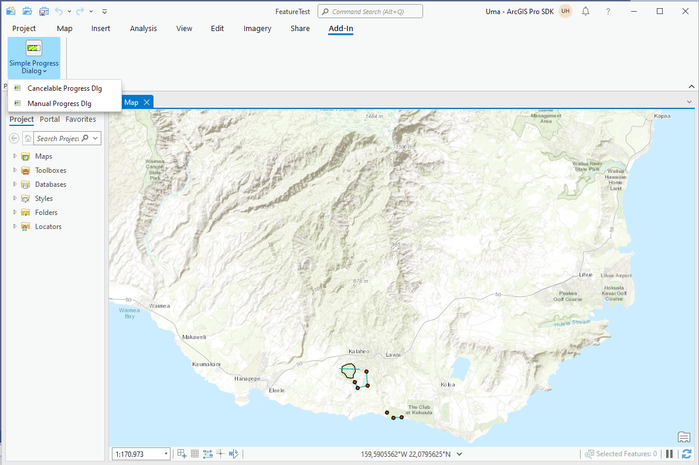
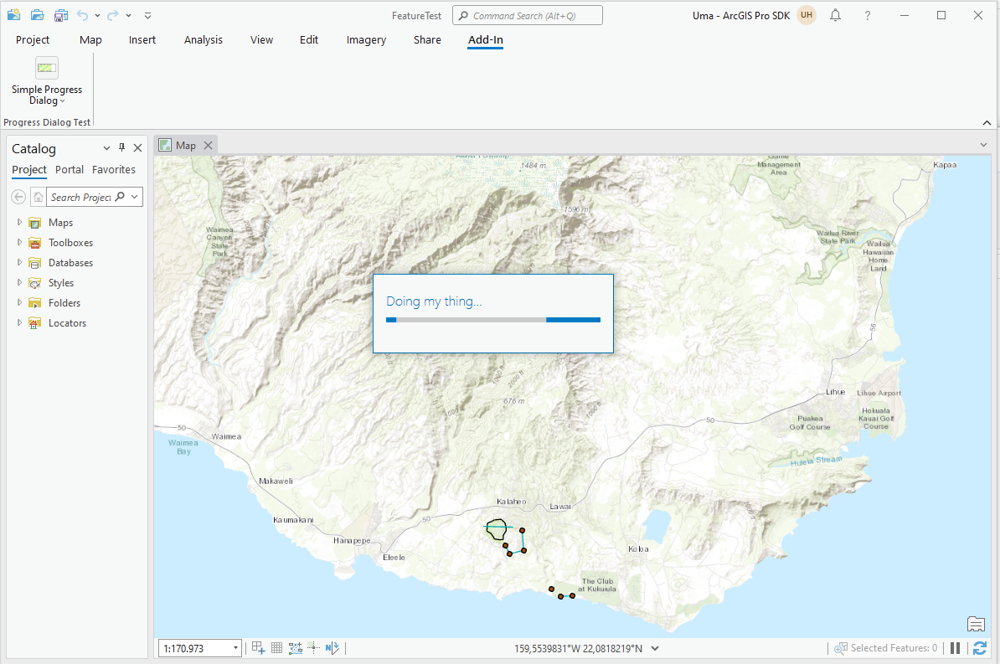
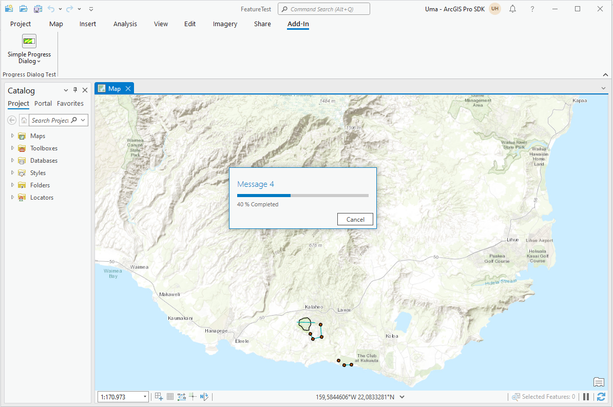
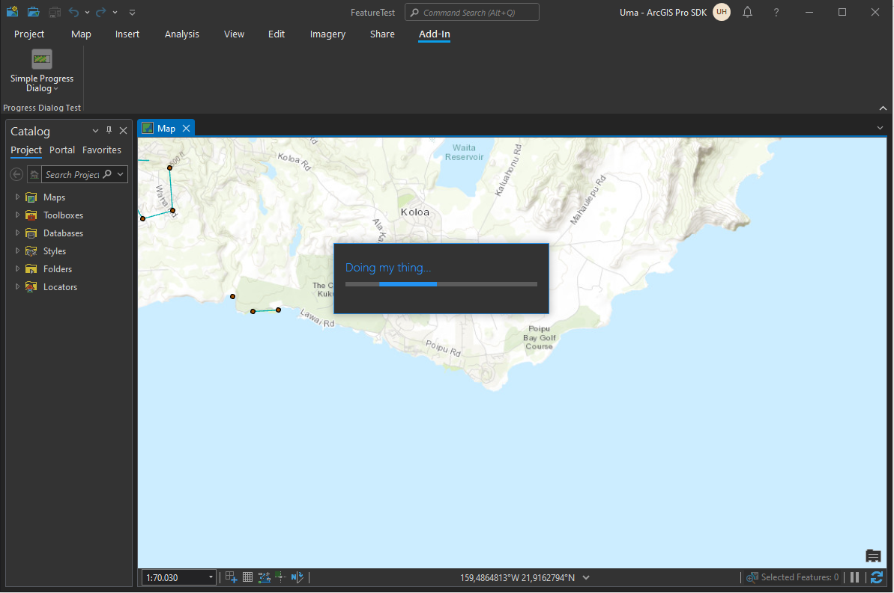

## ProgressDialog

<!-- TODO: Write a brief abstract explaining this sample -->
This Sample shows different patterns that exercise the progress dialog.    
  
1. Simple progress dialog  
2. Cancelable progress dialog  
3. Manually control a progress dialog  
  


<a href="https://pro.arcgis.com/en/pro-app/sdk/" target="_blank">View it live</a>

<!-- TODO: Fill this section below with metadata about this sample-->
```
Language:              C#
Subject:               Framework
Contributor:           ArcGIS Pro SDK Team <arcgisprosdk@esri.com>
Organization:          Esri, https://www.esri.com
Date:                  04/04/2024
ArcGIS Pro:            3.3
Visual Studio:         2022
.NET Target Framework: net8.0-windows
```

## Resources

[Community Sample Resources](https://github.com/Esri/arcgis-pro-sdk-community-samples#resources)

### Samples Data

* Sample data for ArcGIS Pro SDK Community Samples can be downloaded from the [Releases](https://github.com/Esri/arcgis-pro-sdk-community-samples/releases) page.  

## How to use the sample
<!-- TODO: Explain how this sample can be used. To use images in this section, create the image file in your sample project's screenshots folder. Use relative url to link to this image using this syntax:  -->
1. Open this solution in Visual Studio.
2. Click the build menu and select Build Solution.  
3. Run ArCGIS Pro without running the Visual Studio Debugger.  
4. Progress Dialog boxes are disabled when debugging in Visual Studio.  
5. Open any project - it can be an existing project containing data or a new empty project.  
6. Click on the Add-in tab and see the split button in the 'Progress Dialog Test' group.  
  
7. Click on any of the split buttons to see the respective progress dialog implementation work.  
  
8. If you like to see a progress dialog with a progress bar that iterates to a given number of steps you can use the "Cancelable Progress Dlg" button.  This progress dialog runs through 10 steps and updates the progress bar accordingly.  
  
9. Progress dialogs support the ArcGIS Pro Dark Theme seamlessly.  
  
  

<!-- End -->

&nbsp;&nbsp;&nbsp;&nbsp;&nbsp;&nbsp;
&nbsp;&nbsp;&nbsp;&nbsp;&nbsp;&nbsp;&nbsp;&nbsp;&nbsp;&nbsp;&nbsp;&nbsp;
[Home](https://github.com/Esri/arcgis-pro-sdk/wiki) | <a href="https://pro.arcgis.com/en/pro-app/latest/sdk/api-reference" target="_blank">API Reference</a> | [Requirements](https://github.com/Esri/arcgis-pro-sdk/wiki#requirements) | [Download](https://github.com/Esri/arcgis-pro-sdk/wiki#installing-arcgis-pro-sdk-for-net) | <a href="https://github.com/esri/arcgis-pro-sdk-community-samples" target="_blank">Samples</a>
