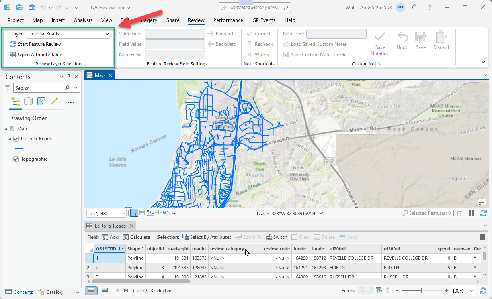
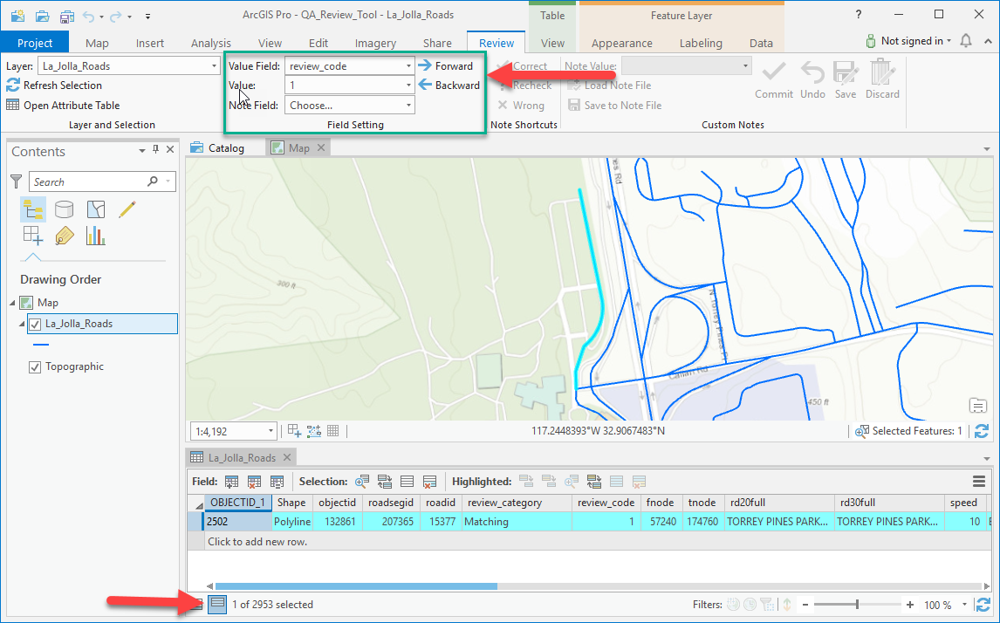
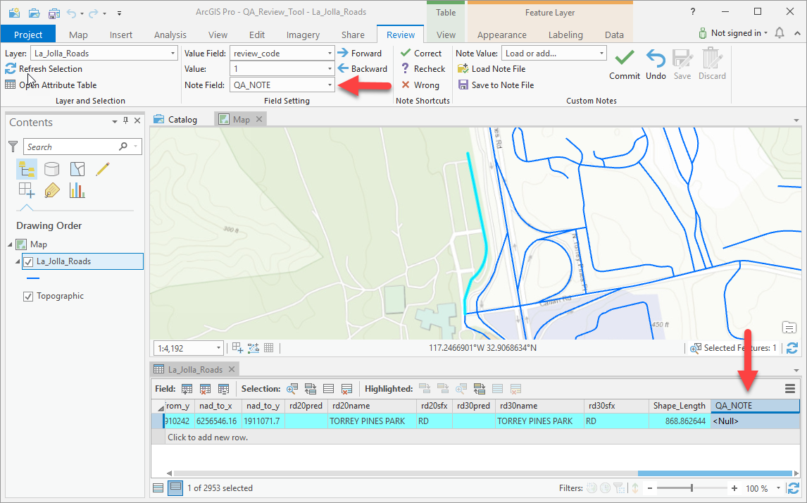
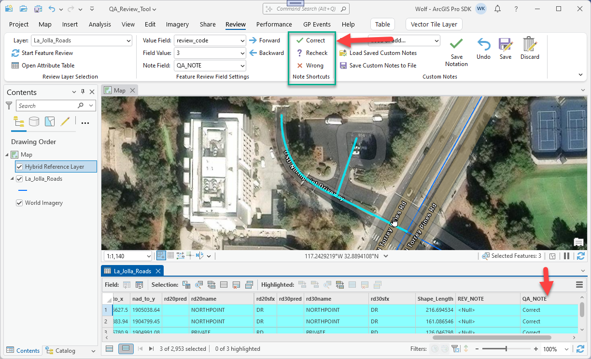
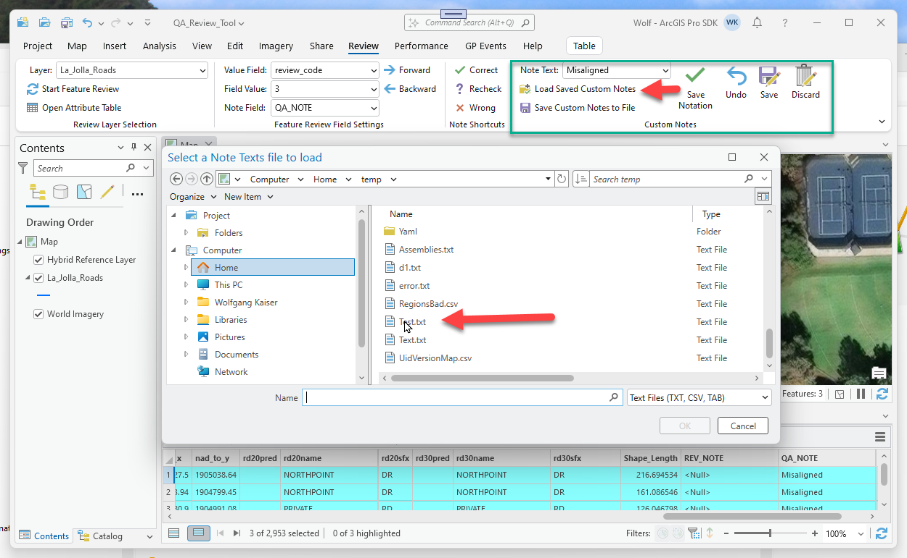
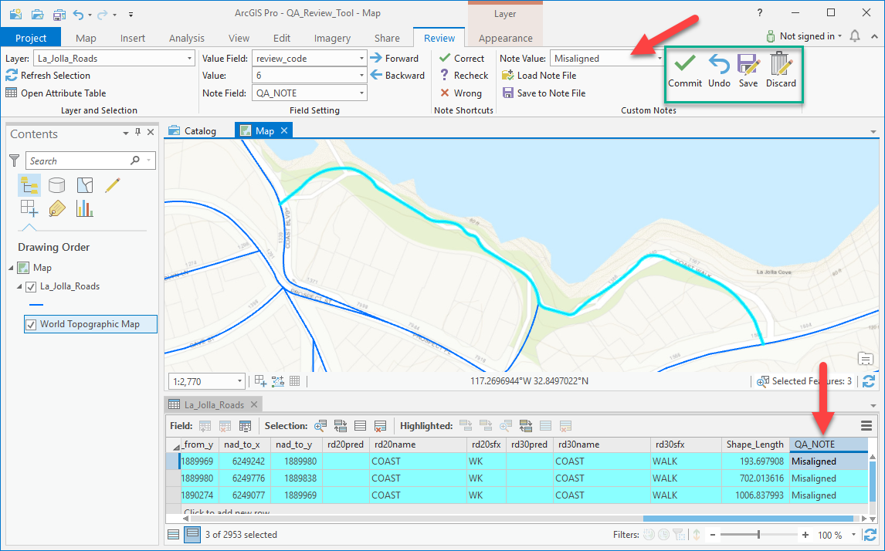

## QAReviewTool

<!-- TODO: Write a brief abstract explaining this sample -->
This sample provides a set of controls which guide the user through a data quality assurance(QA) review workflow, with tools for visually reviewing and notating datasets based on their accuracy.  
  


<a href="http://pro.arcgis.com/en/pro-app/sdk/" target="_blank">View it live</a>

<!-- TODO: Fill this section below with metadata about this sample-->
```
Language:              C#
Subject:               Framework
Contributor:           ArcGIS Pro SDK Team <arcgisprosdk@esri.com>
Organization:          Esri, http://www.esri.com
Date:                  7/01/2020
ArcGIS Pro:            2.6
Visual Studio:         2017, 2019
.NET Target Framework: 4.8
```

## Resources

* [API Reference online](https://pro.arcgis.com/en/pro-app/sdk/api-reference)
* <a href="https://pro.arcgis.com/en/pro-app/sdk/" target="_blank">ArcGIS Pro SDK for .NET (pro.arcgis.com)</a>
* [arcgis-pro-sdk-community-samples](https://github.com/Esri/arcgis-pro-sdk-community-samples)
* [ArcGIS Pro DAML ID Reference](https://github.com/Esri/arcgis-pro-sdk/wiki/ArcGIS-Pro-DAML-ID-Reference)
* [FAQ](https://github.com/Esri/arcgis-pro-sdk/wiki/FAQ)
* [ArcGIS Pro SDK icons](https://github.com/Esri/arcgis-pro-sdk/releases/tag/2.4.0.19948)


### Samples Data

* Sample data for ArcGIS Pro SDK Community Samples can be downloaded from the [repo releases](https://github.com/Esri/arcgis-pro-sdk-community-samples/releases) page.  

## How to use the sample
<!-- TODO: Explain how this sample can be used. To use images in this section, create the image file in your sample project's screenshots folder. Use relative url to link to this image using this syntax:  -->
1. Download the Community Sample data(see under the 'Resources' section for downloading sample data). Make sure that the Sample dataset is unzipped under c:\data and that the sample data contains the folder C:\Data\QAReviewTool containing a map package named “QA_Review_Tool.ppkx” which is required for this sample.  
1. Open this solution in Visual Studio 2017.  
1. Click the build menu and select Build Solution.  
1. Click the Start button to run the solution.  ArcGIS Pro will open.  
1. Open the map package "QA_Review_Tool.ppkx" located in the "C:\Data\QAReviewTool" folder.This project contains all required data.  Be sure the Topographic basemap layer is displayed.  
1. Click on the new “Review” tab provided by the add-in.  In the “Layer and Selection” group, click the dropdown button for the “Layer” combobox and select “La_Jolla_Roads”.  Press the “Refresh Selection” button, which will enable the comboboxes in the “Field Setting” group.Then press the “Open Attribute Table” button and adjust the size of the table to where you can see around 3 or 4 records.  
  
  
1. In the Field Setting group, click on the dropdown button for the “Value Field” and scroll to the bottom of the list and choose the field “review_code”.  This will populate the “Value” field combobox with the unique data values from the review_code field.It will then zoom to the feature containing the value “1”.  The forward and backward navigation buttons are now enabled, and you can click on these to zoom to the different records containing other review_code values.Click on “Show Selected Records” in the attribute table to just show the selected record(s).  
  
  
1. In the “Note Field” combobox, choose the “QA_NOTE” from the list of available field names to store your QA notes.  It will ask if you would like to add the field to your data, and press “OK” to add it.Check to see that QA_NOTE is added at the end of your attribute table, and is also listed in the Note Field combobox.  This step will enable the rest of the controls on the Review tab.  
  
  
1. You are now able to use the enabled Note Shortcuts to apply a brief description to any selected records.Use the “Forward” button to navigate to review_code value 3 and you will see three road features selected.  As the Topographic basemap layer does not show a street for these features, change the basemap to Imagery to see verify the data.  You will see the features represent the entrance driveway to a building and its parking lot.  Press the “Correct” note shortcut button to set the QA review value.  
  
  
1. Next, you can try applying custom notes and managing your edits using the controls in the “Custom Notes” group.You can load a set of custom notes from a textfile and use these in place of the note shortcuts.Press the “Load Note File” button and navigate to the C:\Data\QAReviewTool folder.Click on the file “Custom Notes.txt” and press OK.  
  
  
1. The values will be loaded into the “Note Value” combobox.You can then select from these values and apply them to your current selected records using the “Commit” button.You can also add new values to the note value combobox and save the values to a new note file.Finally, you can use the Undo, Save and Discard buttons to manage your edits.  
  
  


<!-- End -->

&nbsp;&nbsp;&nbsp;&nbsp;&nbsp;&nbsp;
&nbsp;&nbsp;&nbsp;&nbsp;&nbsp;&nbsp;&nbsp;&nbsp;&nbsp;&nbsp;&nbsp;&nbsp;
[Home](https://github.com/Esri/arcgis-pro-sdk/wiki) | <a href="https://pro.arcgis.com/en/pro-app/sdk/api-reference" target="_blank">API Reference</a> | [Requirements](https://github.com/Esri/arcgis-pro-sdk/wiki#requirements) | [Download](https://github.com/Esri/arcgis-pro-sdk/wiki#installing-arcgis-pro-sdk-for-net) | <a href="https://github.com/esri/arcgis-pro-sdk-community-samples" target="_blank">Samples</a>
