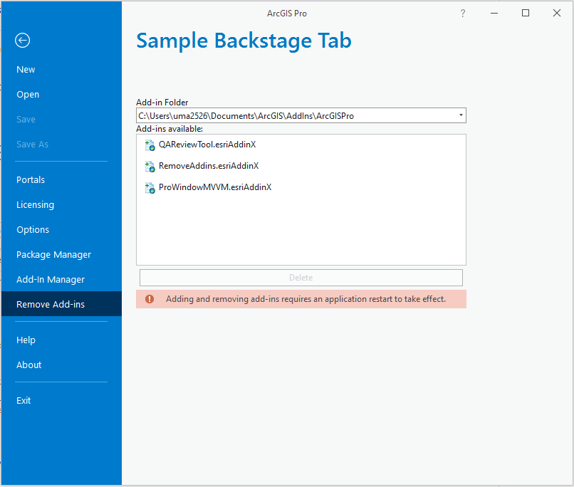

## RemoveAddins

<!-- TODO: Write a brief abstract explaining this sample -->
 This sample shows how to customize the backstage by adding a new tab.   
 In this example we will add a new tab in the backstage called Remove Add-Ins. Add-ins installed on that machine will be listed in that tab and you will be able to delete them.  
 Adding and removing add-ins requires an application restart to take effect.  
   


<a href="https://pro.arcgis.com/en/pro-app/sdk/" target="_blank">View it live</a>

<!-- TODO: Fill this section below with metadata about this sample-->
```
Language:              C#
Subject:               Framework
Contributor:           ArcGIS Pro SDK Team <arcgisprosdk@esri.com>
Organization:          Esri, https://www.esri.com
Date:                  10/01/2023
ArcGIS Pro:            3.2
Visual Studio:         2022
.NET Target Framework: net6.0-windows
```

## Resources

[Community Sample Resources](https://github.com/Esri/arcgis-pro-sdk-community-samples#resources)

### Samples Data

* Sample data for ArcGIS Pro SDK Community Samples can be downloaded from the [Releases](https://github.com/Esri/arcgis-pro-sdk-community-samples/releases) page.  

## How to use the sample
<!-- TODO: Explain how this sample can be used. To use images in this section, create the image file in your sample project's screenshots folder. Use relative url to link to this image using this syntax:  -->
1. In Visual Studio click the Build menu. Then select Build Solution.
 2. Click Start button to open ArcGIS Pro.  
 3. ArcGIS Pro will open.   
 4. Open a blank project.  
 5. Click the Project tab to display the backstage.  
 6. Select the new Remove Add-in tab added to the backstage on the left.  
 7. The Add-in Folder drop down will display all the "well-known" add-in folders registered on your machine.   
 8. Add-ins available list box will display all the add-ins found in each well-known add-in folder.  
 9. You can select any add-in(s) and click the Delete button to remove them.  
Note: Adding and removing add-ins requires an application restart to take effect.  
  
   

<!-- End -->

&nbsp;&nbsp;&nbsp;&nbsp;&nbsp;&nbsp;
&nbsp;&nbsp;&nbsp;&nbsp;&nbsp;&nbsp;&nbsp;&nbsp;&nbsp;&nbsp;&nbsp;&nbsp;
[Home](https://github.com/Esri/arcgis-pro-sdk/wiki) | <a href="https://pro.arcgis.com/en/pro-app/latest/sdk/api-reference" target="_blank">API Reference</a> | [Requirements](https://github.com/Esri/arcgis-pro-sdk/wiki#requirements) | [Download](https://github.com/Esri/arcgis-pro-sdk/wiki#installing-arcgis-pro-sdk-for-net) | <a href="https://github.com/esri/arcgis-pro-sdk-community-samples" target="_blank">Samples</a>
