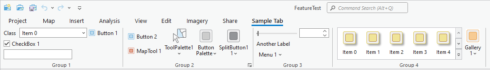
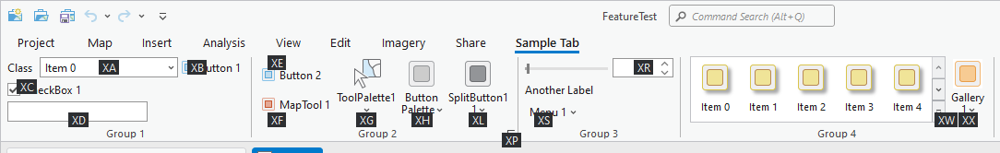
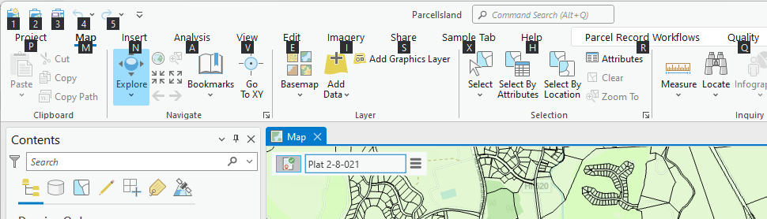
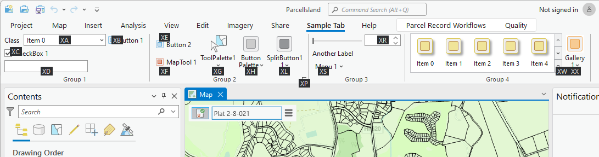
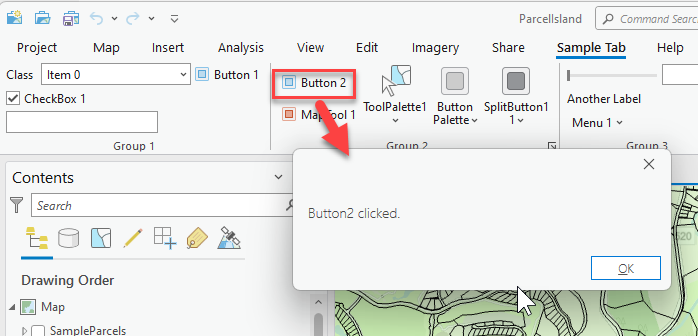

## RibbonControls

<!-- TODO: Write a brief abstract explaining this sample -->
This sample illustrates every type of ribbon control currently available in ArcGIS Pro.  Ribbon controls are declared in DAML with code classes containing the control implementation.  
  


<a href="https://pro.arcgis.com/en/pro-app/sdk/" target="_blank">View it live</a>

<!-- TODO: Fill this section below with metadata about this sample-->
```
Language:              C#
Subject:               Framework
Contributor:           ArcGIS Pro SDK Team <arcgisprosdk@esri.com>
Organization:          Esri, https://www.esri.com
Date:                  11/04/2024
ArcGIS Pro:            3.4
Visual Studio:         2022
.NET Target Framework: net8.0-windows
```

## Resources

[Community Sample Resources](https://github.com/Esri/arcgis-pro-sdk-community-samples#resources)

### Samples Data

* Sample data for ArcGIS Pro SDK Community Samples can be downloaded from the [Releases](https://github.com/Esri/arcgis-pro-sdk-community-samples/releases) page.  

## How to use the sample
<!-- TODO: Explain how this sample can be used. To use images in this section, create the image file in your sample project's screenshots folder. Use relative url to link to this image using this syntax:  -->
1. Download the Community Sample data (see under the 'Resources' section for downloading sample data).  Make sure that the Sample data is unzipped in c:\data.
2. Open this solution in Visual Studio.    
3. Click the build menu and select Build Solution.  
4. Click the Start button to open ArCGIS Pro.  ArcGIS Pro will open.  
5. Open the project "FeatureTest.aprx" in the "C:\Data\FeatureTest" folder.  
6. Click on the "Sample Tab" tab.  
7. View the various ribbon controls.   Don't forget the keytips when defining DAML items.   
  
   
8. Group 1 contains a toolbar (which consists of a LabelControl, CombobBox and Button), CheckBox and EditBox.  
9. Group 2 contains a Button, MapTool, ToolPalette, ButtonPalette and SplitButton with an additional launcher button.  
10. Group 3 contains a toolbar (which consits of a CustomControl and Spinner), LabelControl and Menu.  
11. Group 4 contains an inline Gallery and a Gallery button.   
Note: this is how you can make use of the KeyTips you defined in your config.daml:  
To use KeyTips you must first press the Alt key or the F10 key, this shows the available KeyTip letters for the tabs on the Pro ribbon:  
  
Next you press any of displayed KeyTips letters (white and framed in black).  So for example to get to the “Sample Tab” I simply press the ‘X’ key.  Now the UI is updated to show the ‘Sample Tab’s’ Key Tips:  
  
Finally I can choose a KeyTip from the selected ‘Sample Tab’ tab.  For example if I want to execute the ‘Button 2’ command on the ‘Sample Tab’, I simply press the ‘X’ key followed by the ‘E’ key.  The command is executed and I get this:  
  
  

<!-- End -->

&nbsp;&nbsp;&nbsp;&nbsp;&nbsp;&nbsp;
&nbsp;&nbsp;&nbsp;&nbsp;&nbsp;&nbsp;&nbsp;&nbsp;&nbsp;&nbsp;&nbsp;&nbsp;
[Home](https://github.com/Esri/arcgis-pro-sdk/wiki) | <a href="https://pro.arcgis.com/en/pro-app/latest/sdk/api-reference" target="_blank">API Reference</a> | [Requirements](https://github.com/Esri/arcgis-pro-sdk/wiki#requirements) | [Download](https://github.com/Esri/arcgis-pro-sdk/wiki#installing-arcgis-pro-sdk-for-net) | <a href="https://github.com/esri/arcgis-pro-sdk-community-samples" target="_blank">Samples</a>
