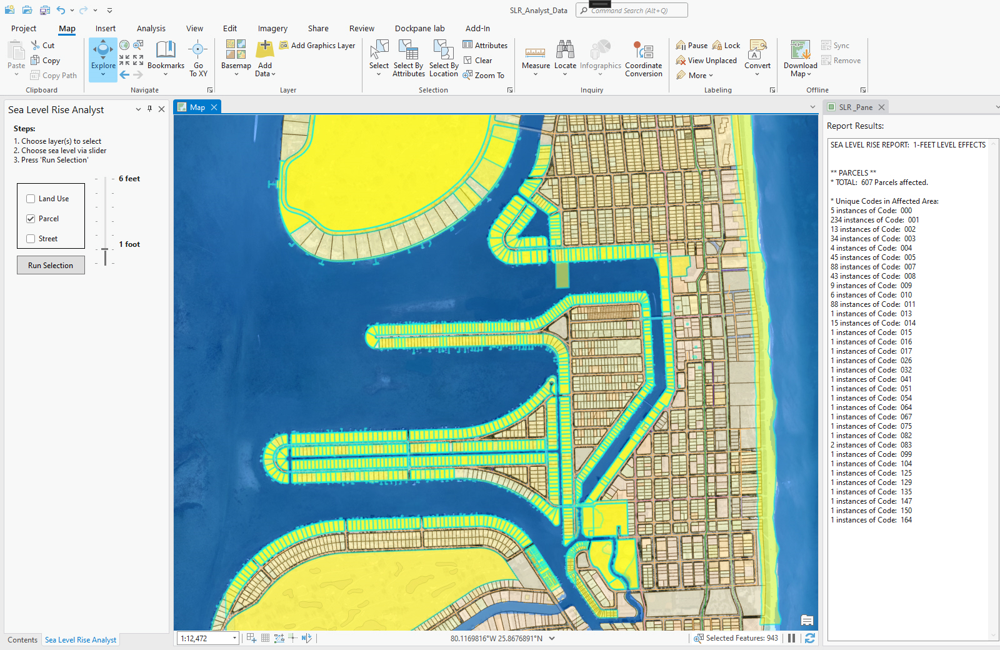
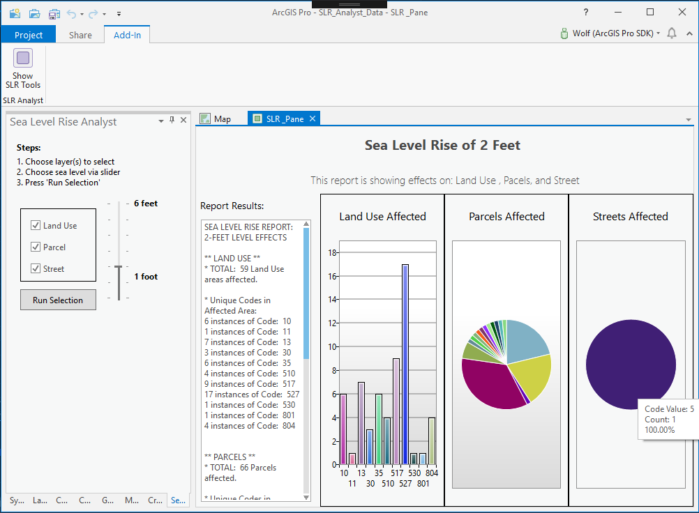

## SLR_Analyst

<!-- TODO: Write a brief abstract explaining this sample -->
This demonstration illustrates custom ArcGIS Pro map exploration functionality provided through a Pro SDK add-in.  The scenario uses a sample Pro add-in, Sea Level Rise Analyst, which can assist urban planning and public safety organizations in quickly identifying areas affected by sea level rise within a study area in Miami Beach, Florida.    
The general concept of the add-in is based on the [NOAA Sea Level Rise Viewer](https://coast.noaa.gov/slr/) web application.	The add-in and dataset allow for identification and selection from three layers � land use, parcels and streets.    
The custom add-in demonstrates three main Pro SDK capabilities:  
-	Interaction with and selection of layers within the project from a custom add-in pane.  
-	Dynamic creation of a temporary report pane with results in text and chart form, and charts which leverage a custom tooltip which allows for better data exploration.  
-	Basic text reporting of code attributes within a selection set.    
  
DATA SOURCES AND DESCRIPTION (Refer to Data Distribution Permission statement at the end of this document)  
The dataset is comprised of data clipped for the study area from the following sources:  
- Land use, Parcel and Street data layers provided by [Miami-Dade County GIS Open Data site](http://gis-mdc.opendata.arcgis.com/)  
- Sea Level Rise layers for 1 � 6 feet provided by [NOAA SLR data site](https://coast.noaa.gov/slrdata/)  
  


<a href="http://pro.arcgis.com/en/pro-app/sdk/" target="_blank">View it live</a>

<!-- TODO: Fill this section below with metadata about this sample-->
```
Language:              C#
Subject:               Framework
Contributor:           ArcGIS Pro SDK Team <arcgisprosdk@esri.com>
Organization:          Esri, http://www.esri.com
Date:                  6/27/2019
ArcGIS Pro:            2.4
Visual Studio:         2017, 2019
.NET Target Framework: 4.6.1
```

## Resources

* [API Reference online](https://pro.arcgis.com/en/pro-app/sdk/api-reference)
* <a href="https://pro.arcgis.com/en/pro-app/sdk/" target="_blank">ArcGIS Pro SDK for .NET (pro.arcgis.com)</a>
* [arcgis-pro-sdk-community-samples](https://github.com/Esri/arcgis-pro-sdk-community-samples)
* [ArcGIS Pro DAML ID Reference](https://github.com/Esri/arcgis-pro-sdk/wiki/ArcGIS-Pro-DAML-ID-Reference)
* [FAQ](https://github.com/Esri/arcgis-pro-sdk/wiki/FAQ)
* [ArcGIS Pro SDK icons](https://github.com/Esri/arcgis-pro-sdk/releases/tag/2.4.0.19946)


### Samples Data

* Sample data for ArcGIS Pro SDK Community Samples can be downloaded from the [repo releases](https://github.com/Esri/arcgis-pro-sdk-community-samples/releases) page.  

## How to use the sample
<!-- TODO: Explain how this sample can be used. To use images in this section, create the image file in your sample project's screenshots folder. Use relative url to link to this image using this syntax:  -->
1. Download the Community Sample data (see under the 'Resources' section for downloading sample data)  
1. Make sure that the Sample data is unzipped in c:\data   
1. The project used for this sample is 'C:\Data\SLR_Analyst\SLR_Analyst_Data.ppkx'  
1. In Visual Studio click the Build menu. Then select Build Solution.  
1. This solution is using the **System.Windows.Controls.DataVisualization.Toolkit Nuget**.  If needed, you can install the Nuget from the "Nuget Package Manager Console" by using this script: "Install-Package System.Windows.Controls.DataVisualization.Toolkit".  
1. Click Start button to open ArcGIS Pro.  
1. ArcGIS Pro will open, open the SLR_Analyst_Data.ppkx project  
1. Once the project is open and loaded, the first step is to open the custom SLR Analyst pane. To do this, select the Add-In tab and press the Show SLR Tools add-in button to open the SLR Analyst dockpane.  
  
  
1. Use your choice of navigation to zoom to an extent within the study area where you can clearly see land use and parcel polygons.  Zooming to 1:6,000 scale should work well initially.  
1. Choose layer(s) to select and then choose sea level rise via the slider   
1. Click 'Run Selection' to run the analysis  
  
  


<!-- End -->

&nbsp;&nbsp;&nbsp;&nbsp;&nbsp;&nbsp;
&nbsp;&nbsp;&nbsp;&nbsp;&nbsp;&nbsp;&nbsp;&nbsp;&nbsp;&nbsp;&nbsp;&nbsp;
[Home](https://github.com/Esri/arcgis-pro-sdk/wiki) | <a href="https://pro.arcgis.com/en/pro-app/sdk/api-reference" target="_blank">API Reference</a> | [Requirements](https://github.com/Esri/arcgis-pro-sdk/wiki#requirements) | [Download](https://github.com/Esri/arcgis-pro-sdk/wiki#installing-arcgis-pro-sdk-for-net) | <a href="https://github.com/esri/arcgis-pro-sdk-community-samples" target="_blank">Samples</a>
