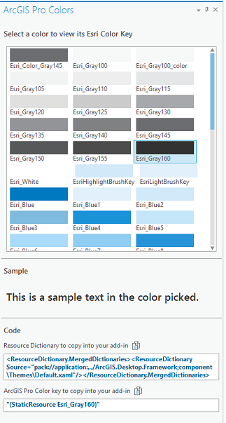

##Styling-with-ArcGIS-Pro

<!-- TODO: Write a brief abstract explaining this sample -->
This sample demonstrates how to create UI elements in your Add-in that have the ArcGIS Pro "look and feel".   
For example, when you load this sample you will be able to get the xaml code to create a "Esri Simple Button".    
Xaml code for buttons, check boxes, colors can be obtained from this sample.   
  


<a href="http://pro.arcgis.com/en/pro-app/sdk/" target="_blank">View it live</a>

<!-- TODO: Fill this section below with metadata about this sample-->
```
Language:              C#
Subject:               Framework
Contributor:           ArcGIS Pro SDK Team <arcgisprosdk@esri.com>
Organization:          Esri, http://www.esri.com
Date:                  7/6/2016
ArcGIS Pro:            1.3
Visual Studio:         2013, 2015
.NET Target Framework: 4.6.1
```

##Resources

* [API Reference online](http://pro.arcgis.com/en/pro-app/sdk/api-reference)  
* <a href="http://pro.arcgis.com/en/pro-app/sdk/" target="_blank">ArcGIS Pro SDK for .NET (pro.arcgis.com)</a>  
* [arcgis-pro-sdk-community-samples](http://github.com/Esri/arcgis-pro-sdk-community-samples)  
* [ArcGIS Pro DAML ID Reference](http://github.com/Esri/arcgis-pro-sdk/wiki/ArcGIS Pro DAML ID Reference)  
* [FAQ](http://github.com/Esri/arcgis-pro-sdk/wiki/FAQ)  
* [ArcGIS Pro SDK icons](https://github.com/Esri/arcgis-pro-sdk/releases/tag/1.2.0.5023)  

* [ProConcepts: ArcGIS Pro Add in Samples](https://github.com/Esri/arcgis-pro-sdk-community-samples/wiki/ProConcepts-ArcGIS-Pro-Add-in-Samples)  

### Samples Data

* Sample data for ArcGIS Pro SDK Community Samples can be downloaded from the [repo releases](https://github.com/Esri/arcgis-pro-sdk-community-samples/releases) page.  

##How to use the sample
<!-- TODO: Explain how this sample can be used. To use images in this section, create the image file in your sample project's screenshots folder. Use relative url to link to this image using this syntax:  -->
1. In Visual Studio click the Build menu. Then select Build Solution.  
2. Click Start button to open ArcGIS Pro.  
3. ArcGIS Pro will open. Click on the new UI Design tab created by this add-in. Two buttons are created on the ribbon in a ArcGIS Pro UI Design group - Control Styles and Colors.   
  
4. Control Styles button: Clicking this button launches the ArcGIS Pro Control Styles dockpane. Select the control you are interested in to view its available styles. You can then click on the Copy button next to the Xaml code for that style to paste into your add-in.  
  
5. Colors button: Clicking this button launches the ArcGIS Pro Colors dockpane. Select any of the Esri colors available in the gallery. You can then click on the Copy button next to the Xaml code for that color to paste into your add-in.  
  
  


[](Esri Tags: ArcGIS-Pro-SDK)
[](Esri Language: C-Sharp)​

<p align = center>
<b> ArcGIS Pro 1.3 SDK for Microsoft .NET Framework</b>
</p>
&nbsp;&nbsp;&nbsp;&nbsp;&nbsp;&nbsp;&nbsp;&nbsp;&nbsp;&nbsp;&nbsp;&nbsp;&nbsp;&nbsp;&nbsp;&nbsp;&nbsp;&nbsp;&nbsp;&nbsp;[Home](https://github.com/Esri/arcgis-pro-sdk/wiki) | <a href="http://pro.arcgis.com/en/pro-app/sdk" target="_blank">ArcGIS Pro SDK</a> | <a href="http://pro.arcgis.com/en/pro-app/sdk/api-reference/index.html" target="_blank">API Reference</a> | [Requirements](#requirements) | [Download](#installing-arcgis-pro-sdk-for-net) |  <a href="http://github.com/esri/arcgis-pro-sdk-community-samples" target="_blank">Samples</a>
