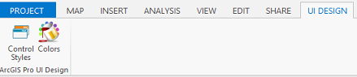
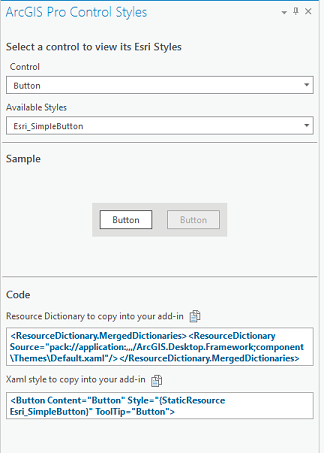
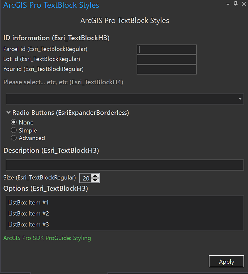
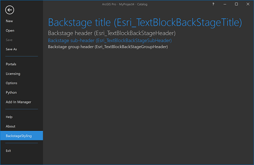
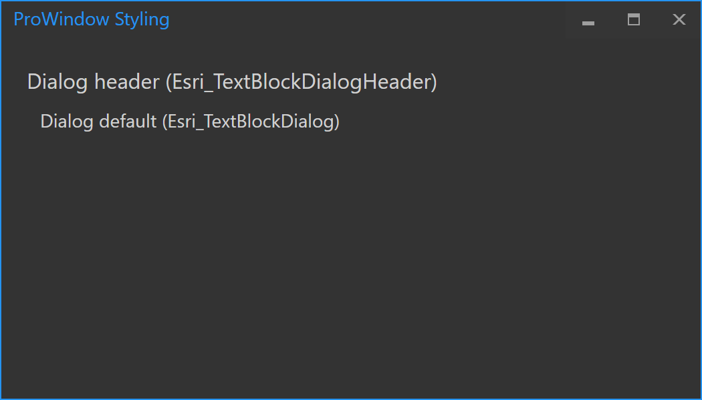

## Styling-with-ArcGIS-Pro

<!-- TODO: Write a brief abstract explaining this sample -->
This sample demonstrates how to create UI elements in your Add-in that have the ArcGIS Pro "look and feel".      
Xaml code for buttons, check boxes, DataGrids, TextBlock styles can be obtained from this sample.   
  


<a href="http://pro.arcgis.com/en/pro-app/sdk/" target="_blank">View it live</a>

<!-- TODO: Fill this section below with metadata about this sample-->
```
Language:              C# 6.0
Subject:               Framework
Contributor:           ArcGIS Pro SDK Team <arcgisprosdk@esri.com>
Organization:          Esri, http://www.esri.com
Date:                  6/28/2017
ArcGIS Pro:            2.0
Visual Studio:         2015, 2017
.NET Target Framework: 4.6.1
```

## Resources

* [API Reference online](http://pro.arcgis.com/en/pro-app/sdk/api-reference)
* <a href="http://pro.arcgis.com/en/pro-app/sdk/" target="_blank">ArcGIS Pro SDK for .NET (pro.arcgis.com)</a>
* [arcgis-pro-sdk-community-samples](http://github.com/Esri/arcgis-pro-sdk-community-samples)
* [ArcGISPro Registry Keys](http://github.com/Esri/arcgis-pro-sdk/wiki/ArcGIS-Pro-Registry-Keys)
* [FAQ](http://github.com/Esri/arcgis-pro-sdk/wiki/FAQ)
* [ArcGIS Pro SDK icons](https://github.com/Esri/arcgis-pro-sdk/releases/tag/1.4.0.7198)
* [ProConcepts: ArcGIS Pro Add in Samples](https://github.com/Esri/arcgis-pro-sdk-community-samples/wiki/ProConcepts-ArcGIS-Pro-Add-in-Samples)


* [ProSnippets: 2.0 Migration](http://github.com/Esri/arcgis-pro-sdk/wiki/ProSnippets-Migrating-to-2.0)  
* [ProSnippets: 2.0 Migration Samples](http://github.com/Esri/arcgis-pro-sdk/wiki/ProSnippets-2.0-Migration-Samples)  
* [ProConcepts: 2.0 Migration](http://github.com/Esri/arcgis-pro-sdk/wiki/ProConcepts-2.0-Migration-Guide)  

### Samples Data

* Sample data for ArcGIS Pro SDK Community Samples can be downloaded from the [repo releases](https://github.com/Esri/arcgis-pro-sdk-community-samples/releases) page.  

## How to use the sample
<!-- TODO: Explain how this sample can be used. To use images in this section, create the image file in your sample project's screenshots folder. Use relative url to link to this image using this syntax:  -->
1. In Visual Studio click the Build menu. Then select Build Solution.  
1. This solution is using the AvalonEdit and Extended.Wpf.Toolkit Nugets. If needed, you can install the Nugets from the "Nuget Package Manager Console" by using this script: "Install-Package AvalonEdit" and "Install-Package Extended.Wpf.Toolkit".  
1. Click Start button to open ArcGIS Pro.  
1. ArcGIS Pro will open. Click on the new UI Design tab created by this add-in. Four buttons are created on the ribbon in an ArcGIS Pro UI Design group - Control Styles, TextBlock Styles, Backstage Styles and ProWindow Styles.   
  
  
1. Control Styles button: Clicking this button launches the ArcGIS Pro Control Styles dockpane. Select the control you are interested in to view its available styles. You can then click on the Copy button next to the Xaml code for that style to paste into your add-in.  
  
  
1. TextBlock Styles button: Clicking this button launches the ArcGIS Pro TextBlock Styles dockpane. You can see the various TextBlock styles available with Pro.  
  
  
1. Backstage Styles button: Clicking this button will launch a Backstage page that lists the backstage TextBlock styles provided in Pro.  
  
  
1. ProWindow Styles button: Clicking this button will launch a ProWindow that lists the dialog TextBlock styles provided in Pro.  
  
  
1. Make sure when working with styles that your look and feel supports the ArcGIS Pro Dark Theme as well as the Default Theme.  
  


<!-- End -->

&nbsp;&nbsp;&nbsp;&nbsp;&nbsp;&nbsp;
&nbsp;&nbsp;&nbsp;&nbsp;&nbsp;&nbsp;&nbsp;&nbsp;&nbsp;&nbsp;&nbsp;&nbsp;
[Home](https://github.com/Esri/arcgis-pro-sdk/wiki) | <a href="http://pro.arcgis.com/en/pro-app/sdk/api-reference" target="_blank">API Reference</a> | [Requirements](https://github.com/Esri/arcgis-pro-sdk/wiki#requirements) | [Download](https://github.com/Esri/arcgis-pro-sdk/wiki#installing-arcgis-pro-sdk-for-net) | <a href="http://github.com/esri/arcgis-pro-sdk-community-samples" target="_blank">Samples</a>
