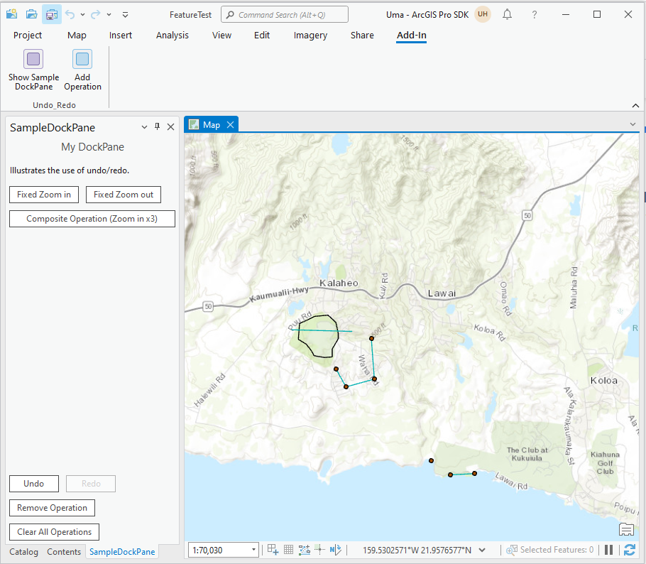

##UndoRedo

<!-- TODO: Write a brief abstract explaining this sample -->
This sample demonstrates how to add operations onto the undo/redo stack.     
  


<a href="http://pro.arcgis.com/en/pro-app/sdk/" target="_blank">View it live</a>

<!-- TODO: Fill this section below with metadata about this sample-->
```
Language:      C#
Subject:       Framework
Contributor:   ArcGIS Pro SDK Team <arcgisprosdk@esri.com>
Organization:  Esri, http://www.esri.com
Date:          9/21/2015
ArcGIS Pro:    1.1
Visual Studio: 2013, 2015
```

##Resources

* [API Reference online](http://pro.arcgis.com/en/pro-app/sdk/api-reference)
* <a href="http://pro.arcgis.com/en/pro-app/sdk/" target="_blank">ArcGIS Pro SDK for .NET (pro.arcgis.com)</a>
* [arcgis-pro-sdk-community-samples](http://github.com/Esri/arcgis-pro-sdk-community-samples)
* [FAQ](http://github.com/Esri/arcgis-pro-sdk/wiki/FAQ)
* [ArcGIS Pro SDK icons](https://github.com/Esri/arcgis-pro-sdk/releases/tag/1.1.0.3308)
* [ProConcepts: ArcGIS Pro Add in Samples](https://github.com/Esri/arcgis-pro-sdk-community-samples/wiki/ProConcepts-ArcGIS-Pro-Add-in-Samples)
* [Sample data for ArcGIS Pro SDK Community Samples](https://github.com/Esri/arcgis-pro-sdk-community-samples/releases)

##How to use the sample
<!-- TODO: Explain how this sample can be used. To use images in this section, create the image file in your sample project's screenshots folder. Use relative url to link to this image using this syntax:  -->
ArcGIS Pro does not contain a single undo/redo operation stack for the application; it has multiple undo/redo stacks. Each pane and dockpane decides how it's  own operations are managed. In many cases, each pane and dockpane has it's own OperationManager; however in some cases they may  elect to share a single OperationManager.  For example, operations added to map A are not visible to map B (becuase they have different  
OperationManagers), but two panes showing the same map will show the same operations as they share the same OperationManager.   
  
When a window becomes active, its OperationManager is requested and connected to the undo/redo user interface.   
  
This sample contains a dockpane which has its own OperationManager.   The two buttons at the top of the dockpane illustrate how to  create an undo/redo operation and add it to the OperationManager.  The third button at the top of the dockpane illustrates a  compositeOperation which allows many operations to be grouped into a single composite operation.   The 4 buttons at the bottom of the  dockpane manipulate the undo/redo stack - performing undo and redo actions; remove undo actions and clearing the stacks.   

  
1. Open this solution in Visual Studio 2013.    
2. Click the Build menu. Then select Build Solution.  
3. Click Start button to open ArcGIS Pro. ArcGIS Pro will open.  
4. Open a project containing data.    
5. Click on the Add-in tab and see that 2 buttons are added to a Undo_Redo group.  
6. Click the "Show Sample DockPane" button in the Undo_Redo group.  The Sample dockpane will be displayed  
7. Ensure that a map is open.    
8. Use the Fixed Zoom In and Fixed Zoom Out buttons to see zoom in and zoom out operations added to the undo stack for the sample dockpane.  
9. Use the Undo and Redo buttons to undo and redo the operations.  Use the Remove Operation button to pop an operation (without undoing it).    
 Use the Clear All Operations button to clear all the operations of a particular category from the stack.      

  
  
  


[](Esri Tags: ArcGIS-Pro-SDK)
[](Esri Language: C-Sharp)​


<p align = center>
<b> ArcGIS Pro 1.1 SDK for Microsoft .NET Framework</b>
</p>
&nbsp;&nbsp;&nbsp;&nbsp;&nbsp;&nbsp;&nbsp;&nbsp;&nbsp;&nbsp;&nbsp;&nbsp;&nbsp;&nbsp;&nbsp;&nbsp;&nbsp;&nbsp;&nbsp;&nbsp;[Home](https://github.com/Esri/arcgis-pro-sdk/wiki) | <a href="http://pro.arcgis.com/en/pro-app/sdk" target="_blank">ArcGIS Pro SDK</a> | <a href="http://pro.arcgis.com/en/pro-app/sdk/api-reference" target="_blank">API Reference</a> | [Requirements](#requirements) | [Download](#download) |  <a href="http://github.com/esri/arcgis-pro-sdk-community-samples" target="_blank">Samples</a>
