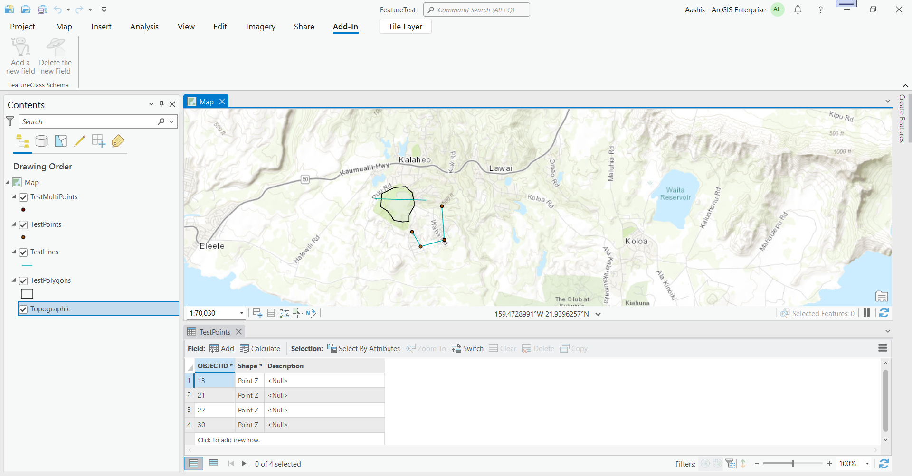
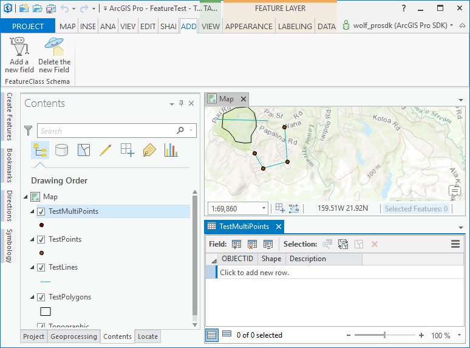
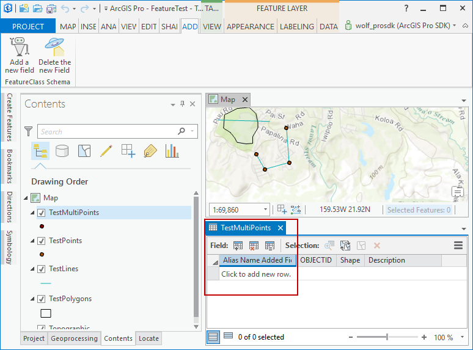
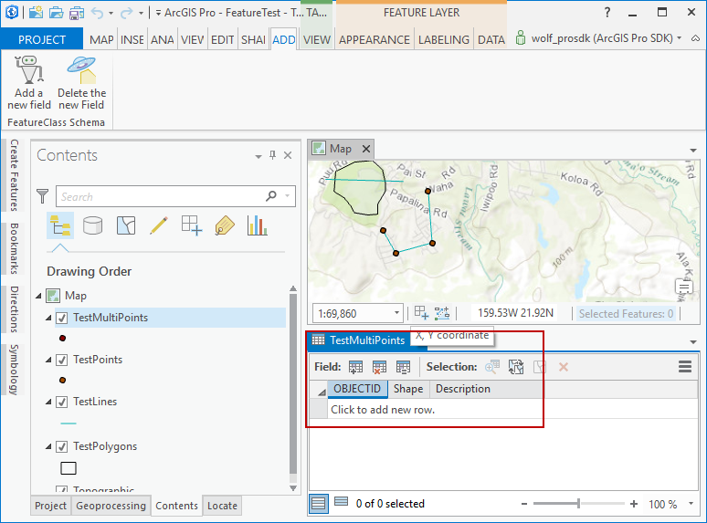

## AddDeleteFieldToFromFeatureClass

<!-- TODO: Write a brief abstract explaining this sample -->
This sample shows how to use Geo Processing to add and remove a fields from a geodatabase.  
  


<a href="https://pro.arcgis.com/en/pro-app/sdk/" target="_blank">View it live</a>

<!-- TODO: Fill this section below with metadata about this sample-->
```
Language:              C#
Subject:               Geodatabase
Contributor:           ArcGIS Pro SDK Team <arcgisprosdk@esri.com>
Organization:          Esri, https://www.esri.com
Date:                  11/04/2024
ArcGIS Pro:            3.4
Visual Studio:         2022
.NET Target Framework: net8.0-windows
```

## Resources

[Community Sample Resources](https://github.com/Esri/arcgis-pro-sdk-community-samples#resources)

### Samples Data

* Sample data for ArcGIS Pro SDK Community Samples can be downloaded from the [Releases](https://github.com/Esri/arcgis-pro-sdk-community-samples/releases) page.  

## How to use the sample
<!-- TODO: Explain how this sample can be used. To use images in this section, create the image file in your sample project's screenshots folder. Use relative url to link to this image using this syntax:  -->
1. Download the Community Sample data (see under the "Resources" section for downloading sample data).  The sample data contains a project called "FeatureTest.aprx" with data suitable for this sample.  Make sure that the Sample data is unzipped in c:\data and "C:\Data\FeatureTest\FeatureTest.aprx" is available.
2. Open this solution in Visual Studio.  
3. Click the build menu and select Build Solution.  
4. Click the Start button to open ArCGIS Pro. ArcGIS Pro will open.    
5. Open the "C:\Data\FeatureTest\FeatureTest.aprx" project.  
6. Open the "Contents Dock Pane" by selecting the View Tab on the Pro ribbon and then clicking the Contents button to open the Contents dock pane".  
7. Click on the Add-in tab and verify that a "FeatureClass Schema" group was added.  
8. Note that the "Add and Delete new field" buttons are disabled as long as no feature layer on the "Contents dock pane" has been selected.  
9. This logic has been implemented in config.daml through the condition="esri_mapping_singleFeatureLayerSelectedCondition" attribute.  
  
10. Open the "Attribute table" for the "TestPoints" layer.  This will later allow you to view schema changes in real time.  
  
11. Note the field names in the attribute table for the "TestPoints" layer.  
12. Click the "Add a new field" button and check that the field "Alias Name Added Field" was added to the attribute table.  
  
13. Click the "Delete the new Field" button and check that the field "Alias Name Added Field" is successfully removed from the attribute table.  
  
  

<!-- End -->

&nbsp;&nbsp;&nbsp;&nbsp;&nbsp;&nbsp;
&nbsp;&nbsp;&nbsp;&nbsp;&nbsp;&nbsp;&nbsp;&nbsp;&nbsp;&nbsp;&nbsp;&nbsp;
[Home](https://github.com/Esri/arcgis-pro-sdk/wiki) | <a href="https://pro.arcgis.com/en/pro-app/latest/sdk/api-reference" target="_blank">API Reference</a> | [Requirements](https://github.com/Esri/arcgis-pro-sdk/wiki#requirements) | [Download](https://github.com/Esri/arcgis-pro-sdk/wiki#installing-arcgis-pro-sdk-for-net) | <a href="https://github.com/esri/arcgis-pro-sdk-community-samples" target="_blank">Samples</a>
