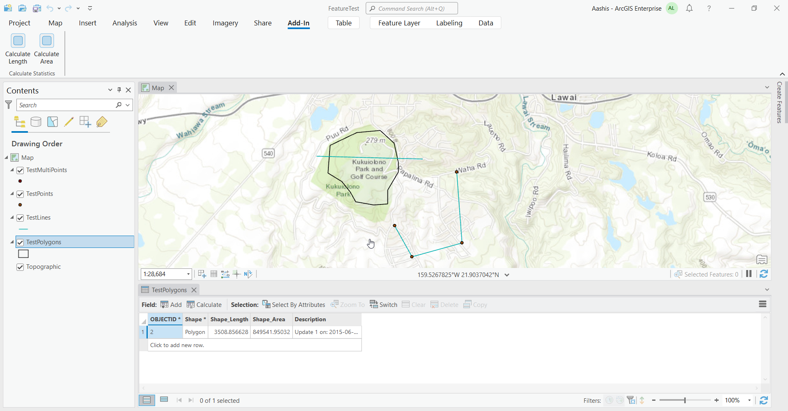
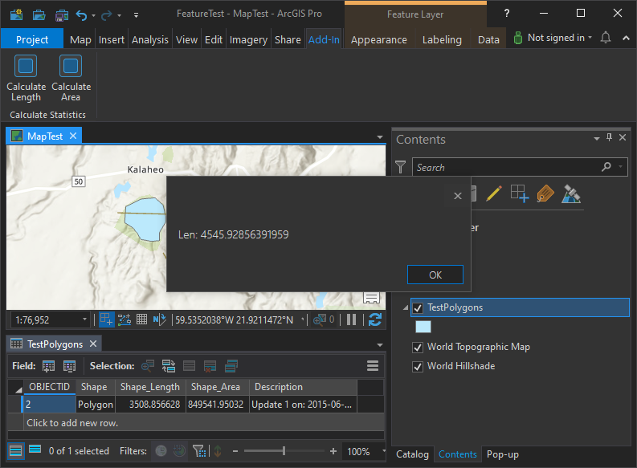
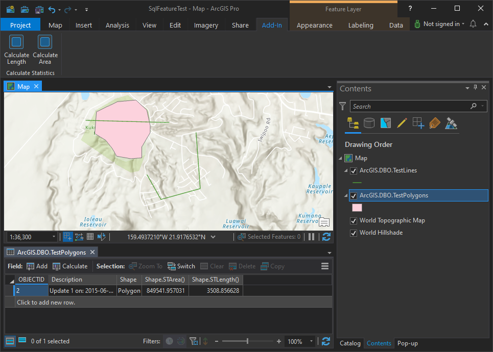
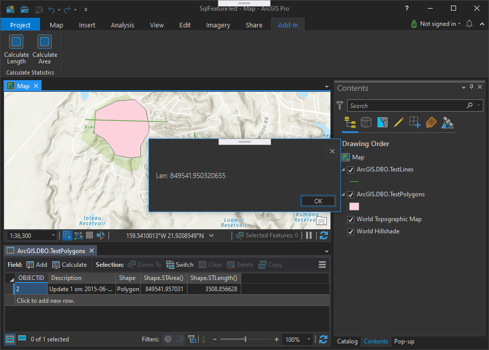

## CalculateStatistics

<!-- TODO: Write a brief abstract explaining this sample -->
This sample illustrates the use of the CalculateStatistics class.  
  


<a href="http://pro.arcgis.com/en/pro-app/sdk/" target="_blank">View it live</a>

<!-- TODO: Fill this section below with metadata about this sample-->
```
Language:              C#
Subject:               Geodatabase
Contributor:           ArcGIS Pro SDK Team <arcgisprosdk@esri.com>
Organization:          Esri, http://www.esri.com
Date:                  7/01/2020
ArcGIS Pro:            2.6
Visual Studio:         2019
.NET Target Framework: 4.8
```

## Resources

* [API Reference online](https://pro.arcgis.com/en/pro-app/sdk/api-reference)
* <a href="https://pro.arcgis.com/en/pro-app/sdk/" target="_blank">ArcGIS Pro SDK for .NET (pro.arcgis.com)</a>
* [arcgis-pro-sdk-community-samples](https://github.com/Esri/arcgis-pro-sdk-community-samples)
* [ArcGIS Pro DAML ID Reference](https://github.com/Esri/arcgis-pro-sdk/wiki/ArcGIS-Pro-DAML-ID-Reference)
* [FAQ](https://github.com/Esri/arcgis-pro-sdk/wiki/FAQ)
* [ArcGIS Pro SDK icons](https://github.com/Esri/arcgis-pro-sdk/releases/tag/2.4.0.19948)


### Samples Data

* Sample data for ArcGIS Pro SDK Community Samples can be downloaded from the [repo releases](https://github.com/Esri/arcgis-pro-sdk-community-samples/releases) page.  

## How to use the sample
<!-- TODO: Explain how this sample can be used. To use images in this section, create the image file in your sample project's screenshots folder. Use relative url to link to this image using this syntax:  -->
1. Download the Community Sample data (see under the 'Resources' section for downloading sample data).  The sample data contains a dataset called 'FeatureTest' with sample data for use by this sample.  Make sure that the Sample data is unzipped in c:\data and "C:\Data\FeatureTest" is available.  
1. In Visual studio click the Build menu. Then select Build Solution.  
1. Click Start button to open ArcGIS Pro.  
1. In ArcGIS Pro open the 'C:\Data\FeatureTest\FeatureTest.aprx' project  
1. Click on the ADD-IN tab which contains the 'Calculate Statistics' group.    
  
  
1. Click on the "Calculate Length" button to calculate the sum of all length field values for all features in the testlines feature layer.  
  
Connect to a SQL Server database and add both TestLines and TestPolygons from the file geodatabase to SQL Server.    
Add a new Map and add the two SQL Server feature layers to the new map  
  
  
1. Click on the "Calculate Area" button to calculate the sum of all area field values for all features in the testPolygon feature layer.  
  
The calculate statistics function is not working properly with release 2.5 and early, so this version contains a workaround that can be used until ArcGIS Pro 2.6 is released.  
  


<!-- End -->

&nbsp;&nbsp;&nbsp;&nbsp;&nbsp;&nbsp;
&nbsp;&nbsp;&nbsp;&nbsp;&nbsp;&nbsp;&nbsp;&nbsp;&nbsp;&nbsp;&nbsp;&nbsp;
[Home](https://github.com/Esri/arcgis-pro-sdk/wiki) | <a href="https://pro.arcgis.com/en/pro-app/sdk/api-reference" target="_blank">API Reference</a> | [Requirements](https://github.com/Esri/arcgis-pro-sdk/wiki#requirements) | [Download](https://github.com/Esri/arcgis-pro-sdk/wiki#installing-arcgis-pro-sdk-for-net) | <a href="https://github.com/esri/arcgis-pro-sdk-community-samples" target="_blank">Samples</a>
