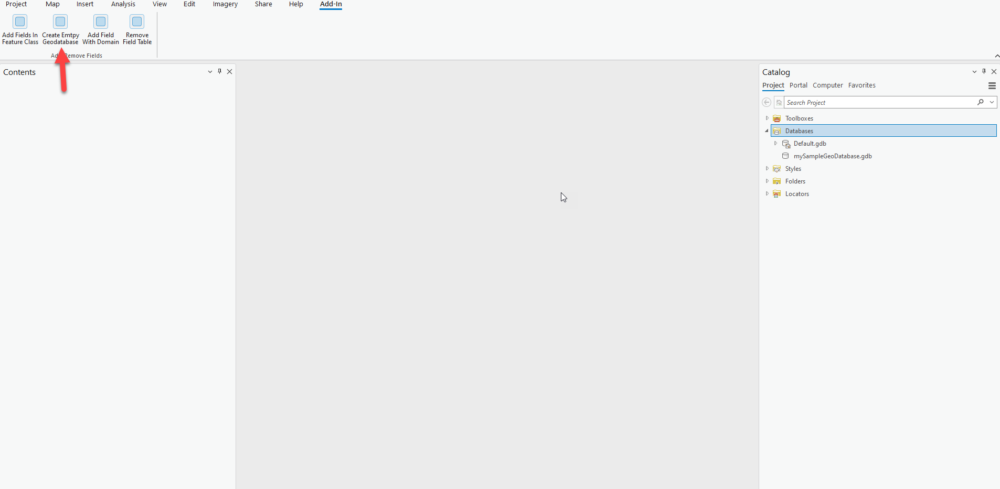
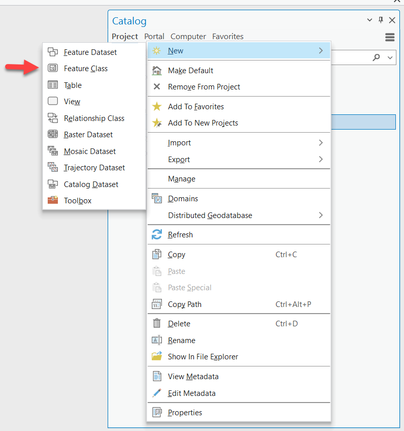
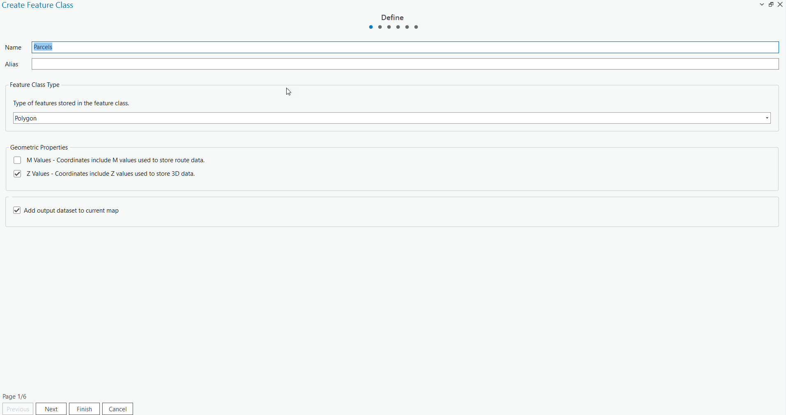
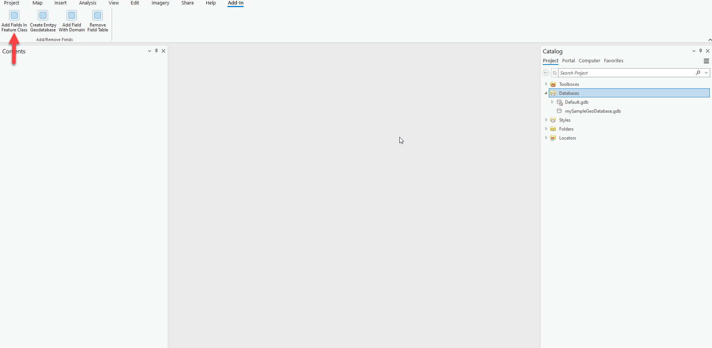
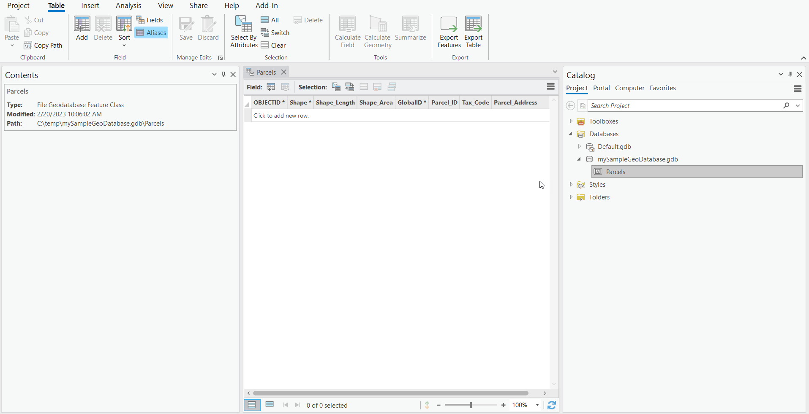
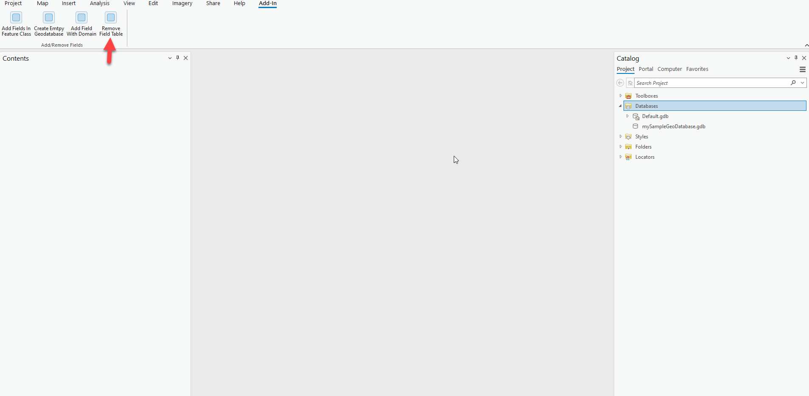
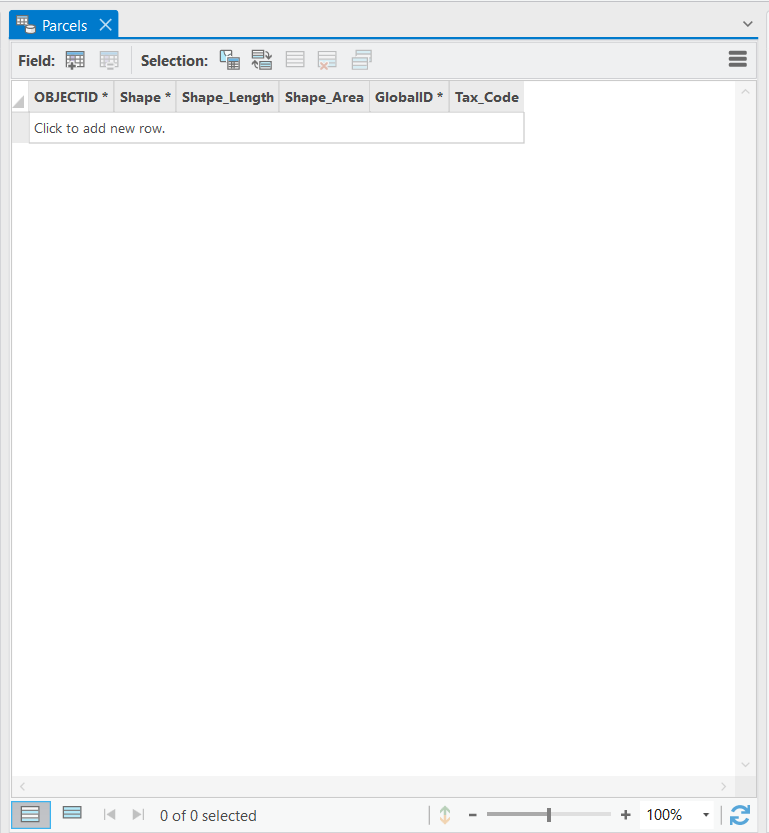
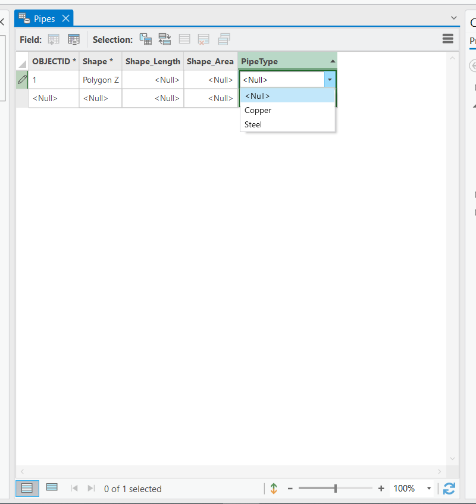

## AddRemoveFields

<!-- TODO: Write a brief abstract explaining this sample -->
This sample shows how to use the DDL APIs to add and remove fields in a FeatureClass.  
  


<a href="https://pro.arcgis.com/en/pro-app/sdk/" target="_blank">View it live</a>

<!-- TODO: Fill this section below with metadata about this sample-->
```
Language:              C#
Subject:               Framework
Contributor:           ArcGIS Pro SDK Team <arcgisprosdk@esri.com>
Organization:          Esri, https://www.esri.com
Date:                  11/04/2024
ArcGIS Pro:            3.4
Visual Studio:         2022
.NET Target Framework: net8.0-windows
```

## Resources

[Community Sample Resources](https://github.com/Esri/arcgis-pro-sdk-community-samples#resources)

### Samples Data

* Sample data for ArcGIS Pro SDK Community Samples can be downloaded from the [Releases](https://github.com/Esri/arcgis-pro-sdk-community-samples/releases) page.  

## How to use the sample
<!-- TODO: Explain how this sample can be used. To use images in this section, create the image file in your sample project's screenshots folder. Use relative url to link to this image using this syntax:  -->
1. Open this solution in Visual Studio.
2. Click the build menu and select Build Solution.    
3. Click the Start button to open ArcGIS Pro. ArcGIS Pro will open.      
4. Open any project.  
5. Click on the Add-in tab and verify that a "Add/Remove Fields" group was added.  
6. Notice the buttons in the "Add/Remove Fields" group.  
7. Tap the "Create Emtpy Geodatabase" button.  
  
8. Add the new Database located in the "C:\temp\mySampleGeoDatabase.gdb" directory into the Catalog pane.  
9. Add a Feature Class to the Geodatabase and name it "Parcels".  
  
10. Tap the finish button to finish adding the new Feature Class  
  
11. Tap the "Add Fields in Feature Class" button.  
  
12. Open the Table for the Parcels Feature Class.  
13. Notice the newly added "Tax_Code" , "Parcel_ID" , "Global_ID" and "Parcel_Address" fields.  
  
14. Tap the "Remove Field Table"  
  
15. Open the Table for the Parcels Feature Class.  
16. Notice the "Parcel_Address" Field has been deleted.  
  
17. Add a new Feature Class named "Pipes",  
18. Tap the "Add Field with Domain" button.  
   
19. Open the table for the "Pipes" Feature Class.  
  
20. Notice the domains of the "Pipe Type" field.  
  

<!-- End -->

&nbsp;&nbsp;&nbsp;&nbsp;&nbsp;&nbsp;
&nbsp;&nbsp;&nbsp;&nbsp;&nbsp;&nbsp;&nbsp;&nbsp;&nbsp;&nbsp;&nbsp;&nbsp;
[Home](https://github.com/Esri/arcgis-pro-sdk/wiki) | <a href="https://pro.arcgis.com/en/pro-app/latest/sdk/api-reference" target="_blank">API Reference</a> | [Requirements](https://github.com/Esri/arcgis-pro-sdk/wiki#requirements) | [Download](https://github.com/Esri/arcgis-pro-sdk/wiki#installing-arcgis-pro-sdk-for-net) | <a href="https://github.com/esri/arcgis-pro-sdk-community-samples" target="_blank">Samples</a>
