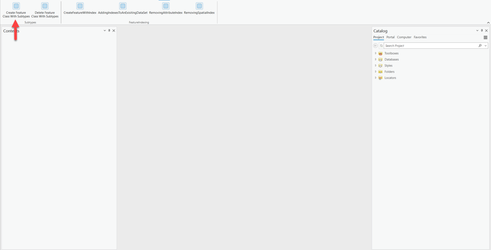
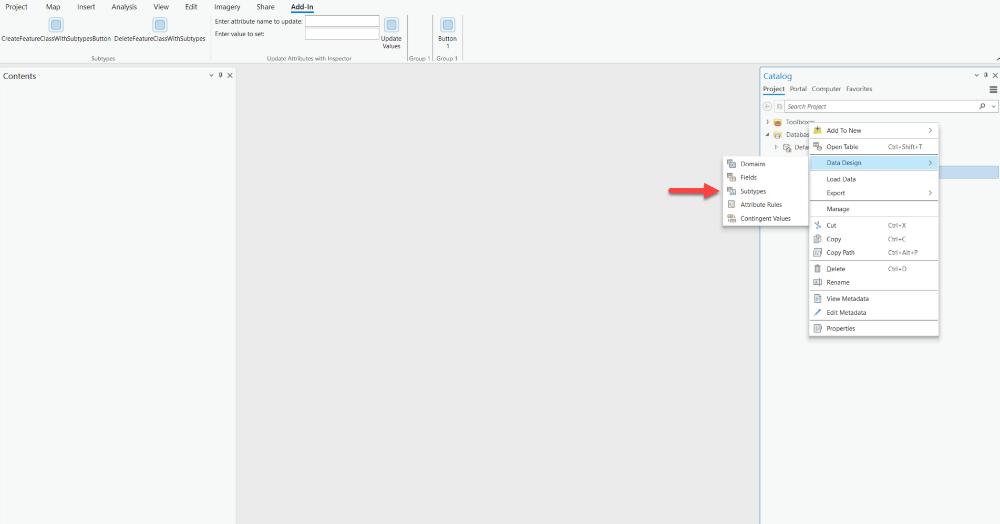
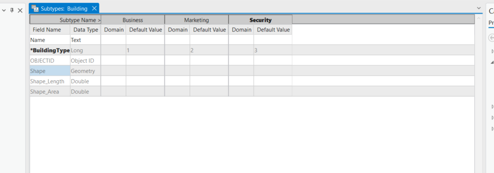
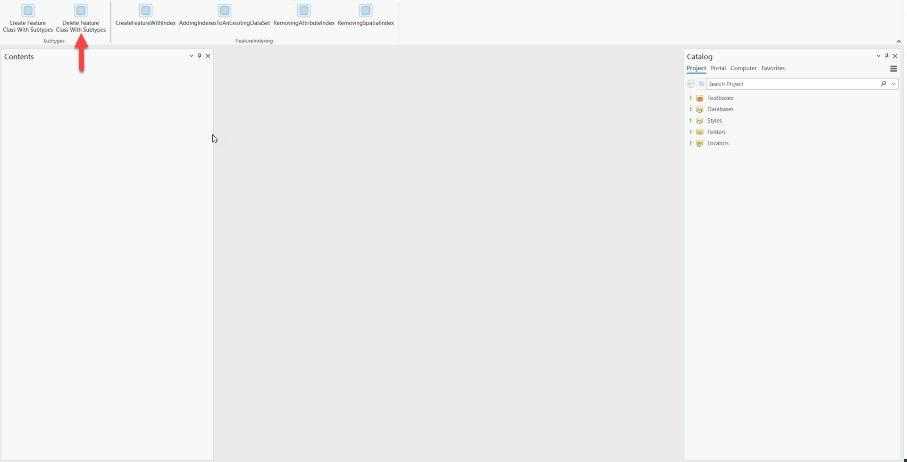
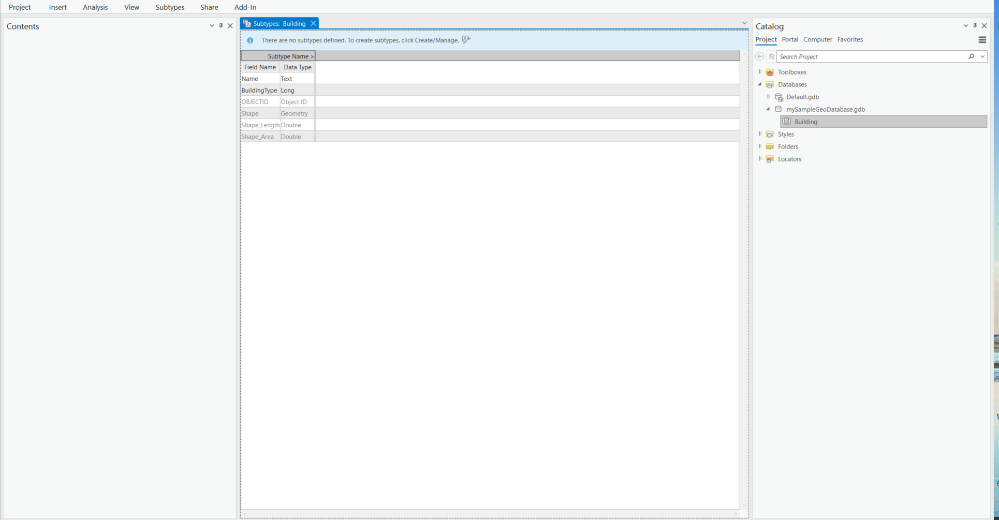

## DDLCreateDeleteFeatureClassWithSubtypes

<!-- TODO: Write a brief abstract explaining this sample -->
This sample shows how to use the DDL APIs to create a feature class with subtypes and delete them in a file geodatabase.    
  


<a href="https://pro.arcgis.com/en/pro-app/sdk/" target="_blank">View it live</a>

<!-- TODO: Fill this section below with metadata about this sample-->
```
Language:              C#
Subject:               Framework
Contributor:           ArcGIS Pro SDK Team <arcgisprosdk@esri.com>
Organization:          Esri, https://www.esri.com
Date:                  10/01/2023
ArcGIS Pro:            3.2
Visual Studio:         2022
.NET Target Framework: net6.0-windows
```

## Resources

[Community Sample Resources](https://github.com/Esri/arcgis-pro-sdk-community-samples#resources)

### Samples Data

* Sample data for ArcGIS Pro SDK Community Samples can be downloaded from the [Releases](https://github.com/Esri/arcgis-pro-sdk-community-samples/releases) page.  

## How to use the sample
<!-- TODO: Explain how this sample can be used. To use images in this section, create the image file in your sample project's screenshots folder. Use relative url to link to this image using this syntax:  -->
Using the sample:  
  
1. Open this solution in Visual Studio.
2. Click the build menu and select Build Solution.    
3. Click the Start button to open ArCGIS Pro. ArcGIS Pro will open.      
4. Open any project.  
5. Click on the Add-in tab and verify that a "Subtypes" group was added.  
6. Notice the buttons in the Subtype group.  
7. Tap the "CreateFeatureClassWithSubtypeButton"  
  
8. Add the new Database into the Catalog pane.  
    
9. Expand the newly added database.  
10. Right click on the "Building" Feature class.  
11. Open the subtypes menu  
    
12. Notice the subtypes.  
  
13. Tap the "DeleteFeatureClassWithSubtypeButton"  
    
14. Refresh the database  
15. Right click on the "Building" Feature class.  
16. Open the subtypes menu  
   
17. Notice the subtypes have been deleted.  
  
  

<!-- End -->

&nbsp;&nbsp;&nbsp;&nbsp;&nbsp;&nbsp;
&nbsp;&nbsp;&nbsp;&nbsp;&nbsp;&nbsp;&nbsp;&nbsp;&nbsp;&nbsp;&nbsp;&nbsp;
[Home](https://github.com/Esri/arcgis-pro-sdk/wiki) | <a href="https://pro.arcgis.com/en/pro-app/latest/sdk/api-reference" target="_blank">API Reference</a> | [Requirements](https://github.com/Esri/arcgis-pro-sdk/wiki#requirements) | [Download](https://github.com/Esri/arcgis-pro-sdk/wiki#installing-arcgis-pro-sdk-for-net) | <a href="https://github.com/esri/arcgis-pro-sdk-community-samples" target="_blank">Samples</a>
