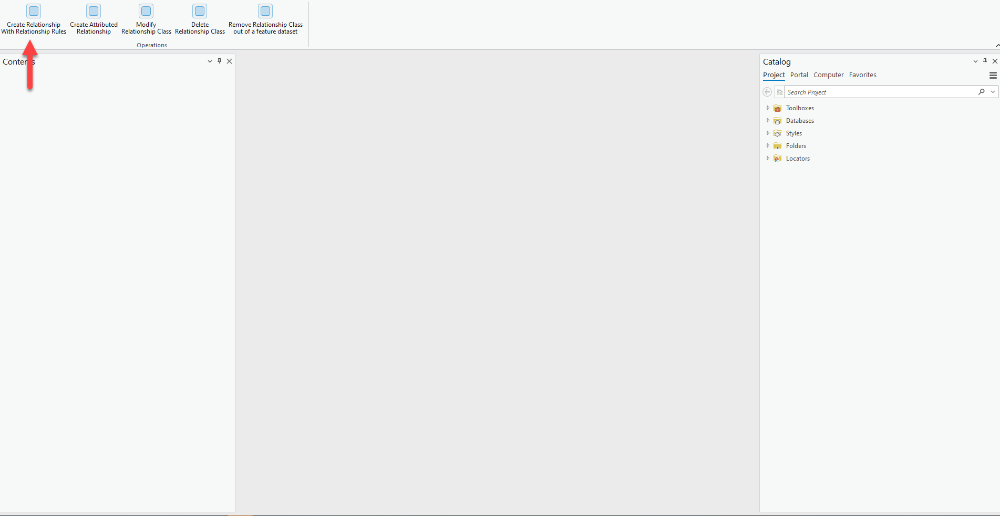
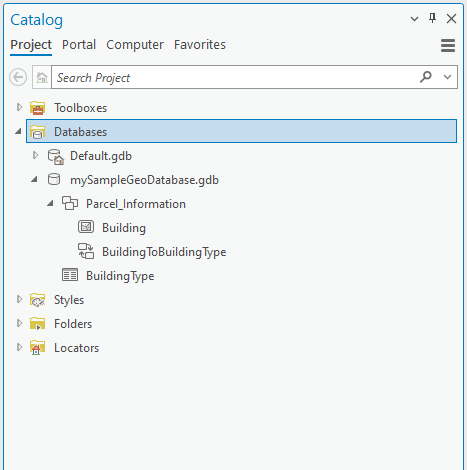
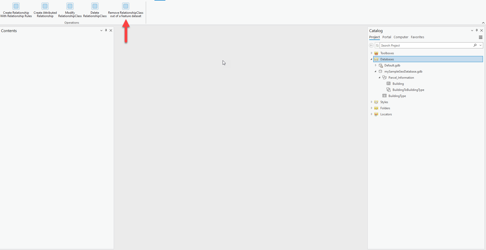
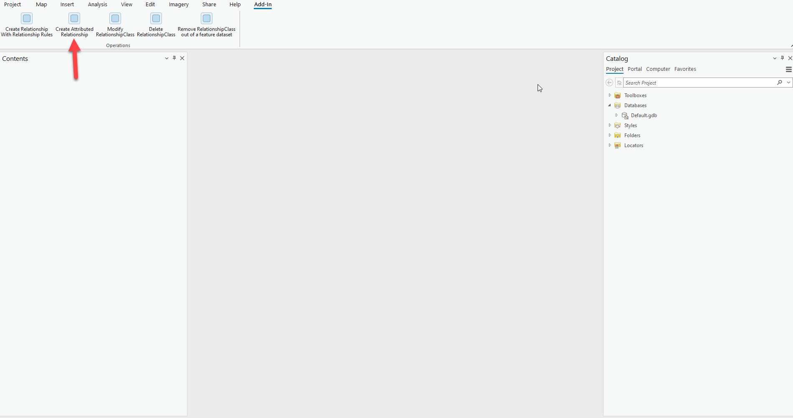
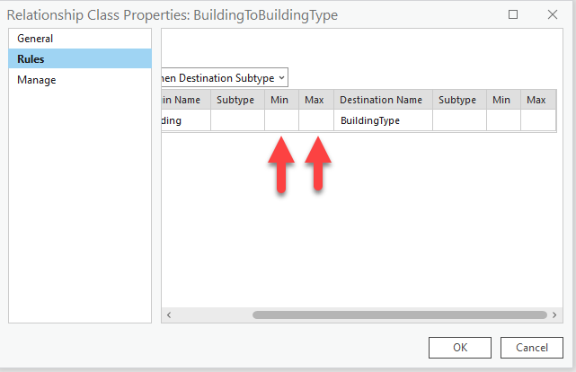
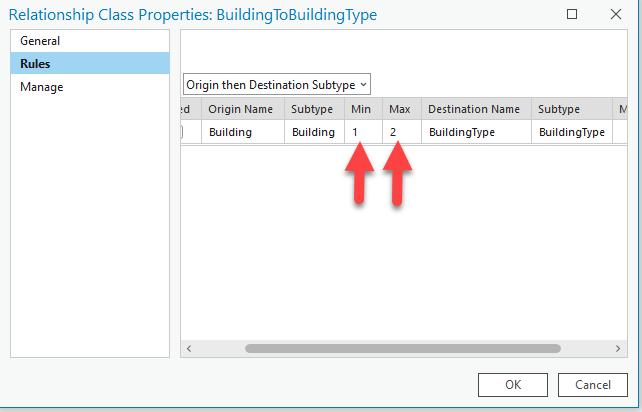
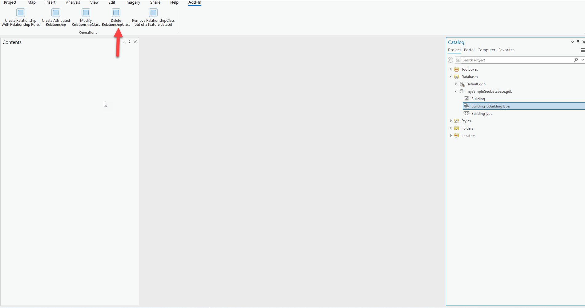

## DDLCreateDeleteRelationshipClass

<!-- TODO: Write a brief abstract explaining this sample -->
This sample illustrates how to use the DDL APIs to create and delete relationship classes and move a relationship class in and out of a feature data set.  
  


<a href="https://pro.arcgis.com/en/pro-app/sdk/" target="_blank">View it live</a>

<!-- TODO: Fill this section below with metadata about this sample-->
```
Language:              C#
Subject:               Framework
Contributor:           ArcGIS Pro SDK Team <arcgisprosdk@esri.com>
Organization:          Esri, https://www.esri.com
Date:                  05/06/2025
ArcGIS Pro:            3.5
Visual Studio:         2022
.NET Target Framework: net8.0-windows
```

## Resources

[Community Sample Resources](https://github.com/Esri/arcgis-pro-sdk-community-samples#resources)

### Samples Data

* Sample data for ArcGIS Pro SDK Community Samples can be downloaded from the [Releases](https://github.com/Esri/arcgis-pro-sdk-community-samples/releases) page.  

## How to use the sample
<!-- TODO: Explain how this sample can be used. To use images in this section, create the image file in your sample project's screenshots folder. Use relative url to link to this image using this syntax:  -->
1. Open this solution in Visual Studio.
2. Click the build menu and select Build Solution.  
3. Click the Start button to open ArCGIS Pro. ArcGIS Pro will open.      
4. Open any project.  
5. Click on the Add-in tab and verify that a "Operations" group was added.  
6. Notice the buttons in the "Operations" group.  
7. Tap the "Create Relationship with Relationship Rules" button.  
  
8. Add the new Database into the Catalog pane.  
    
9. Notice the structure of the data.  
10. In order to move the "BuildingToBuildingType" RelationshipClass out of the FeatureDataSet ,"Parcel_Information", and into the root we tap on the "Remove RelationshipClass out of feature dataset" button  
  
11. Notice the "BuildingToBuildingType" is in the root of the "mySampleGeoDatabase.gdb".  
    
12. Delete the "mySampleGeoDatabase.gdb"  
13. Tap on the "Create Atrributed Relationship" button   
   
14. Add the new Database into the Catalog pane.  
15. Right click on "BuildingToBuildingType", select properties, then select Rules.Notice the Min and Max values are blank.  
  
16. Tap the "Modify RelationshipClass" button  
    
17.Right click on "BuildingToBuildingType", select properties, then select Rules.Notice the Min and Max values are no longer blank.  
18.Tap the "Delete RelationshipClass" button  
  
19.Refresh the Database.  
20. Notice "BuildingToBuildingType" has been deleted.  
  

<!-- End -->

&nbsp;&nbsp;&nbsp;&nbsp;&nbsp;&nbsp;
&nbsp;&nbsp;&nbsp;&nbsp;&nbsp;&nbsp;&nbsp;&nbsp;&nbsp;&nbsp;&nbsp;&nbsp;
[Home](https://github.com/Esri/arcgis-pro-sdk/wiki) | <a href="https://pro.arcgis.com/en/pro-app/latest/sdk/api-reference" target="_blank">API Reference</a> | [Requirements](https://github.com/Esri/arcgis-pro-sdk/wiki#requirements) | [Download](https://github.com/Esri/arcgis-pro-sdk/wiki#installing-arcgis-pro-sdk-for-net) | <a href="https://github.com/esri/arcgis-pro-sdk-community-samples" target="_blank">Samples</a>
