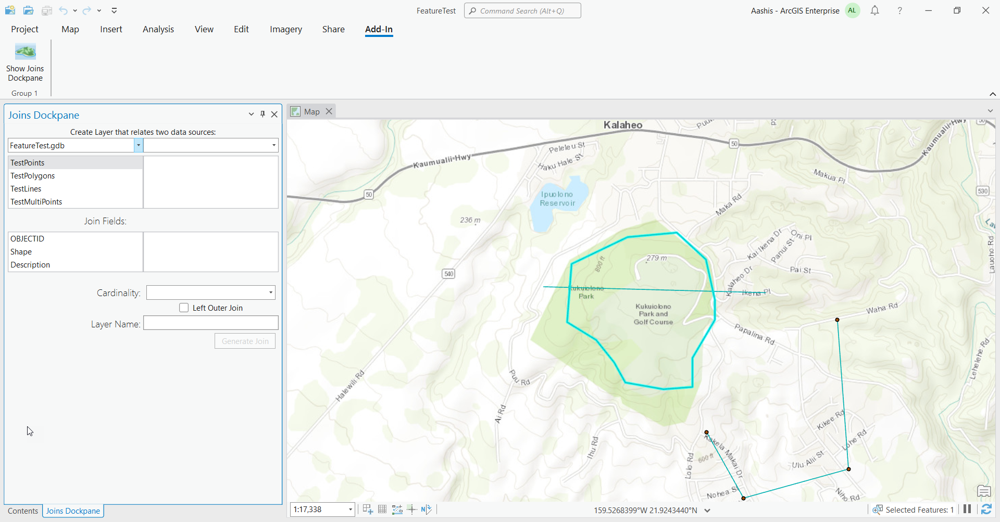
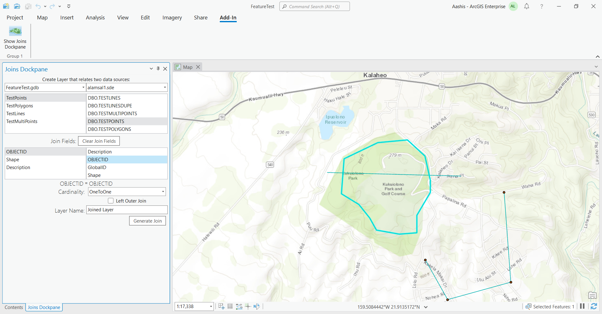
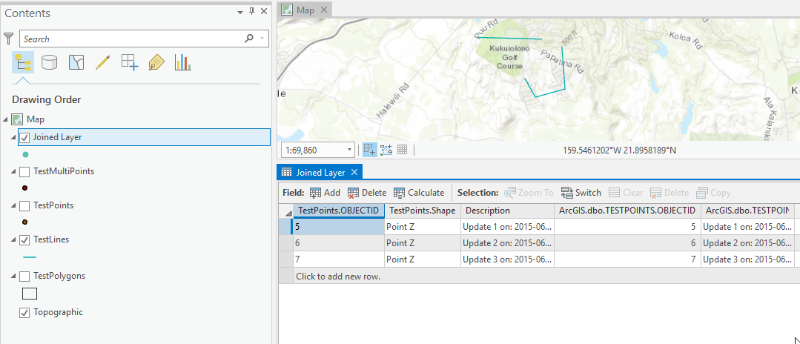

## DynamicJoins

<!-- TODO: Write a brief abstract explaining this sample -->
This sample illustrates the use of dynamic joins of tables and feature classes.  
  


<a href="https://pro.arcgis.com/en/pro-app/sdk/" target="_blank">View it live</a>

<!-- TODO: Fill this section below with metadata about this sample-->
```
Language:              C#
Subject:               Geodatabase
Contributor:           ArcGIS Pro SDK Team <arcgisprosdk@esri.com>
Organization:          Esri, https://www.esri.com
Date:                  11/04/2024
ArcGIS Pro:            3.4
Visual Studio:         2022
.NET Target Framework: net8.0-windows
```

## Resources

[Community Sample Resources](https://github.com/Esri/arcgis-pro-sdk-community-samples#resources)

### Samples Data

* Sample data for ArcGIS Pro SDK Community Samples can be downloaded from the [Releases](https://github.com/Esri/arcgis-pro-sdk-community-samples/releases) page.  

## How to use the sample
<!-- TODO: Explain how this sample can be used. To use images in this section, create the image file in your sample project's screenshots folder. Use relative url to link to this image using this syntax:  -->
1. This solution is using the **Newtonsoft.Json NuGet**.  If needed, you can install the NuGet from the "NuGet Package Manager Console" by using this script: "Install-Package Newtonsoft.Json".
2. This solution is using the **Expression.Interaction NuGet**.  If needed, you can install the NuGet from the "NuGet Package Manager Console" by using this script: "Install-Package Expression.Interaction".  
3. In Visual studio click the Build menu. Then select Build Solution.  
4. Click Start button to open ArcGIS Pro.  
5. ArcGIS Pro will open, select any project  
6. Open the Add-in tab and click the "Show Joins Dockpane" button to open "Joins" dockpane.  
  
7. Select two data sources to join  
8. select the Join fields  
  
9. Define remaining options including layer name  
10. Click the "Generate Join" button to create the layer  
11. Open the new layer's attribute table to view the join result.  
  
  

<!-- End -->

&nbsp;&nbsp;&nbsp;&nbsp;&nbsp;&nbsp;
&nbsp;&nbsp;&nbsp;&nbsp;&nbsp;&nbsp;&nbsp;&nbsp;&nbsp;&nbsp;&nbsp;&nbsp;
[Home](https://github.com/Esri/arcgis-pro-sdk/wiki) | <a href="https://pro.arcgis.com/en/pro-app/latest/sdk/api-reference" target="_blank">API Reference</a> | [Requirements](https://github.com/Esri/arcgis-pro-sdk/wiki#requirements) | [Download](https://github.com/Esri/arcgis-pro-sdk/wiki#installing-arcgis-pro-sdk-for-net) | <a href="https://github.com/esri/arcgis-pro-sdk-community-samples" target="_blank">Samples</a>
