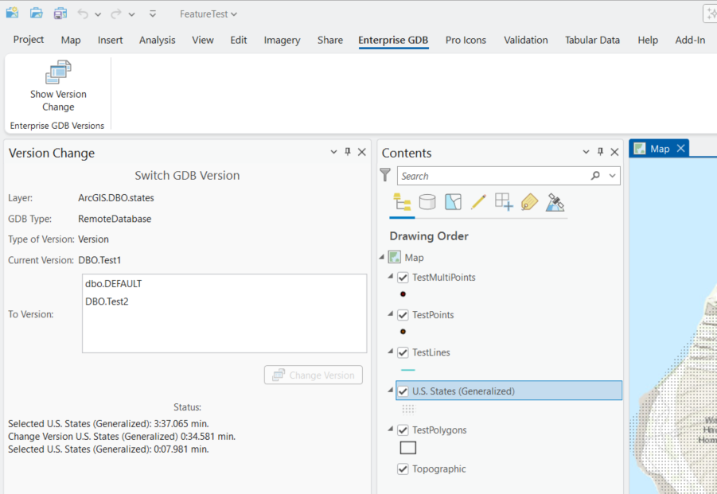

## EnterpriseGDBVersionChange

<!-- TODO: Write a brief abstract explaining this sample -->
This sample illustrates how to switch versions for an Enterprise Geodatabase connection.  
  


<a href="https://pro.arcgis.com/en/pro-app/sdk/" target="_blank">View it live</a>

<!-- TODO: Fill this section below with metadata about this sample-->
```
Language:              C#
Subject:               Framework
Contributor:           ArcGIS Pro SDK Team <arcgisprosdk@esri.com>
Organization:          Esri, https://www.esri.com
Date:                  05/06/2025
ArcGIS Pro:            3.5
Visual Studio:         2022
.NET Target Framework: net8.0-windows
```

## Resources

[Community Sample Resources](https://github.com/Esri/arcgis-pro-sdk-community-samples#resources)

### Samples Data

* Sample data for ArcGIS Pro SDK Community Samples can be downloaded from the [Releases](https://github.com/Esri/arcgis-pro-sdk-community-samples/releases) page.  

## How to use the sample
<!-- TODO: Explain how this sample can be used. To use images in this section, create the image file in your sample project's screenshots folder. Use relative url to link to this image using this syntax:  -->
1. Open this solution in Visual Studio.
2. Click the build menu and select Build Solution.  
3. Launch the debugger to open ArCGIS Pro.  
4. Open any project "that contains a map with an Enterprise Geodatabase connection".  
5. Open the "Enterprise GDB" tab on the Pro ribbon  
6. Click on the "Show Version Change" button to open the "Switch GDB Version" dockpane.  
  
7. Select any feature class with an Enterprise Geodatabase connection from the map's TOC.  
8. The "Switch GDB Version" dockpane is updated with the selected feature class's version information.  
9. Select a version from the drop-down list as the 'Switch To' version.  
10. Click the "Switch Version" button to switch the selected feature class to the selected "To version".  
  

<!-- End -->

&nbsp;&nbsp;&nbsp;&nbsp;&nbsp;&nbsp;
&nbsp;&nbsp;&nbsp;&nbsp;&nbsp;&nbsp;&nbsp;&nbsp;&nbsp;&nbsp;&nbsp;&nbsp;
[Home](https://github.com/Esri/arcgis-pro-sdk/wiki) | <a href="https://pro.arcgis.com/en/pro-app/latest/sdk/api-reference" target="_blank">API Reference</a> | [Requirements](https://github.com/Esri/arcgis-pro-sdk/wiki#requirements) | [Download](https://github.com/Esri/arcgis-pro-sdk/wiki#installing-arcgis-pro-sdk-for-net) | <a href="https://github.com/esri/arcgis-pro-sdk-community-samples" target="_blank">Samples</a>
