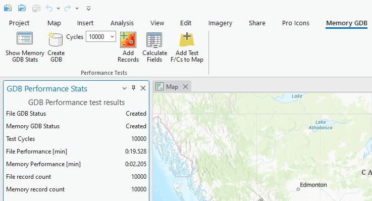
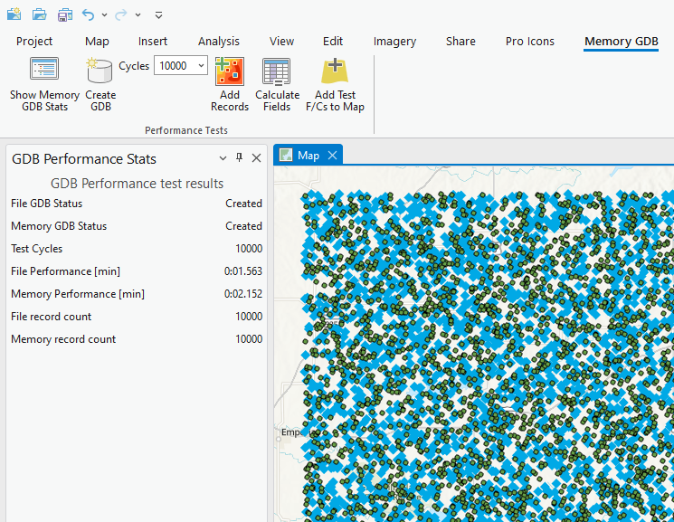

## MemoryGeodatabase

<!-- TODO: Write a brief abstract explaining this sample -->
This sample shows how to create create a memory Geodatabase and then compares the performances of a Memory GDB Point Feature class with a File GDB Point Feature class.  
  


<a href="https://pro.arcgis.com/en/pro-app/sdk/" target="_blank">View it live</a>

<!-- TODO: Fill this section below with metadata about this sample-->
```
Language:              C#
Subject:               Framework
Contributor:           ArcGIS Pro SDK Team <arcgisprosdk@esri.com>
Organization:          Esri, https://www.esri.com
Date:                  05/06/2025
ArcGIS Pro:            3.5
Visual Studio:         2022
.NET Target Framework: net8.0-windows
```

## Resources

[Community Sample Resources](https://github.com/Esri/arcgis-pro-sdk-community-samples#resources)

### Samples Data

* Sample data for ArcGIS Pro SDK Community Samples can be downloaded from the [Releases](https://github.com/Esri/arcgis-pro-sdk-community-samples/releases) page.  

## How to use the sample
<!-- TODO: Explain how this sample can be used. To use images in this section, create the image file in your sample project's screenshots folder. Use relative url to link to this image using this syntax:  -->
1. In Visual studio rebuild the solution.
2. Debug the add-in.  
3. ArcGIS Pro opens, create a new Map project using the Map template.  
4. Click the "Show Memory GDB Stats" button to show the "GDB Performance Stats" dockpane.   
5. Click the "Create GDB" button to show create a memory and add a Test Point feature class to both the Memory GDB and the default File GDB.  
6. Click the "Add Records" button to add "Cycle" number of records to both File and Memory Test Feature Classes.  
7. See the Perfomance stats on the dockpane  
  
8. Click the "Calculate Fields" button to update all records in both File and Memory Test Feature Classes.   
  
9. Click the "Add Test F/Cs to Map" button to add the Test Feature classes to the map.  
  

<!-- End -->

&nbsp;&nbsp;&nbsp;&nbsp;&nbsp;&nbsp;
&nbsp;&nbsp;&nbsp;&nbsp;&nbsp;&nbsp;&nbsp;&nbsp;&nbsp;&nbsp;&nbsp;&nbsp;
[Home](https://github.com/Esri/arcgis-pro-sdk/wiki) | <a href="https://pro.arcgis.com/en/pro-app/latest/sdk/api-reference" target="_blank">API Reference</a> | [Requirements](https://github.com/Esri/arcgis-pro-sdk/wiki#requirements) | [Download](https://github.com/Esri/arcgis-pro-sdk/wiki#installing-arcgis-pro-sdk-for-net) | <a href="https://github.com/esri/arcgis-pro-sdk-community-samples" target="_blank">Samples</a>
