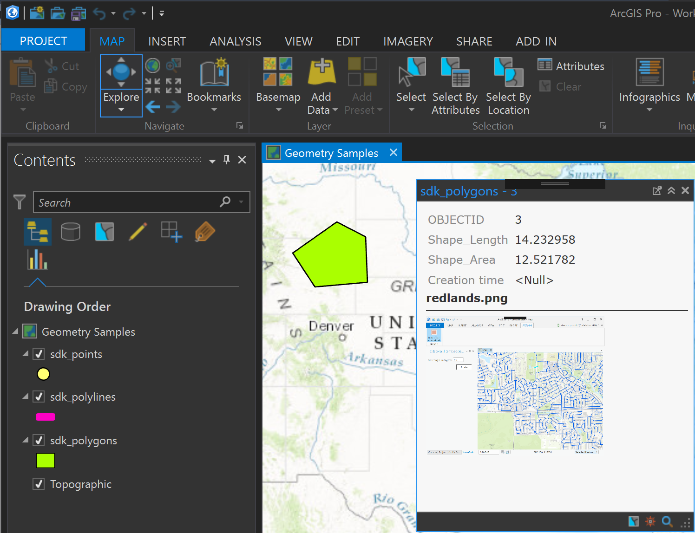
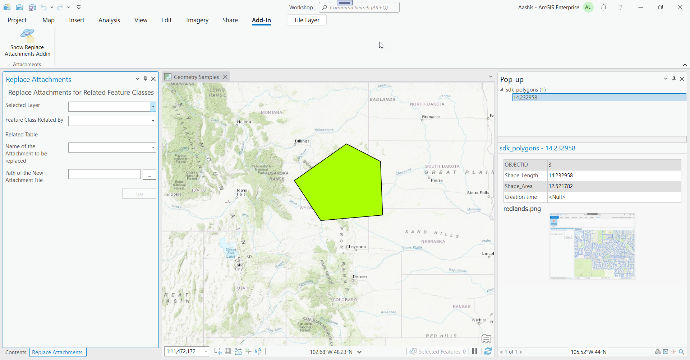
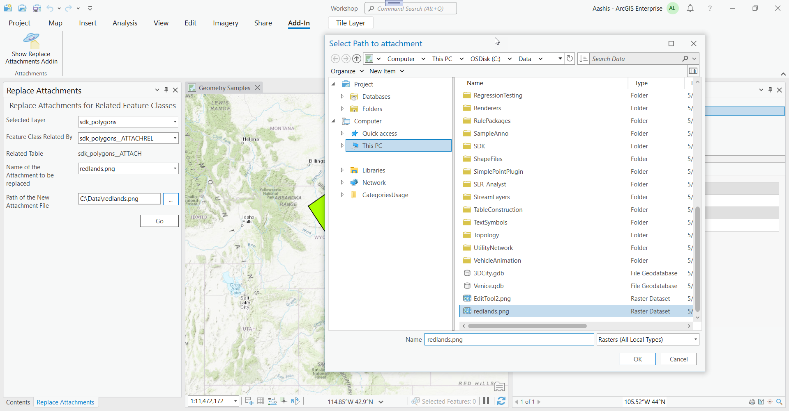
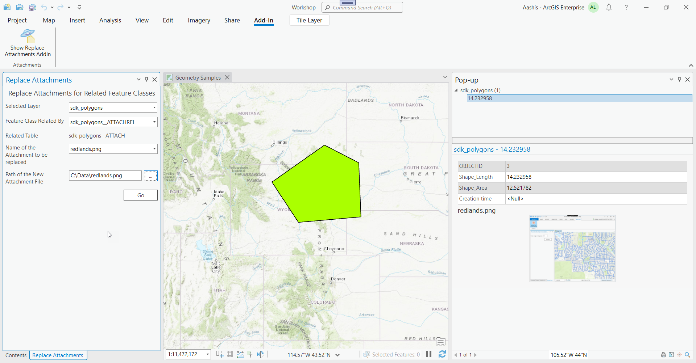
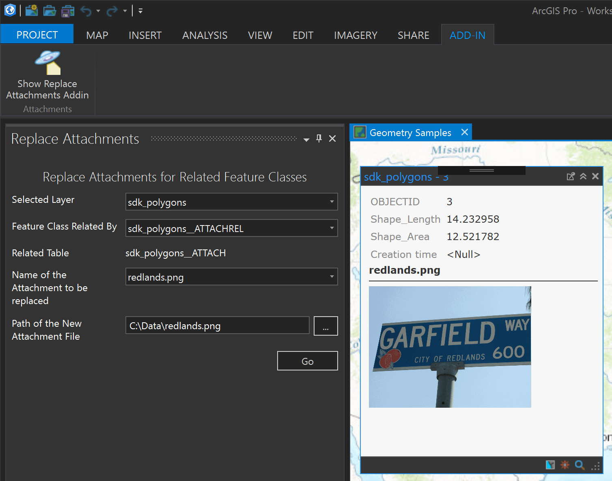

## ReplaceAttachments

<!-- TODO: Write a brief abstract explaining this sample -->
This is a sample to update attachments with a given name with new attachment data, in all Tables/FeatureClasses  related to the Table/FeatureClass associated with the layer selected  
  


<a href="http://pro.arcgis.com/en/pro-app/sdk/" target="_blank">View it live</a>

<!-- TODO: Fill this section below with metadata about this sample-->
```
Language:              C#
Subject:               Geodatabase
Contributor:           ArcGIS Pro SDK Team <arcgisprosdk@esri.com>
Organization:          Esri, http://www.esri.com
Date:                  4/20/2017
ArcGIS Pro:            2.0
Visual Studio:         2015, 2017
.NET Target Framework: 4.6.1
```

## Resources

* [API Reference online](http://pro.arcgis.com/en/pro-app/sdk/api-reference)
* <a href="http://pro.arcgis.com/en/pro-app/sdk/" target="_blank">ArcGIS Pro SDK for .NET (pro.arcgis.com)</a>
* [arcgis-pro-sdk-community-samples](http://github.com/Esri/arcgis-pro-sdk-community-samples)
* [ArcGISPro Registry Keys](http://github.com/Esri/arcgis-pro-sdk/wiki/ArcGIS-Pro-Registry-Keys)
* [FAQ](http://github.com/Esri/arcgis-pro-sdk/wiki/FAQ)
* [ArcGIS Pro SDK icons](https://github.com/Esri/arcgis-pro-sdk/releases/tag/1.4.0.7198)
* [ProConcepts: ArcGIS Pro Add in Samples](https://github.com/Esri/arcgis-pro-sdk-community-samples/wiki/ProConcepts-ArcGIS-Pro-Add-in-Samples)


### Samples Data

* Sample data for ArcGIS Pro SDK Community Samples can be downloaded from the [repo releases](https://github.com/Esri/arcgis-pro-sdk-community-samples/releases) page.  

## How to use the sample
<!-- TODO: Explain how this sample can be used. To use images in this section, create the image file in your sample project's screenshots folder. Use relative url to link to this image using this syntax:  -->
      
  
1. Download the Community Sample data (see under the 'Resources' section for downloading sample data).  The sample data contains a folder called 'C:\Data\Working with Core Geometry and Data' with sample data required for this solution.  Make sure that the Sample data is unzipped in c:\data and "C:\Data\Working with Core Geometry and Data" is available.  
1. In Visual Studio 2015 click the Build menu. Then select Build Solution.  
1. Click Start button to debug ArcGIS Pro.  
1. In ArcGIS Pro open the Project called "Workshop.aprx" in the "C:\Data\Working with Core Geometry and Data" folder.  This project and data is required because it contains data that is attachment enabled.  
1. Use the ArcGIS Pro "Explore" button and identify the polygon overlaying part of Wyoming.   
  
  
1. Note the attachment called 'redlands.png' which is displayed below the tabular data in the identify layer popup.  
1. Click the 'Show Replace Attachments Addin' button to show the "Replace Attachments" dockpane.  
  
  
1. Use the pull-downs on the "Replace Attachments" dockpane to make selections as shown on the screen below.  
  
  
1. Click on the "File Selection" Button on the right of "Path of the New Attachment File" and select the image file "c:\data\Redlands.png"  
  
  
1. Click the "Go" button to replace all attachments of the given name with the new attachment data.  
1. Use the ArcGIS Pro "Explore" button and identify the polygon   
1. Note the changed attachment  
  
  


<!-- End -->

&nbsp;&nbsp;&nbsp;&nbsp;&nbsp;&nbsp;
&nbsp;&nbsp;&nbsp;&nbsp;&nbsp;&nbsp;&nbsp;&nbsp;&nbsp;&nbsp;&nbsp;&nbsp;
[Home](https://github.com/Esri/arcgis-pro-sdk/wiki) | <a href="http://pro.arcgis.com/en/pro-app/sdk/api-reference" target="_blank">API Reference</a> | [Requirements](https://github.com/Esri/arcgis-pro-sdk/wiki#requirements) | [Download](https://github.com/Esri/arcgis-pro-sdk/wiki#installing-arcgis-pro-sdk-for-net) | <a href="http://github.com/esri/arcgis-pro-sdk-community-samples" target="_blank">Samples</a>
