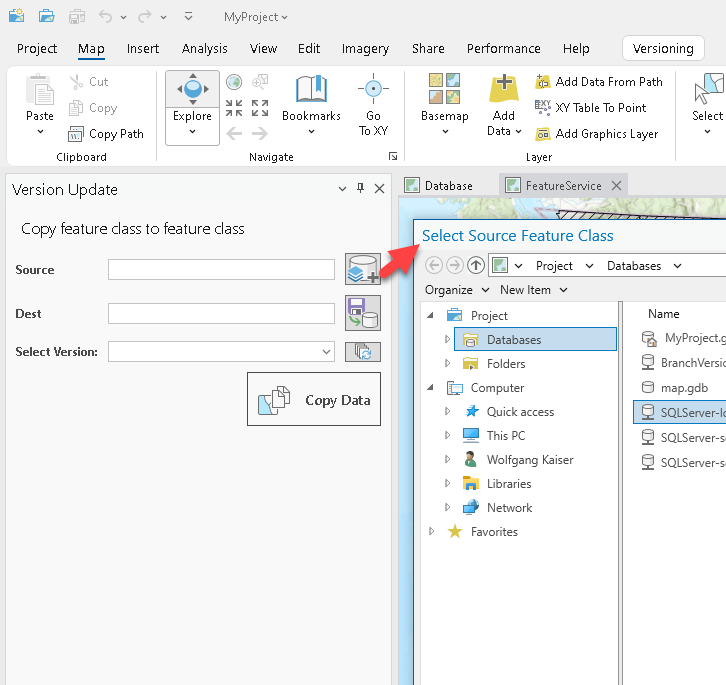
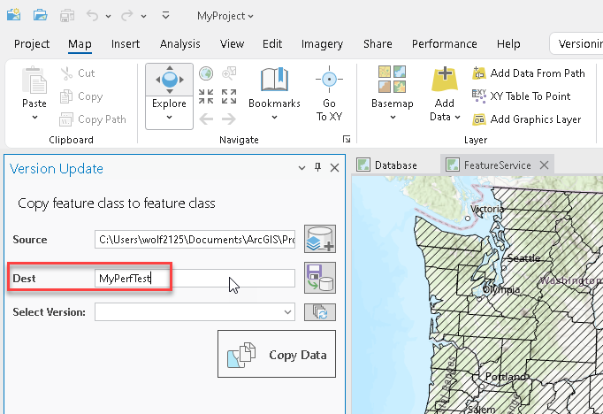
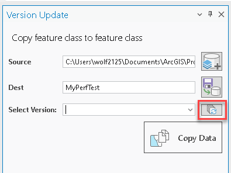
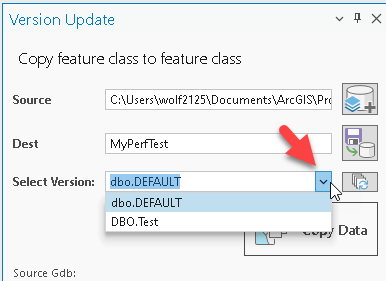
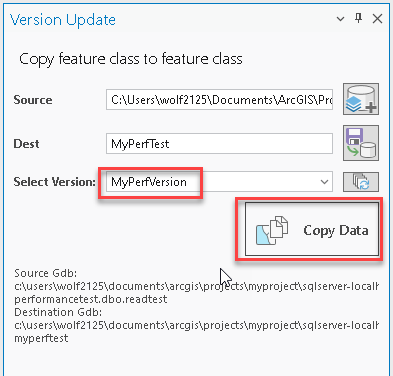
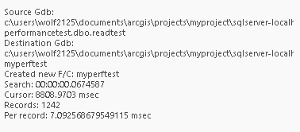

## VersionUpdatePerformance

<!-- TODO: Write a brief abstract explaining this sample -->
This sample exercises the update performance to Enterprise Geodatabases.  The updates can be measured against version updates and default version updates.  
  


<a href="https://pro.arcgis.com/en/pro-app/sdk/" target="_blank">View it live</a>

<!-- TODO: Fill this section below with metadata about this sample-->
```
Language:              C#
Subject:               Framework
Contributor:           ArcGIS Pro SDK Team <arcgisprosdk@esri.com>
Organization:          Esri, https://www.esri.com
Date:                  11/04/2024
ArcGIS Pro:            3.4
Visual Studio:         2022
.NET Target Framework: net8.0-windows
```

## Resources

[Community Sample Resources](https://github.com/Esri/arcgis-pro-sdk-community-samples#resources)

### Samples Data

* Sample data for ArcGIS Pro SDK Community Samples can be downloaded from the [Releases](https://github.com/Esri/arcgis-pro-sdk-community-samples/releases) page.  

## How to use the sample
<!-- TODO: Explain how this sample can be used. To use images in this section, create the image file in your sample project's screenshots folder. Use relative url to link to this image using this syntax:  -->
1. This sample requires an ArcGIS Pro project with a connection file to an Enterprise Geodatabase (.SDE).  When running the performance test the test will create a copy of a source feature class, so 'create' level access is required.
2. In Visual Studio click the Build menu. Then select Build Solution.  
3. Launch the debugger to open ArcGIS Pro.  
4. ArcGIS Pro opens, open an aprx project that allows you to connect to an Enterprise Geodatabase  
5. Click on the 'Performance' tab on the ArcGIS Pro ribbon and click the 'Update /w Versions' button to open the 'Version Update' dockpane.  
6. Click the 'Select the Feature Class Source' button and select an Enterprise Connection file from on the popup dialog, the select a suitable test Feature Class (note that all features from this feature class will be copied for the performance test).  
  
7. Enter a name for a new destination Feature class.  The destination will use the source's Enterprise Geodatabase connection and if the destination doesn't exist the schema of the source is used to create the destination Feature Class.  
  
8. In order to select a specific version for your test you have to click the 'Version Refresh' first.  
  
9. After using the 'Version Refresh' button use the version drop-down to select an existing version to perform the performance test, or enter a new version name to create a new version.  
  
10. Click the 'Copy' button to start the performance test.  
  
11. Performance Stats are displayed in this text box:  
  
  

<!-- End -->

&nbsp;&nbsp;&nbsp;&nbsp;&nbsp;&nbsp;
&nbsp;&nbsp;&nbsp;&nbsp;&nbsp;&nbsp;&nbsp;&nbsp;&nbsp;&nbsp;&nbsp;&nbsp;
[Home](https://github.com/Esri/arcgis-pro-sdk/wiki) | <a href="https://pro.arcgis.com/en/pro-app/latest/sdk/api-reference" target="_blank">API Reference</a> | [Requirements](https://github.com/Esri/arcgis-pro-sdk/wiki#requirements) | [Download](https://github.com/Esri/arcgis-pro-sdk/wiki#installing-arcgis-pro-sdk-for-net) | <a href="https://github.com/esri/arcgis-pro-sdk-community-samples" target="_blank">Samples</a>
