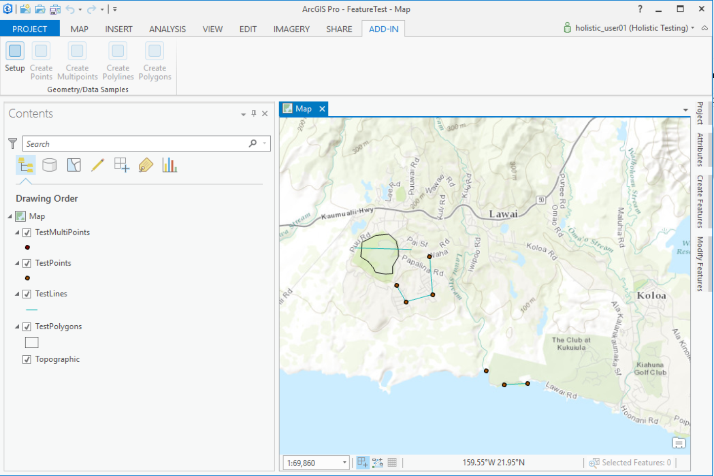
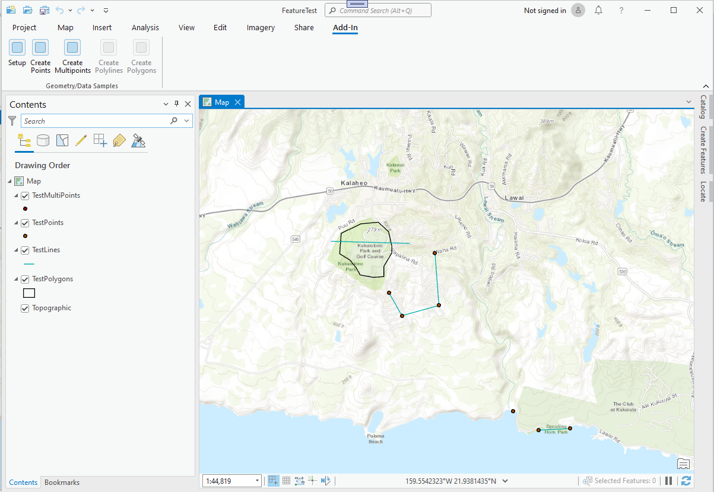
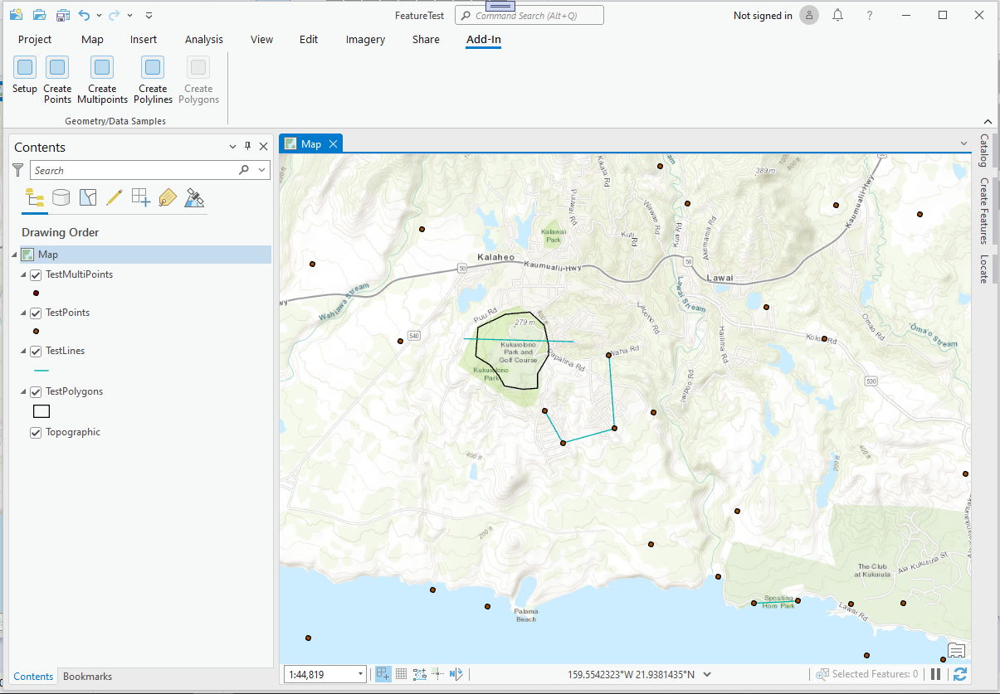
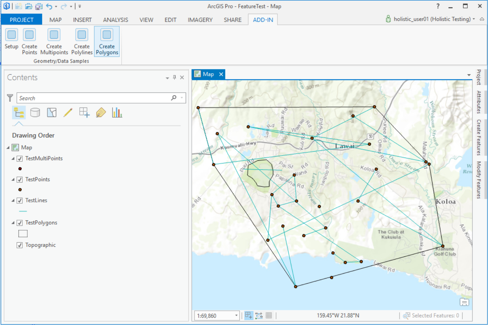

## ConstructingGeometries_VB

<!-- TODO: Write a brief abstract explaining this sample -->
 This sample provide four buttons showing the construction of geometry types of type MapPoint, Multipoint, Polyline, and Polygon and shows how to:  
 * Construct and manipulate geometries  
 * Use GeometryEngine functionality  
 * Search and retrieve features  
   


<a href="http://pro.arcgis.com/en/pro-app/sdk/" target="_blank">View it live</a>

<!-- TODO: Fill this section below with metadata about this sample-->
```
Language:              VB
Subject:               Geometry, Geodatabase
Contributor:           ArcGIS Pro SDK Team <arcgisprosdk@esri.com>
Organization:          Esri, http://www.esri.com
Date:                  7/10/2020
ArcGIS Pro:            2.6
Visual Studio:         2017, 2019
.NET Target Framework: 4.8
```

## Resources

* [API Reference online](https://pro.arcgis.com/en/pro-app/sdk/api-reference)
* <a href="https://pro.arcgis.com/en/pro-app/sdk/" target="_blank">ArcGIS Pro SDK for .NET (pro.arcgis.com)</a>
* [arcgis-pro-sdk-community-samples](https://github.com/Esri/arcgis-pro-sdk-community-samples)
* [ArcGIS Pro DAML ID Reference](https://github.com/Esri/arcgis-pro-sdk/wiki/ArcGIS-Pro-DAML-ID-Reference)
* [FAQ](https://github.com/Esri/arcgis-pro-sdk/wiki/FAQ)
* [ArcGIS Pro SDK icons](https://github.com/Esri/arcgis-pro-sdk/releases/tag/2.4.0.19948)


### Samples Data

* Sample data for ArcGIS Pro SDK Community Samples can be downloaded from the [repo releases](https://github.com/Esri/arcgis-pro-sdk-community-samples/releases) page.  

## How to use the sample
<!-- TODO: Explain how this sample can be used. To use images in this section, create the image file in your sample project's screenshots folder. Use relative url to link to this image using this syntax:  -->
 1. Download the Community Sample data (see under the 'Resources' section for downloading sample data)  
 1. Make sure that the Sample data is unzipped in c:\data   
 1. The project used for this sample is 'C:\Data\FeatureTest\FeatureTest.aprx'  
 1. In Visual Studio click the Build menu. Then select Build Solution.  
 1. Click Start button to open ArcGIS Pro.  
 1. ArcGIS Pro will open, select the FeatureTest.aprx project  
 1. Click on the ADD-IN tab and make sure that your active map contains Setup/point/multipoint/line/polygon features buttons as shown below.  
   
  
 1. Click on Setup button to enable the create point and create multipoint buttons   
   
  
 1. Click the createPoints button to create random points over the current extent of the map  
 1. The map extent shows the random created points and also enables create polylines button  
   
  
 1. Click the createPolylines button to create random lines the current extent of the map  
 1. The map extent shows the random lines and also enables create polygons button  
   
  
 1. Click the createPolygons button to create random polygon over the current extent of the map  
   
   


<!-- End -->

&nbsp;&nbsp;&nbsp;&nbsp;&nbsp;&nbsp;
&nbsp;&nbsp;&nbsp;&nbsp;&nbsp;&nbsp;&nbsp;&nbsp;&nbsp;&nbsp;&nbsp;&nbsp;
[Home](https://github.com/Esri/arcgis-pro-sdk/wiki) | <a href="https://pro.arcgis.com/en/pro-app/sdk/api-reference" target="_blank">API Reference</a> | [Requirements](https://github.com/Esri/arcgis-pro-sdk/wiki#requirements) | [Download](https://github.com/Esri/arcgis-pro-sdk/wiki#installing-arcgis-pro-sdk-for-net) | <a href="https://github.com/esri/arcgis-pro-sdk-community-samples" target="_blank">Samples</a>
