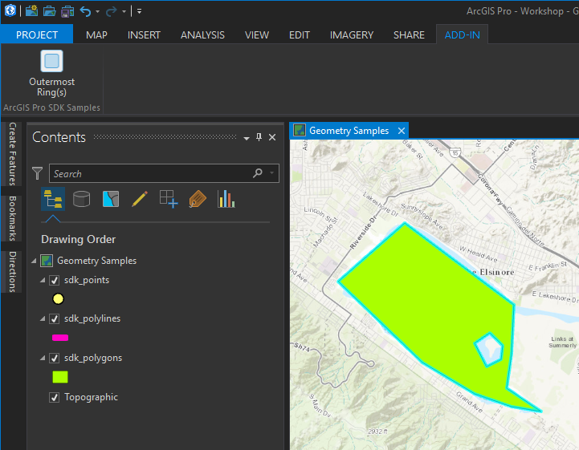
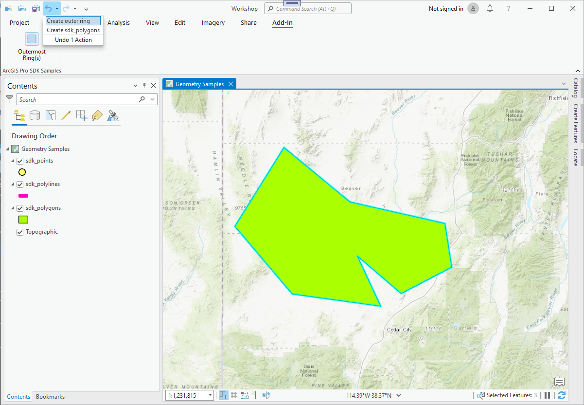
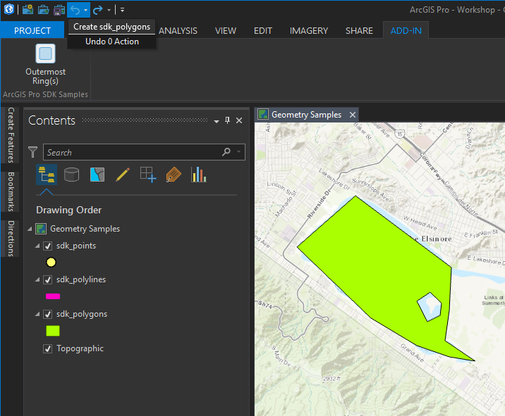

## GeometrySamples

<!-- TODO: Write a brief abstract explaining this sample -->
This sample show how to convert a multi part geometry in single part  geometries and how to retrieve the outermost ring(s) of a polygon.  
  


<a href="http://pro.arcgis.com/en/pro-app/sdk/" target="_blank">View it live</a>

<!-- TODO: Fill this section below with metadata about this sample-->
```
Language:              C#
Subject:               Geometry
Contributor:           ArcGIS Pro SDK Team <arcgisprosdk@esri.com>
Organization:          Esri, http://www.esri.com
Date:                  5/12/2021
ArcGIS Pro:            2.8
Visual Studio:         2017, 2019
.NET Target Framework: 4.8
```

## Resources

[Community Sample Resources](https://github.com/Esri/arcgis-pro-sdk-community-samples#resources)

### Samples Data

* Sample data for ArcGIS Pro SDK Community Samples can be downloaded from the [Releases](https://github.com/Esri/arcgis-pro-sdk-community-samples/releases) page.  

## How to use the sample
<!-- TODO: Explain how this sample can be used. To use images in this section, create the image file in your sample project's screenshots folder. Use relative url to link to this image using this syntax:  -->
1. Download the Community Sample data (see under the 'Resources' section for downloading sample data).  The sample data contains a folder called 'C:\Data\Working with Core Geometry and Data' with sample data required for this solution.  Make sure that the Sample data is unzipped in c:\data and "C:\Data\Working with Core Geometry and Data" is available.  
1. In Visual Studio click the Build menu. Then select Build Solution.  
1. Click Start button to debug ArcGIS Pro.  
1. In ArcGIS Pro open the Project called "Workshop.aprx" in the "C:\Data\Working with Core Geometry and Data" folder.  This project and data is required because it contains data that is attachment enabled.  
1. Digitize a polygon with multiple parts including holes using the sdk_polygons layer.  
  
  
1. Switch to the Add-in tab on the ArcGIS Pro ribbon and click the 'Outermost Ring(s)' button in the ArcGIS Pro SDK Samples group.  
1. The button will inspect the geometries of the polygon features and store the outer most ring(s) of the existing features as new features in the same feature class.  
  
  
1. Use the Undo pull-down to undo the "Create outer ring" operation.  
  
  
1. The create polygon feature operation is undone.  
  


<!-- End -->

&nbsp;&nbsp;&nbsp;&nbsp;&nbsp;&nbsp;
&nbsp;&nbsp;&nbsp;&nbsp;&nbsp;&nbsp;&nbsp;&nbsp;&nbsp;&nbsp;&nbsp;&nbsp;
[Home](https://github.com/Esri/arcgis-pro-sdk/wiki) | <a href="https://pro.arcgis.com/en/pro-app/latest/sdk/api-reference" target="_blank">API Reference</a> | [Requirements](https://github.com/Esri/arcgis-pro-sdk/wiki#requirements) | [Download](https://github.com/Esri/arcgis-pro-sdk/wiki#installing-arcgis-pro-sdk-for-net) | <a href="https://github.com/esri/arcgis-pro-sdk-community-samples" target="_blank">Samples</a>
