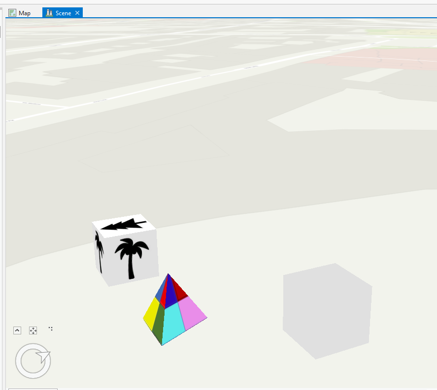
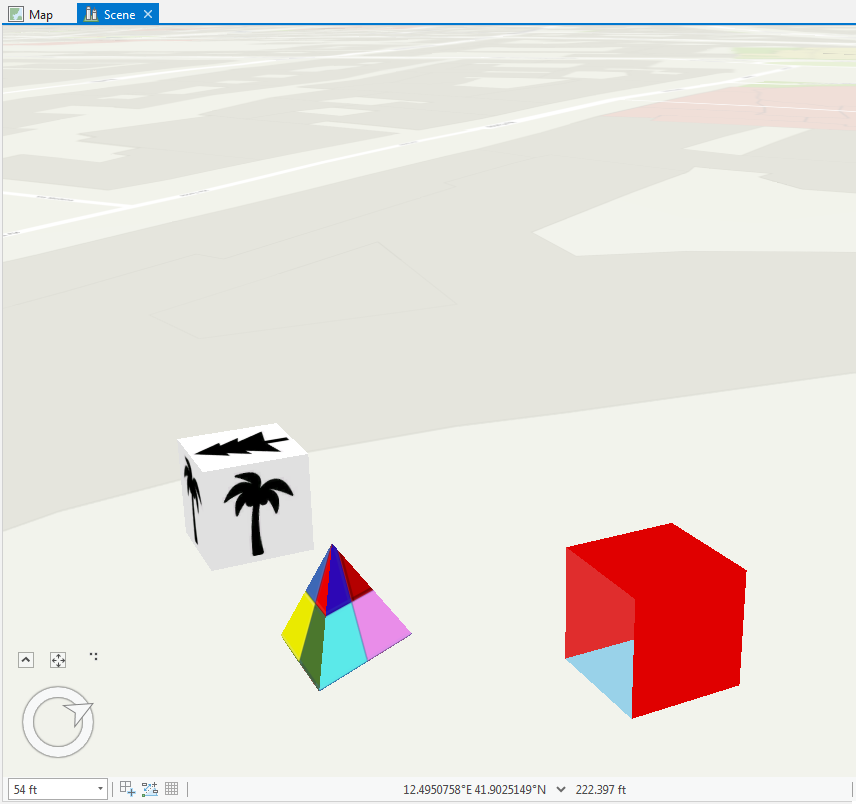
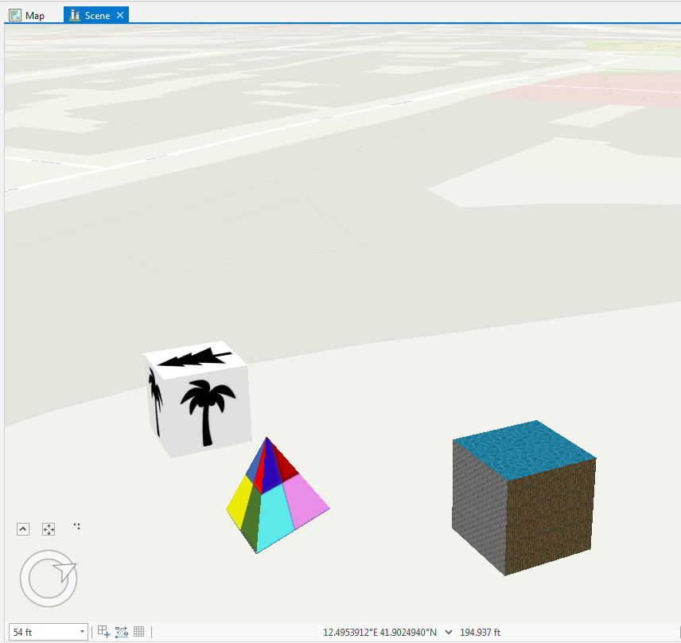
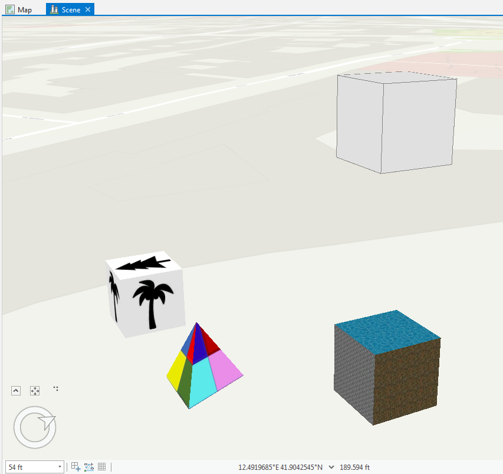

## MultipatchBuilderEx

<!-- TODO: Write a brief abstract explaining this sample -->
This sample demonstrates how to construct multipatch geometries using the MultipatchBuilderEx class found in the ArcGIS.Core.Geometry namespace.   
The MultipatchBuilderEx class also allows you to modify properties of a multipatch including the materials and textures.  
This add-in contains a number of buttons which create and modify multipatch features.   
  


<a href="https://pro.arcgis.com/en/pro-app/sdk/" target="_blank">View it live</a>

<!-- TODO: Fill this section below with metadata about this sample-->
```
Language:              C#
Subject:               Geometry
Contributor:           ArcGIS Pro SDK Team <arcgisprosdk@esri.com>
Organization:          Esri, https://www.esri.com
Date:                  02/22/2023
ArcGIS Pro:            3.1
Visual Studio:         2022
.NET Target Framework: net6.0-windows
```

## Resources

[Community Sample Resources](https://github.com/Esri/arcgis-pro-sdk-community-samples#resources)

### Samples Data

* Sample data for ArcGIS Pro SDK Community Samples can be downloaded from the [Releases](https://github.com/Esri/arcgis-pro-sdk-community-samples/releases) page.  

## How to use the sample
<!-- TODO: Explain how this sample can be used. To use images in this section, create the image file in your sample project's screenshots folder. Use relative url to link to this image using this syntax:  -->
1. Download the Community Sample data (see under the 'Resources' section for downloading sample data)  
1. Make sure that the Sample data is unzipped in C:\Data  
1. Before you run the sample verify that the project "C:\Data\MultipatchTest\MultipatchTest.aprx" is present since this is required to run the sample.  
1. In Visual Studio click the Build menu. Then select Build Solution.  
1. Click Start button to open ArcGIS Pro.  
1. ArcGIS Pro will open.  
1. Open the "C:\Data\MultipatchTest\MultipatchTest.aprx" project.  
1. Click on the ADD-IN TAB.  
1. Click on the *Create Triangle Multipatch* button.   
1. A new multiaptch feature will be created.  
  
  
1. Click on the "Apply Materials" button.  
1. The created multipatch feature will now have materials applied to it's faces.   
  
  
1. Click on the "Apply Textures" button.  
1. The created multipatch feature will now have textures applied to it's faces.   
  
  
1. Click on the "Add Multipatch to Overlay" button.  
1. A new multiaptch geometry will be added to the overlay using a mesh symbol.  
  
  


<!-- End -->

&nbsp;&nbsp;&nbsp;&nbsp;&nbsp;&nbsp;
&nbsp;&nbsp;&nbsp;&nbsp;&nbsp;&nbsp;&nbsp;&nbsp;&nbsp;&nbsp;&nbsp;&nbsp;
[Home](https://github.com/Esri/arcgis-pro-sdk/wiki) | <a href="https://pro.arcgis.com/en/pro-app/latest/sdk/api-reference" target="_blank">API Reference</a> | [Requirements](https://github.com/Esri/arcgis-pro-sdk/wiki#requirements) | [Download](https://github.com/Esri/arcgis-pro-sdk/wiki#installing-arcgis-pro-sdk-for-net) | <a href="https://github.com/esri/arcgis-pro-sdk-community-samples" target="_blank">Samples</a>
