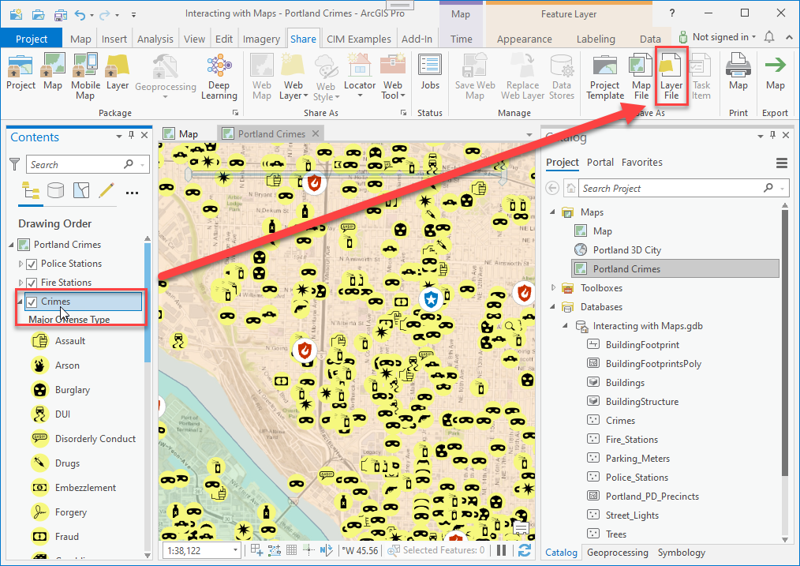
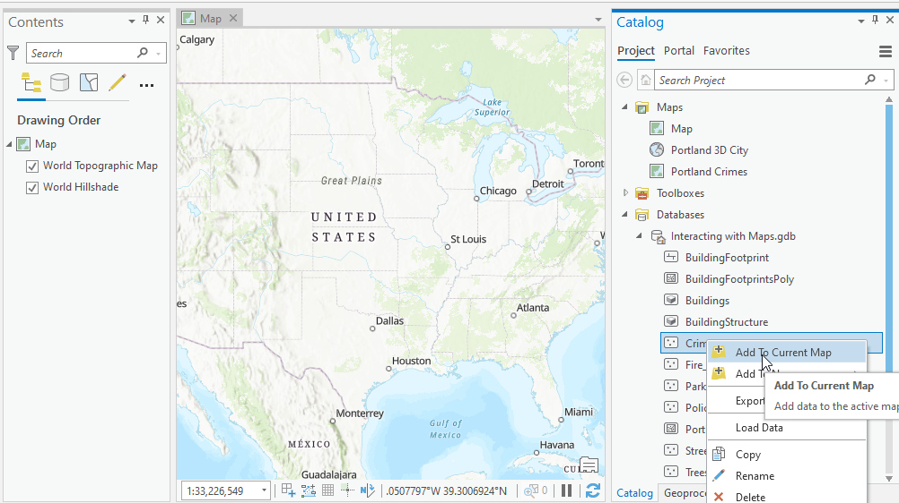
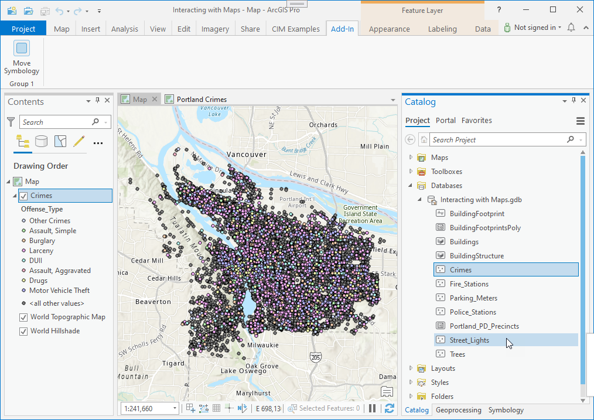
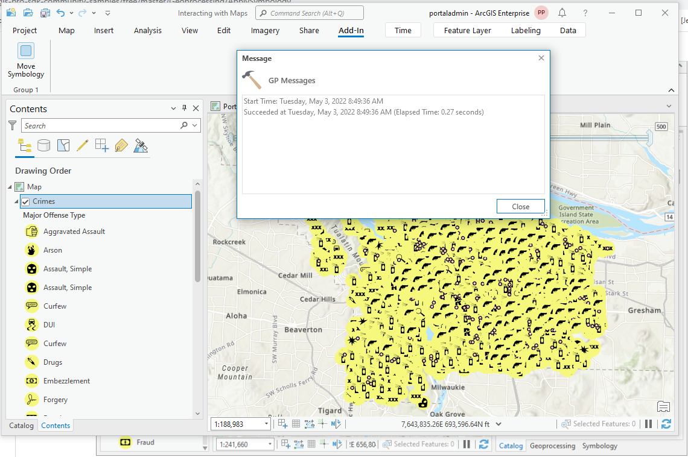

## ApplySymbology

<!-- TODO: Write a brief abstract explaining this sample -->
This sample shows how to move Symbology from one layer to another layer using the 'Apply Symbology From Layer' GeoProcessing tool.    
  


<a href="http://pro.arcgis.com/en/pro-app/sdk/" target="_blank">View it live</a>

<!-- TODO: Fill this section below with metadata about this sample-->
```
Language:              C#
Subject:               Framework
Contributor:           ArcGIS Pro SDK Team <arcgisprosdk@esri.com>
Organization:          Esri, http://www.esri.com
Date:                  11/01/2021
ArcGIS Pro:            2.9
Visual Studio:         2017, 2019
.NET Target Framework: 4.8
```

## Resources

[Community Sample Resources](https://github.com/Esri/arcgis-pro-sdk-community-samples#resources)

### Samples Data

* Sample data for ArcGIS Pro SDK Community Samples can be downloaded from the [Releases](https://github.com/Esri/arcgis-pro-sdk-community-samples/releases) page.  

## How to use the sample
<!-- TODO: Explain how this sample can be used. To use images in this section, create the image file in your sample project's screenshots folder. Use relative url to link to this image using this syntax:  -->
1. Download the Community Sample data (see under the "Resources" section for downloading sample data).  The sample data contains a project called "FeatureTest.aprx" with data suitable for this sample.  Make sure that the Sample data is unzipped in c:\data and "C:\Data\Interacting with Maps" is available.   
1. In Visual studio click the Build menu. Then select Build Solution and debug the solution.  
1. ArcGIS Pro will open, select and open the "C:\Data\Interacting with Maps\Interacting with Maps.aprx" project.  
1. Open the 'Portland Crimes' map, select the 'Crimes' layer, and use the 'New Layer File' button on the 'Share' tab to save the 'Crimes' layer as lyrx file, called 'Crimes.lyrx'.  
  
  
1. Create a new empty 2D Map and then open the catalog dockpane and add the 'Crimes' feature class to the current map.  
  
  
1. Open the Add-in tab and click the "Move Symbology" button to start the 'Apply Symbology From Layer' GeoProcessing tool.  
  
  
1. When prompted to select the 'Symbology Input Layer' browse and select the 'Crimes.lyrx' file saved in the pervious step.  
1. After the GeoProcessing tool completes, note that the 'Crimes' symbology has been updated.  
  
  


<!-- End -->

&nbsp;&nbsp;&nbsp;&nbsp;&nbsp;&nbsp;
&nbsp;&nbsp;&nbsp;&nbsp;&nbsp;&nbsp;&nbsp;&nbsp;&nbsp;&nbsp;&nbsp;&nbsp;
[Home](https://github.com/Esri/arcgis-pro-sdk/wiki) | <a href="https://pro.arcgis.com/en/pro-app/latest/sdk/api-reference" target="_blank">API Reference</a> | [Requirements](https://github.com/Esri/arcgis-pro-sdk/wiki#requirements) | [Download](https://github.com/Esri/arcgis-pro-sdk/wiki#installing-arcgis-pro-sdk-for-net) | <a href="https://github.com/esri/arcgis-pro-sdk-community-samples" target="_blank">Samples</a>
