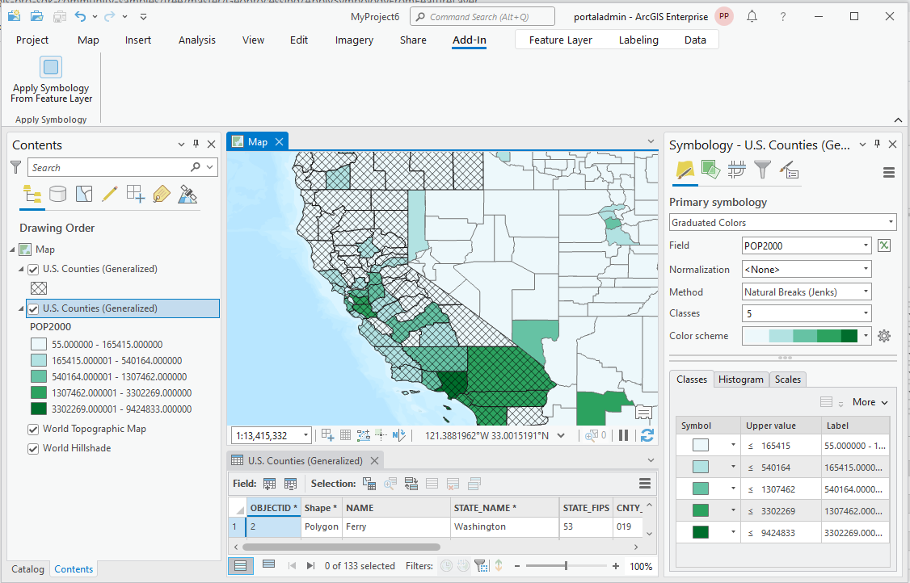
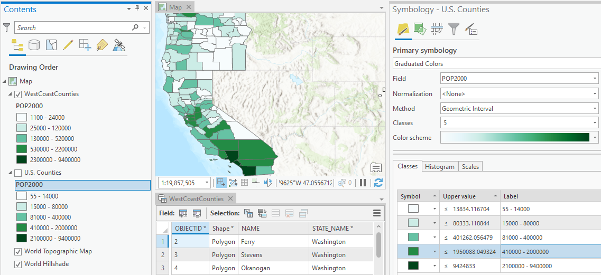

## ApplySymbologyFromFeatureLayer

<!-- TODO: Write a brief abstract explaining this sample -->
This sample demonstrates how to the "ApplySymbologyFromLayer_management" geoprocessing task  
  


<a href="https://pro.arcgis.com/en/pro-app/sdk/" target="_blank">View it live</a>

<!-- TODO: Fill this section below with metadata about this sample-->
```
Language:              C#
Subject:               Geoprocessing
Contributor:           ArcGIS Pro SDK Team <arcgisprosdk@esri.com>
Organization:          Esri, https://www.esri.com
Date:                  04/04/2024
ArcGIS Pro:            3.3
Visual Studio:         2022
.NET Target Framework: net8.0-windows
```

## Resources

[Community Sample Resources](https://github.com/Esri/arcgis-pro-sdk-community-samples#resources)

### Samples Data

* Sample data for ArcGIS Pro SDK Community Samples can be downloaded from the [Releases](https://github.com/Esri/arcgis-pro-sdk-community-samples/releases) page.  

## How to use the sample
<!-- TODO: Explain how this sample can be used. To use images in this section, create the image file in your sample project's screenshots folder. Use relative url to link to this image using this syntax:  -->
Requirements to run this sample:  
* the first layer in TOC is WITHOUT any symbology  
* the second layer HAS the symbology  
* symbology from the 2nd layer will be applied to the first layer  
* As a sample you can use following sample data: C:\Data\Admin\AdminData.gdb\counties  
* Both layers must have fields with the POP2000 name.  The NAME field is used, the input parameters for the "ApplySymbologyFromLayer_management" geoprocessing task  
  
1. fieldType = "VALUE_FIELD";
2. sourceField = "POP2000";  
3. targetField = "POP2000";  
  
Using the sample:  
4. In Visual Studio click the Build menu. Then select Build Solution.  
5. Click Start button to open ArcGIS Pro.  
6. Open any project in ArcGIS Pro with a Map that contains a the two feature layers shown as requirements above.  
  
7. After the map view is open switch on the Pro Ribbon to the 'Add-in' tab.  
8. Click the "Apply Symbology From Feature Layer" button.  Notice the Symbology has been applied to the topmost layer.  
  
  

<!-- End -->

&nbsp;&nbsp;&nbsp;&nbsp;&nbsp;&nbsp;
&nbsp;&nbsp;&nbsp;&nbsp;&nbsp;&nbsp;&nbsp;&nbsp;&nbsp;&nbsp;&nbsp;&nbsp;
[Home](https://github.com/Esri/arcgis-pro-sdk/wiki) | <a href="https://pro.arcgis.com/en/pro-app/latest/sdk/api-reference" target="_blank">API Reference</a> | [Requirements](https://github.com/Esri/arcgis-pro-sdk/wiki#requirements) | [Download](https://github.com/Esri/arcgis-pro-sdk/wiki#installing-arcgis-pro-sdk-for-net) | <a href="https://github.com/esri/arcgis-pro-sdk-community-samples" target="_blank">Samples</a>
