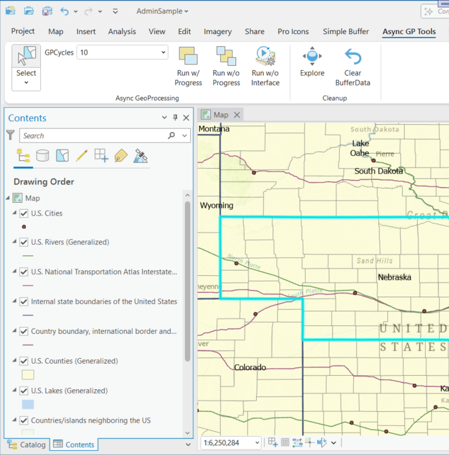
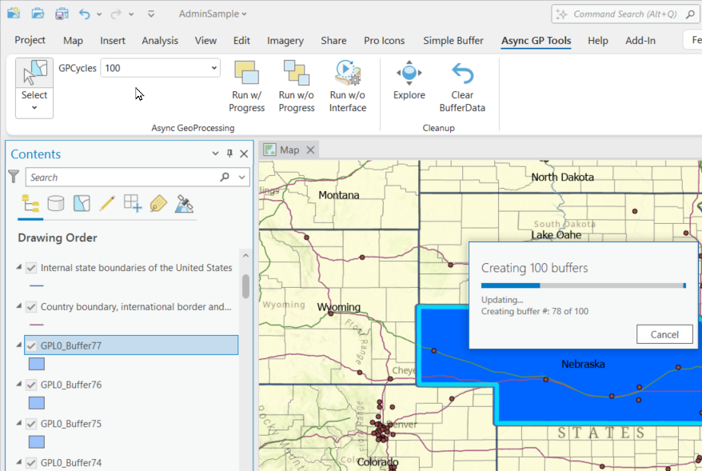
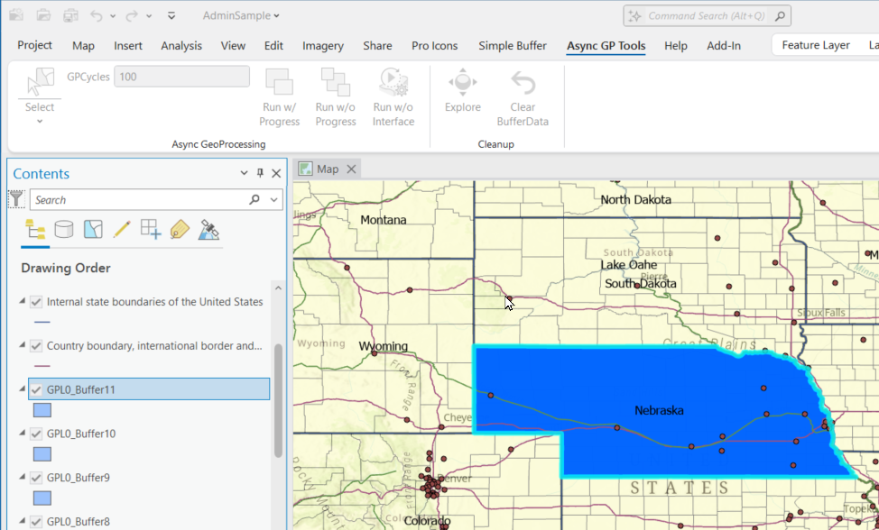
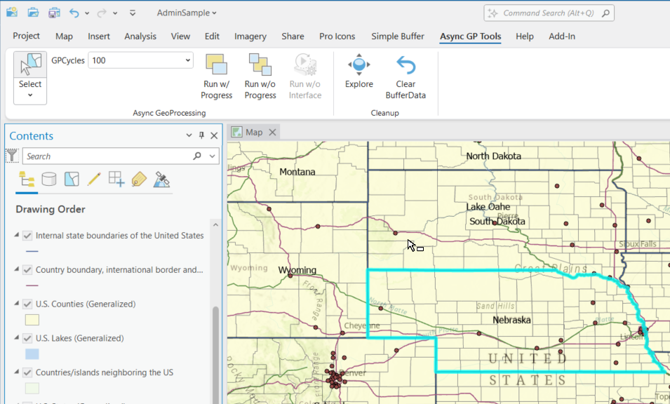

## AsyncGeoProcessing

<!-- TODO: Write a brief abstract explaining this sample -->
This sample shows who to run GP tools with and without progressors and the effect on UI responsiveness.  
  


<a href="https://pro.arcgis.com/en/pro-app/sdk/" target="_blank">View it live</a>

<!-- TODO: Fill this section below with metadata about this sample-->
```
Language:              C#
Subject:               Geodatabase
Contributor:           ArcGIS Pro SDK Team <arcgisprosdk@esri.com>
Organization:          Esri, https://www.esri.com
Date:                  05/06/2025
ArcGIS Pro:            3.5
Visual Studio:         2022
.NET Target Framework: net8.0-windows
```

## Resources

[Community Sample Resources](https://github.com/Esri/arcgis-pro-sdk-community-samples#resources)

### Samples Data

* Sample data for ArcGIS Pro SDK Community Samples can be downloaded from the [Releases](https://github.com/Esri/arcgis-pro-sdk-community-samples/releases) page.  

## How to use the sample
<!-- TODO: Explain how this sample can be used. To use images in this section, create the image file in your sample project's screenshots folder. Use relative url to link to this image using this syntax:  -->
1. In Visual studio rebuild the solution.
2. Debug the add-in.  
3. When ArcGIS Pro opens open any project with a map containing at least one polygon layer.    
4. Select the "Async GP Tools" tab.  Select a polygon feature in the map.  
  
5. Click the "Run w/ Progress" button to create a series of buffers around the selected polygon feature.   
6. A progressor is displayed while the tool is running.  Notice that the UI is not responsive while the tool is running.  
  
7. Click the "Run w/o Progress" button to create a series of buffers around the selected polygon feature.   
8. No progressor is displayed while this tool is running.  Notice that the UI is now responsive while the tool is running.  With each newly created polygon the table of content is updated.  
  
9. Click the "Run w/o Interface" button to create a series of buffers around the selected polygon feature.   
10. No progressor is displayed while this tool is running and the table of content is not updated until the whole process is complete.  Notice that the UI is fully responsive while the tool is running.  With each newly created polygon the table of content is updated.  
  
  

<!-- End -->

&nbsp;&nbsp;&nbsp;&nbsp;&nbsp;&nbsp;
&nbsp;&nbsp;&nbsp;&nbsp;&nbsp;&nbsp;&nbsp;&nbsp;&nbsp;&nbsp;&nbsp;&nbsp;
[Home](https://github.com/Esri/arcgis-pro-sdk/wiki) | <a href="https://pro.arcgis.com/en/pro-app/latest/sdk/api-reference" target="_blank">API Reference</a> | [Requirements](https://github.com/Esri/arcgis-pro-sdk/wiki#requirements) | [Download](https://github.com/Esri/arcgis-pro-sdk/wiki#installing-arcgis-pro-sdk-for-net) | <a href="https://github.com/esri/arcgis-pro-sdk-community-samples" target="_blank">Samples</a>
