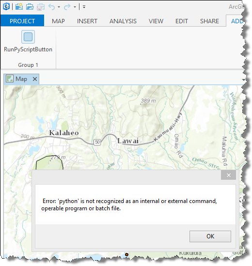

##CallScriptFromNet

<!-- TODO: Write a brief abstract explaining this sample -->
This Button add-in, when clicked, calls a Python script, reads the text stream output from the script and uses it. From simplicity, output text is sent to windows messagebox.  
However, you can execute complex Python code in the Python script and call the script from within the button.   
  


<a href="http://pro.arcgis.com/en/pro-app/sdk/" target="_blank">View it live</a>

<!-- TODO: Fill this section below with metadata about this sample-->
```
Language:      C#
Subject:       Geoprocessing
Contributor:   ArcGIS Pro SDK Team <arcgisprosdk@esri.com>
Organization:  Esri, http://www.esri.com
Date:          9/21/2015
ArcGIS Pro:    1.1
Visual Studio: 2013, 2015
```

##Resources

* [API Reference online](http://pro.arcgis.com/en/pro-app/sdk/api-reference)
* <a href="http://pro.arcgis.com/en/pro-app/sdk/" target="_blank">ArcGIS Pro SDK for .NET (pro.arcgis.com)</a>
* [arcgis-pro-sdk-community-samples](http://github.com/Esri/arcgis-pro-sdk-community-samples)
* [FAQ](http://github.com/Esri/arcgis-pro-sdk/wiki/FAQ)
* [ArcGIS Pro SDK icons](https://github.com/Esri/arcgis-pro-sdk/releases/tag/1.1.0.3308)
* [ProConcepts: ArcGIS Pro Add in Samples](https://github.com/Esri/arcgis-pro-sdk-community-samples/wiki/ProConcepts-ArcGIS-Pro-Add-in-Samples)
* [Sample data for ArcGIS Pro SDK Community Samples](https://github.com/Esri/arcgis-pro-sdk-community-samples/releases)

##How to use the sample
<!-- TODO: Explain how this sample can be used. To use images in this section, create the image file in your sample project's screenshots folder. Use relative url to link to this image using this syntax:  -->
1. This solution file includes an example python script named test1.py  
1. This sample also requires that you install the recommended version of Python for ArcGIS Pro and add python.exe to you path  
1. Open the 'RunPyScriptButton' class and update the path to test1.py to point to the sample script file in your solution  
1. Build the solution - make sure it compiles successfully.  
1. Open ArcGIS Pro - go to the ADD-IN Tab, find RunPyScriptButton in Group 1 group.  
1. Click on the button - wait few seconds - a message box will show up with a message of "Hello - this message is from a TEST Python script"  
  
  


[](Esri Tags: ArcGIS-Pro-SDK)
[](Esri Language: C-Sharp)​


<p align = center>
<b> ArcGIS Pro 1.1 SDK for Microsoft .NET Framework</b>
</p>
&nbsp;&nbsp;&nbsp;&nbsp;&nbsp;&nbsp;&nbsp;&nbsp;&nbsp;&nbsp;&nbsp;&nbsp;&nbsp;&nbsp;&nbsp;&nbsp;&nbsp;&nbsp;&nbsp;&nbsp;[Home](https://github.com/Esri/arcgis-pro-sdk/wiki) | <a href="http://pro.arcgis.com/en/pro-app/sdk" target="_blank">ArcGIS Pro SDK</a> | <a href="http://pro.arcgis.com/en/pro-app/sdk/api-reference" target="_blank">API Reference</a> | [Requirements](#requirements) | [Download](#download) |  <a href="http://github.com/esri/arcgis-pro-sdk-community-samples" target="_blank">Samples</a>
