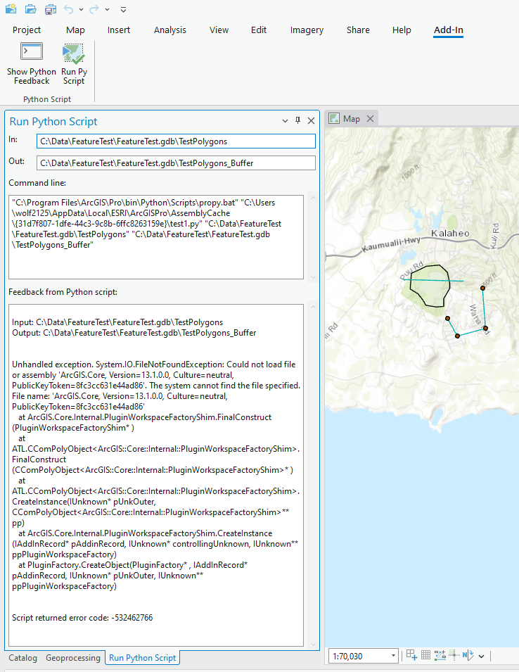
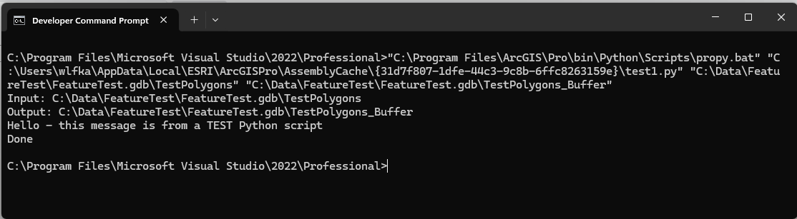

## CallScriptFromNet

<!-- TODO: Write a brief abstract explaining this sample -->
This Button add-in, when clicked, uses the first Polygon layer in the Map and runs a buffer operation with help of a Python script.  It reads the text stream output from python and displays it.   
  


<a href="https://pro.arcgis.com/en/pro-app/sdk/" target="_blank">View it live</a>

<!-- TODO: Fill this section below with metadata about this sample-->
```
Language:              C#
Subject:               Geoprocessing
Contributor:           ArcGIS Pro SDK Team <arcgisprosdk@esri.com>
Organization:          Esri, https://www.esri.com
Date:                  04/04/2024
ArcGIS Pro:            3.3
Visual Studio:         2022
.NET Target Framework: net8.0-windows
```

## Resources

[Community Sample Resources](https://github.com/Esri/arcgis-pro-sdk-community-samples#resources)

### Samples Data

* Sample data for ArcGIS Pro SDK Community Samples can be downloaded from the [Releases](https://github.com/Esri/arcgis-pro-sdk-community-samples/releases) page.  

## How to use the sample
<!-- TODO: Explain how this sample can be used. To use images in this section, create the image file in your sample project's screenshots folder. Use relative url to link to this image using this syntax:  -->
1. This solution file includes an example python script named test1.py which is included as 'Content' (Build action) in the add-in.
2. This sample also requires an ArcGIS Project with a map that has at least one polygon layer in the Map's table of content.  
3. Rebuild the project in Visual Studio and debug.   
4. In ArcGIS Pro open a project with a map that has one polygon layer in the Map's TOC.  
5. Make sure the Map is the active map.  
6. Go to the ADD-IN Tab, find the "Python Script" group and click "Show Python Feedback" followed by "Run Py Script".  
7. The "Run Python Script" Dockpane will populate the "In" and "Out" feature classes used for the script's buffer operation.    
8. Note: the "In" feature class is derived from the first feature layer in the active Map's table of content.  
9. Note: the "Out" feature class is derived from the "In" feature class with a "_Buffer" appended to the feature class name.  
10. Note: if the "Out" feature class exists the code will delete the feature class in order for the script to work.  
11. The Feedback from Python is displayed in the dockpane:  
  
12. If you have ArcGIS Pro installed and licensed on your machine you should be able to run this python script directly from a Windows command prompt.  
13. To do so open a Windows Command prompt and copy/paste the content from the Dockpane's 'Command line' field.  
  
  

<!-- End -->

&nbsp;&nbsp;&nbsp;&nbsp;&nbsp;&nbsp;
&nbsp;&nbsp;&nbsp;&nbsp;&nbsp;&nbsp;&nbsp;&nbsp;&nbsp;&nbsp;&nbsp;&nbsp;
[Home](https://github.com/Esri/arcgis-pro-sdk/wiki) | <a href="https://pro.arcgis.com/en/pro-app/latest/sdk/api-reference" target="_blank">API Reference</a> | [Requirements](https://github.com/Esri/arcgis-pro-sdk/wiki#requirements) | [Download](https://github.com/Esri/arcgis-pro-sdk/wiki#installing-arcgis-pro-sdk-for-net) | <a href="https://github.com/esri/arcgis-pro-sdk-community-samples" target="_blank">Samples</a>
