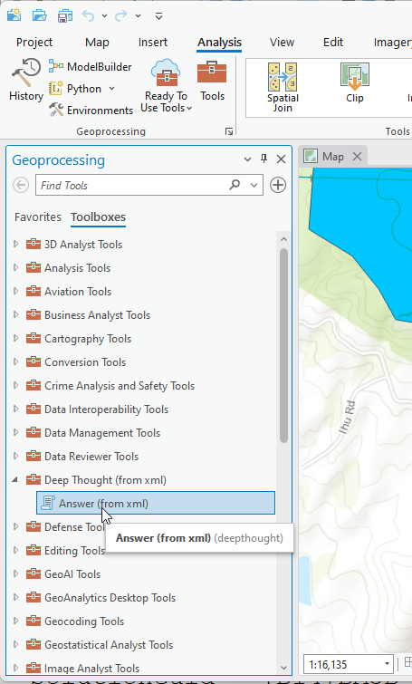
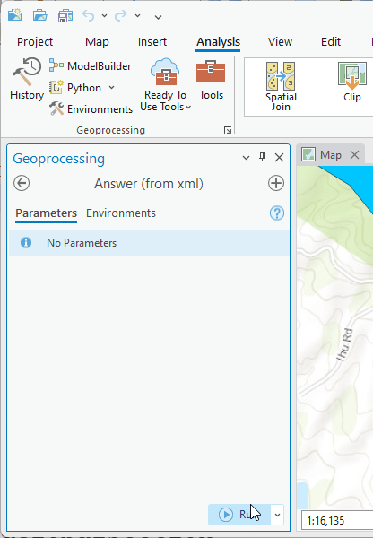
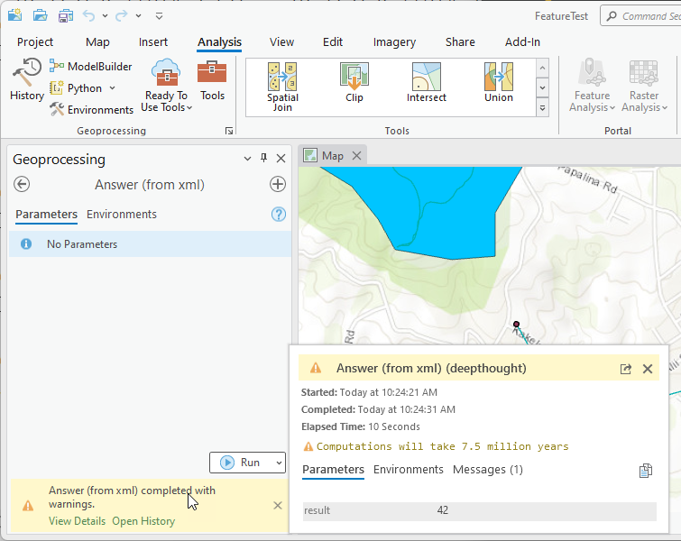
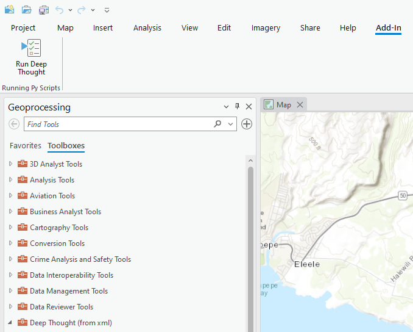
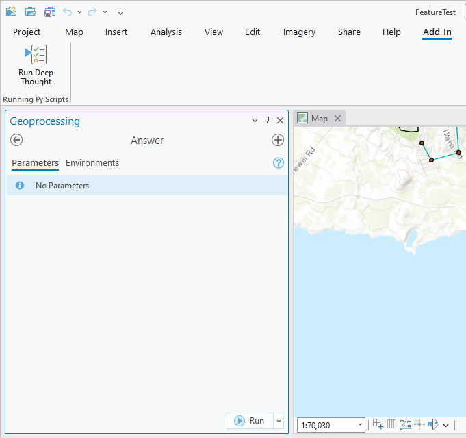
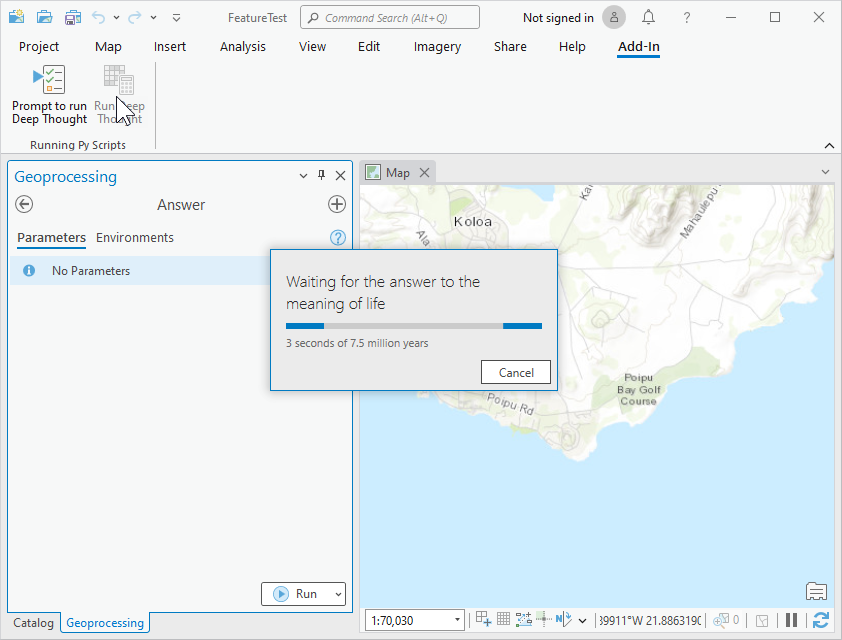
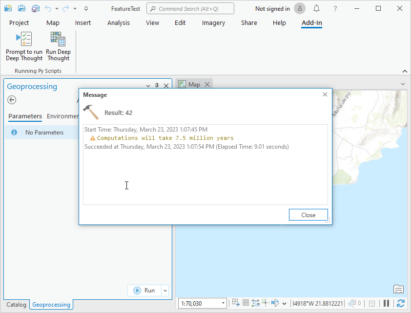

## DeepThought

<!-- TODO: Write a brief abstract explaining this sample -->
This samples shows how to programmatically add a geoprocessing toolbox to run a simply python script.  
  


<a href="https://pro.arcgis.com/en/pro-app/sdk/" target="_blank">View it live</a>

<!-- TODO: Fill this section below with metadata about this sample-->
```
Language:              C#
Subject:               Geoprocessing
Contributor:           ArcGIS Pro SDK Team <arcgisprosdk@esri.com>
Organization:          Esri, https://www.esri.com
Date:                  10/01/2023
ArcGIS Pro:            3.2
Visual Studio:         2022
.NET Target Framework: net6.0-windows
```

## Resources

[Community Sample Resources](https://github.com/Esri/arcgis-pro-sdk-community-samples#resources)

### Samples Data

* Sample data for ArcGIS Pro SDK Community Samples can be downloaded from the [Releases](https://github.com/Esri/arcgis-pro-sdk-community-samples/releases) page.  

## How to use the sample
<!-- TODO: Explain how this sample can be used. To use images in this section, create the image file in your sample project's screenshots folder. Use relative url to link to this image using this syntax:  -->
      
  
1. In Visual Studio click the Build menu. Then select Build Solution.
2. Click Start button to open ArcGIS Pro.  
3. ArcGIS Pro will open.   
4. Open any project file or an empty map template. The Geoprocessing dockpane is displayed.  
5. On the Geoprocessing dockpane click on the 'Toolboxes' tab.  The list of toolboxes are displayed.  
6. Search for 'Deep Thought' in the toolbox list.    
  
7. Double click on 'Answer (from xml)' and run the tool by clicking the 'Run' button.  
  
8. Wait for the GP task to finish and you can view the answer in the popup.  
  
9. In order to test programmatic instantiation of the 'Deep Thought' answer script, select the Add-in tab with the 'Running Py Scripts' group.  
  
10. Click the 'Prompt to run Deep Thought' button to see the parameter input for the answer.py popup.  
  
11. Click the 'Run Deep Thought' button runs the python command directly using a progressor.  Run this command outside the VS debugger to see the progresssor.  
    
  
  

<!-- End -->

&nbsp;&nbsp;&nbsp;&nbsp;&nbsp;&nbsp;
&nbsp;&nbsp;&nbsp;&nbsp;&nbsp;&nbsp;&nbsp;&nbsp;&nbsp;&nbsp;&nbsp;&nbsp;
[Home](https://github.com/Esri/arcgis-pro-sdk/wiki) | <a href="https://pro.arcgis.com/en/pro-app/latest/sdk/api-reference" target="_blank">API Reference</a> | [Requirements](https://github.com/Esri/arcgis-pro-sdk/wiki#requirements) | [Download](https://github.com/Esri/arcgis-pro-sdk/wiki#installing-arcgis-pro-sdk-for-net) | <a href="https://github.com/esri/arcgis-pro-sdk-community-samples" target="_blank">Samples</a>
