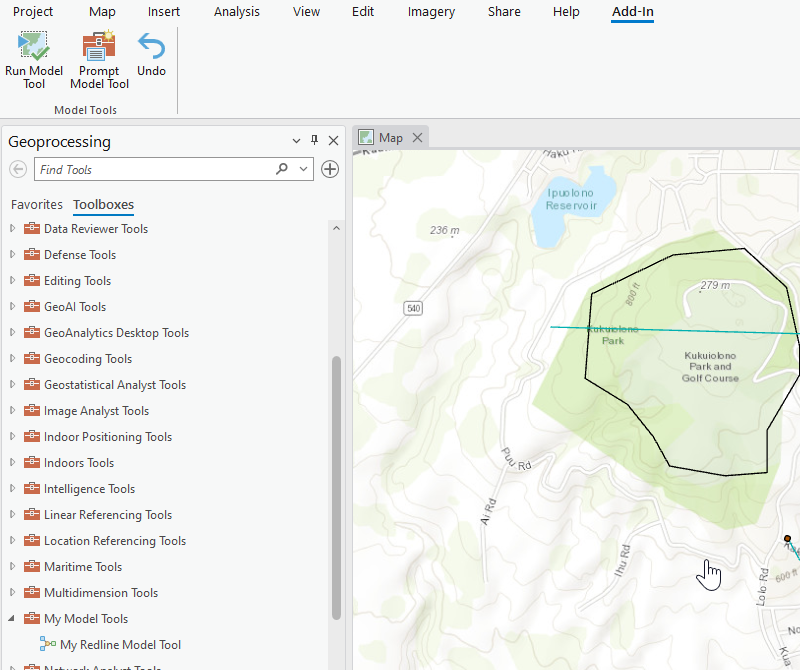
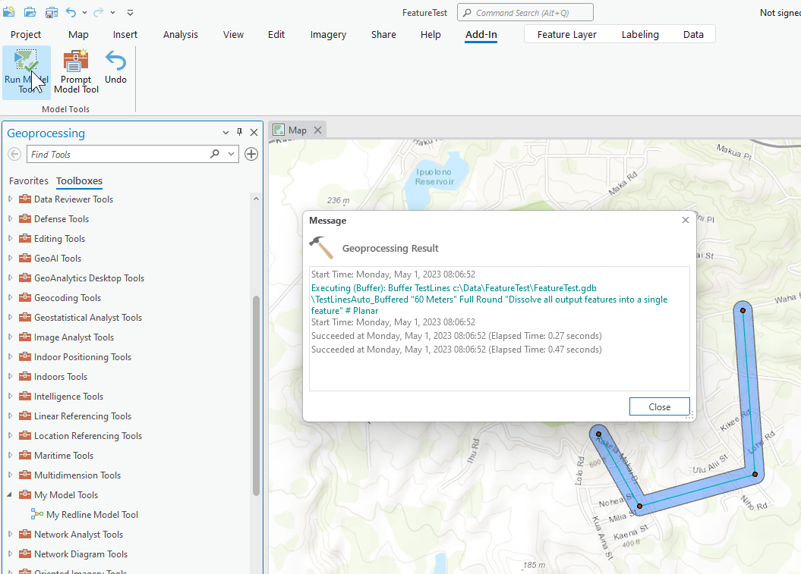

## ExecuteModelTool

<!-- TODO: Write a brief abstract explaining this sample -->
This sample shows how to embed a Model GP Tool into an Add-in.  
  


<a href="https://pro.arcgis.com/en/pro-app/sdk/" target="_blank">View it live</a>

<!-- TODO: Fill this section below with metadata about this sample-->
```
Language:              C#
Subject:               Geoprocessing
Contributor:           ArcGIS Pro SDK Team <arcgisprosdk@esri.com>
Organization:          Esri, https://www.esri.com
Date:                  04/04/2024
ArcGIS Pro:            3.3
Visual Studio:         2022
.NET Target Framework: net8.0-windows
```

## Resources

[Community Sample Resources](https://github.com/Esri/arcgis-pro-sdk-community-samples#resources)

### Samples Data

* Sample data for ArcGIS Pro SDK Community Samples can be downloaded from the [Releases](https://github.com/Esri/arcgis-pro-sdk-community-samples/releases) page.  

## How to use the sample
<!-- TODO: Explain how this sample can be used. To use images in this section, create the image file in your sample project's screenshots folder. Use relative url to link to this image using this syntax:  -->
1. Download the Community Sample data (see under the 'Resources' section for downloading sample data)
2. Make sure that the Sample data is unzipped in c:\Data  
3. Before you run the sample verify that the project C:\Data\FeatureTest\FeatureTest.aprx" is present since this is required to run the sample.  
4. In Visual studio click the Build menu. Then select Build Solution.  
5. Click Start button to open ArcGIS Pro.  
6. Open the "C:\Data\FeatureTest\FeatureTest.aprx" project.  
7. Open the Geoprocessing dockpane and click on the 'Toolboxes' tab.  The list of toolboxes are displayed.  
8. Search for 'My Model Tools' in the toolbox list.    
  
9. On the Add-in tab click the 'Run Model Tool' button to run the model tool automatically, or the 'Prompt Model tool' button the get prompted for parameters frist.  
  
  

<!-- End -->

&nbsp;&nbsp;&nbsp;&nbsp;&nbsp;&nbsp;
&nbsp;&nbsp;&nbsp;&nbsp;&nbsp;&nbsp;&nbsp;&nbsp;&nbsp;&nbsp;&nbsp;&nbsp;
[Home](https://github.com/Esri/arcgis-pro-sdk/wiki) | <a href="https://pro.arcgis.com/en/pro-app/latest/sdk/api-reference" target="_blank">API Reference</a> | [Requirements](https://github.com/Esri/arcgis-pro-sdk/wiki#requirements) | [Download](https://github.com/Esri/arcgis-pro-sdk/wiki#installing-arcgis-pro-sdk-for-net) | <a href="https://github.com/esri/arcgis-pro-sdk-community-samples" target="_blank">Samples</a>
