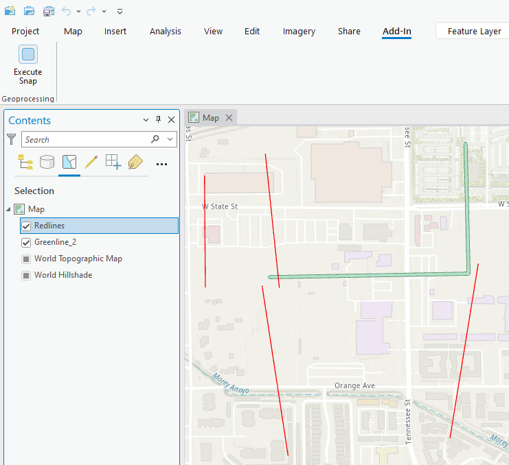
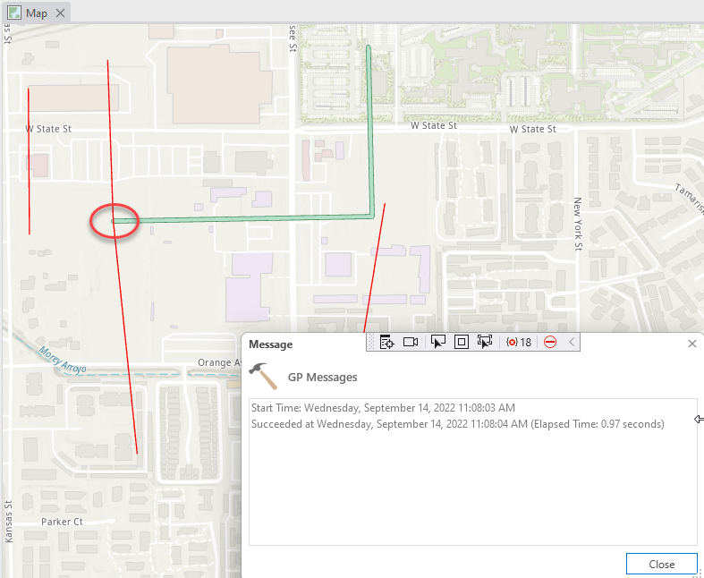

## ExecuteSnap

<!-- TODO: Write a brief abstract explaining this sample -->
This sample runs the Snap (Editing) geoprocessing tool.  The tool moves points or vertices to coincide exactly with the vertices, edges, or end points of other features.   
[Snap (Editing) help](https://pro.arcgis.com/en/pro-app/latest/tool-reference/editing/snap.htm)  
  


<a href="https://pro.arcgis.com/en/pro-app/sdk/" target="_blank">View it live</a>

<!-- TODO: Fill this section below with metadata about this sample-->
```
Language:              C#
Subject:               Framework
Contributor:           ArcGIS Pro SDK Team <arcgisprosdk@esri.com>
Organization:          Esri, https://www.esri.com
Date:                  05/06/2025
ArcGIS Pro:            3.5
Visual Studio:         2022
.NET Target Framework: net8.0-windows
```

## Resources

[Community Sample Resources](https://github.com/Esri/arcgis-pro-sdk-community-samples#resources)

### Samples Data

* Sample data for ArcGIS Pro SDK Community Samples can be downloaded from the [Releases](https://github.com/Esri/arcgis-pro-sdk-community-samples/releases) page.  

## How to use the sample
<!-- TODO: Explain how this sample can be used. To use images in this section, create the image file in your sample project's screenshots folder. Use relative url to link to this image using this syntax:  -->
1. Download the Community Sample data (see under the 'Resources' section for downloading sample data).  The sample data contains a folder called 'C:\Data\GeoProcessing' with sample data required for this solution.  Make sure that the Sample data is unzipped in c:\data and "C:\Data\GeoProcessing" is available.
2. In Visual Studio click the Build menu. Then select Build Solution.    
3. Launch the debugger to open ArcGIS Pro.  
4. Open the C:\Data\GeoProcessing\EditSnap\EditSnap.aprx project.   
5. Notice the Redline layer's geometries, some of the vertices are close to the Greenline geometrie's ends.   
  
6. Under the Add-in tab, click the "Execute Snap" button.  This will take all 'Redline' features and snap any vertices that are closer than 50 meters to the any vertex of the Greenline layer.  
  
  

<!-- End -->

&nbsp;&nbsp;&nbsp;&nbsp;&nbsp;&nbsp;
&nbsp;&nbsp;&nbsp;&nbsp;&nbsp;&nbsp;&nbsp;&nbsp;&nbsp;&nbsp;&nbsp;&nbsp;
[Home](https://github.com/Esri/arcgis-pro-sdk/wiki) | <a href="https://pro.arcgis.com/en/pro-app/latest/sdk/api-reference" target="_blank">API Reference</a> | [Requirements](https://github.com/Esri/arcgis-pro-sdk/wiki#requirements) | [Download](https://github.com/Esri/arcgis-pro-sdk/wiki#installing-arcgis-pro-sdk-for-net) | <a href="https://github.com/esri/arcgis-pro-sdk-community-samples" target="_blank">Samples</a>
