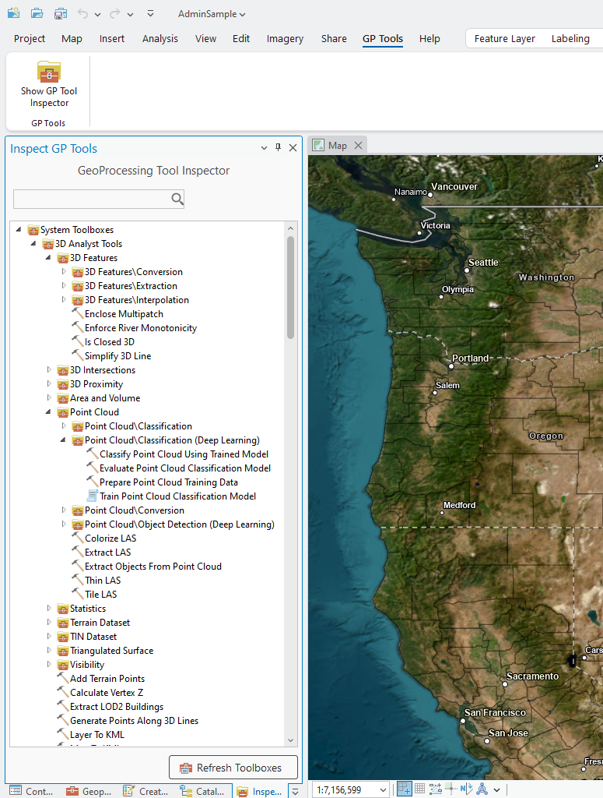
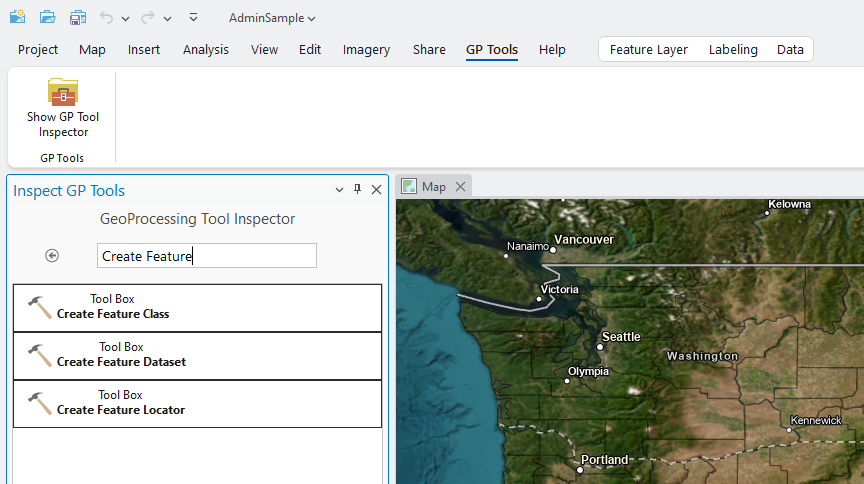
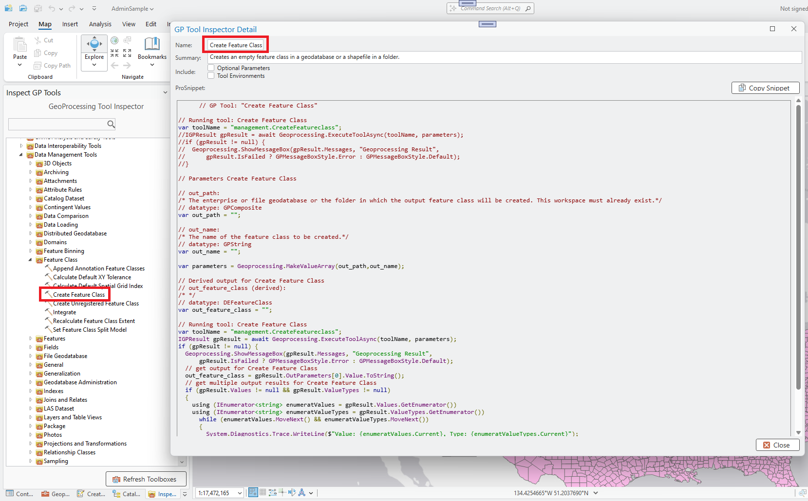
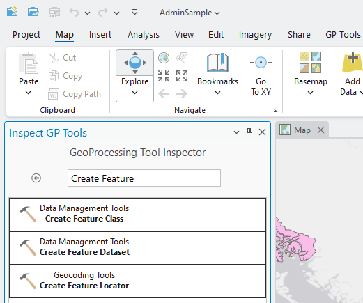

## GPToolInspector

<!-- TODO: Write a brief abstract explaining this sample -->
GPToolInspector is an Add-in that reads the ArcGIS Pro toolboxes folder and displays all discovered toolboxes and tools in a tree view.  The tree view can be used to 'drill down' to find any tool by category, or the tree view can be searched by tool description for locating a specific tool.  Clicking on a tool node displays a popup dialog showing the tool usage in form of a code snippet that is ready to be applied within your add-in or managed configuration code.  
  


<a href="https://pro.arcgis.com/en/pro-app/sdk/" target="_blank">View it live</a>

<!-- TODO: Fill this section below with metadata about this sample-->
```
Language:              C#
Subject:               Framework
Contributor:           ArcGIS Pro SDK Team <arcgisprosdk@esri.com>
Organization:          Esri, https://www.esri.com
Date:                  05/06/2025
ArcGIS Pro:            3.5
Visual Studio:         2022
.NET Target Framework: net8.0-windows
```

## Resources

[Community Sample Resources](https://github.com/Esri/arcgis-pro-sdk-community-samples#resources)

### Samples Data

* Sample data for ArcGIS Pro SDK Community Samples can be downloaded from the [Releases](https://github.com/Esri/arcgis-pro-sdk-community-samples/releases) page.  

## How to use the sample
<!-- TODO: Explain how this sample can be used. To use images in this section, create the image file in your sample project's screenshots folder. Use relative url to link to this image using this syntax:  -->
1. Download this repo onto your local machine and open the GPToolInspector solution using Visual Studio 2022.
2. In Visual Studio click the Build menu. Then select Build Solution.  
3. Click Start button to open ArcGIS Pro.  
4. ArcGIS Pro will open.   
5. Open any project and then open the "GP Tools" tab on the ArcGIS Pro ribbon.  The "Show GP Tool Inspector" button can be used to open the "Inspect GP Tools" dockpane.  
  
6. The "Inspect GP Tools" dockpane will open.  The "System Toolboxes" tree view in the dockpane displays all the toolboxes and tools found in the ArcGIS Pro toolboxes folder.  The tree view can be used to 'drill down' to find any tool by category.  
7. Once a 'Tool' node is located , clicking on the node will display a popup dialog showing the tool usage in form of a code snippet that is ready to be applied within your add-in or managed configuration code.  
  
8. Use the search text box above the tree view to search by tool description.  Enter a tool descriptin like for example: "Create Feature".  
  
9. The search results will be displayed in form of a listview.  Click on a 'Tool' node to display the tool usage in form of a code snippet.  
  
  

<!-- End -->

&nbsp;&nbsp;&nbsp;&nbsp;&nbsp;&nbsp;
&nbsp;&nbsp;&nbsp;&nbsp;&nbsp;&nbsp;&nbsp;&nbsp;&nbsp;&nbsp;&nbsp;&nbsp;
[Home](https://github.com/Esri/arcgis-pro-sdk/wiki) | <a href="https://pro.arcgis.com/en/pro-app/latest/sdk/api-reference" target="_blank">API Reference</a> | [Requirements](https://github.com/Esri/arcgis-pro-sdk/wiki#requirements) | [Download](https://github.com/Esri/arcgis-pro-sdk/wiki#installing-arcgis-pro-sdk-for-net) | <a href="https://github.com/esri/arcgis-pro-sdk-community-samples" target="_blank">Samples</a>
