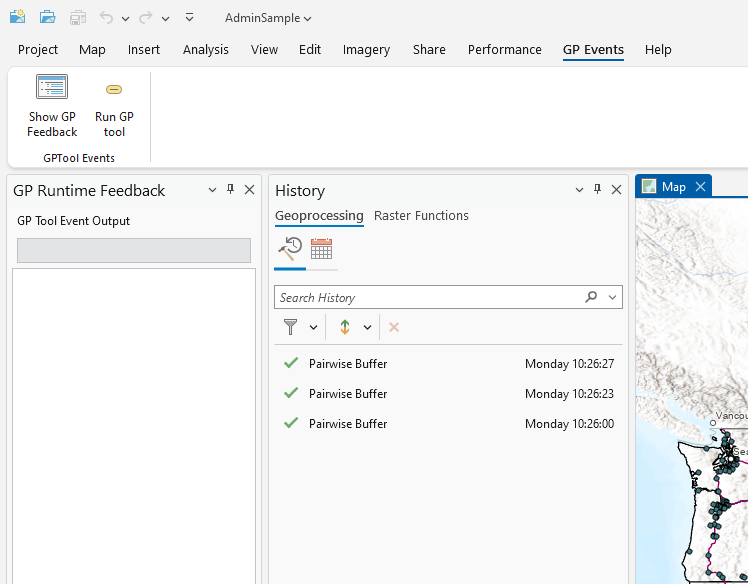
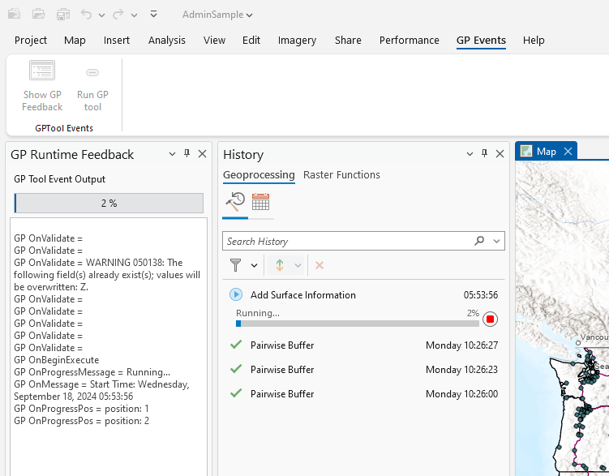

## GeoProcesssingEventsWithUI

<!-- TODO: Write a brief abstract explaining this sample -->
This sample shows how to capture GP Tool runtime events including the percentage completion event.  
  


<a href="https://pro.arcgis.com/en/pro-app/sdk/" target="_blank">View it live</a>

<!-- TODO: Fill this section below with metadata about this sample-->
```
Language:              C#
Subject:               Framework
Contributor:           ArcGIS Pro SDK Team <arcgisprosdk@esri.com>
Organization:          Esri, https://www.esri.com
Date:                  11/04/2024
ArcGIS Pro:            3.4
Visual Studio:         2022
.NET Target Framework: net8.0-windows
```

## Resources

[Community Sample Resources](https://github.com/Esri/arcgis-pro-sdk-community-samples#resources)

### Samples Data

* Sample data for ArcGIS Pro SDK Community Samples can be downloaded from the [Releases](https://github.com/Esri/arcgis-pro-sdk-community-samples/releases) page.  

## How to use the sample
<!-- TODO: Explain how this sample can be used. To use images in this section, create the image file in your sample project's screenshots folder. Use relative url to link to this image using this syntax:  -->
1. Download the Community Sample data (see under the 'Resources' section for downloading sample data).  The sample data contains a project called 'AdminSample.aprx' that includes data that is used by this sample.  Make sure that the Sample data is unzipped in c:\data and "C:\Data\Admin" is available.
2. In Visual studio rebuild the solution.  
3. Debug the add-in.  
4. After ArcGIS Pro opens, open the "C:\Data\Admin\AdminSample.aprx" project.  
5. Select the "GP Events" tab.  
6. On the "GPTool Events" Group click the "Show GP Feedback" button to display the "GP Runtime Feedback" dockpane.  
  
7. On the "GPTool Events" Group click the "Run GP tool" button to run the "Add Surface Information" GP Tool (Spatial Analyst Tools).    
  
8. Notice the updates to the GP Tool progress status and progress bar.  
  

<!-- End -->

&nbsp;&nbsp;&nbsp;&nbsp;&nbsp;&nbsp;
&nbsp;&nbsp;&nbsp;&nbsp;&nbsp;&nbsp;&nbsp;&nbsp;&nbsp;&nbsp;&nbsp;&nbsp;
[Home](https://github.com/Esri/arcgis-pro-sdk/wiki) | <a href="https://pro.arcgis.com/en/pro-app/latest/sdk/api-reference" target="_blank">API Reference</a> | [Requirements](https://github.com/Esri/arcgis-pro-sdk/wiki#requirements) | [Download](https://github.com/Esri/arcgis-pro-sdk/wiki#installing-arcgis-pro-sdk-for-net) | <a href="https://github.com/esri/arcgis-pro-sdk-community-samples" target="_blank">Samples</a>
