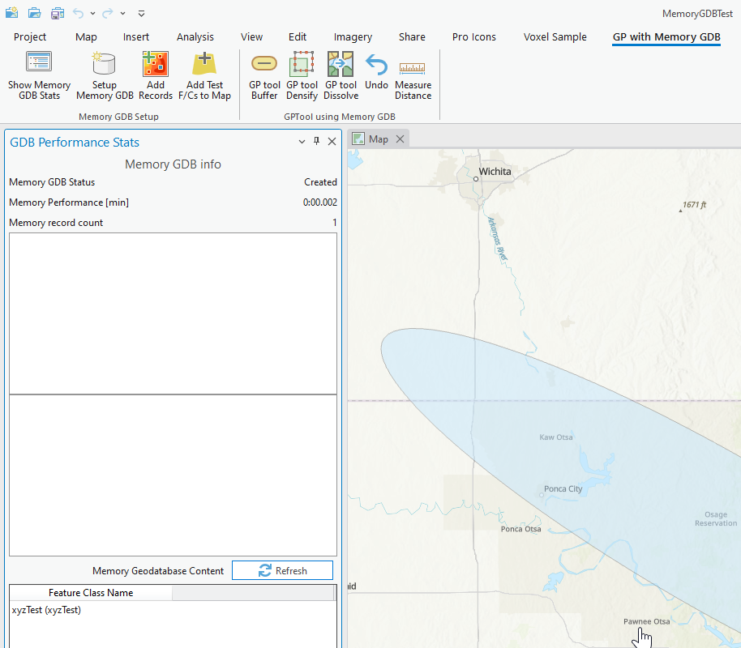
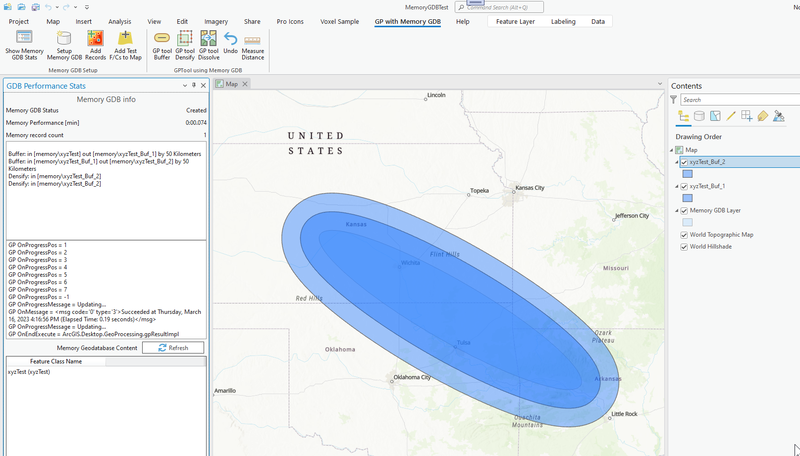

## GeoProcesssingWithMemoryGDB

<!-- TODO: Write a brief abstract explaining this sample -->
This sample shows how to create create a memory Geodatabase and then uses the Memory Geodatabase for geo processing.  
  


<a href="https://pro.arcgis.com/en/pro-app/sdk/" target="_blank">View it live</a>

<!-- TODO: Fill this section below with metadata about this sample-->
```
Language:              C#
Subject:               Framework
Contributor:           ArcGIS Pro SDK Team <arcgisprosdk@esri.com>
Organization:          Esri, https://www.esri.com
Date:                  10/01/2023
ArcGIS Pro:            3.2
Visual Studio:         2022
.NET Target Framework: net6.0-windows
```

## Resources

[Community Sample Resources](https://github.com/Esri/arcgis-pro-sdk-community-samples#resources)

### Samples Data

* Sample data for ArcGIS Pro SDK Community Samples can be downloaded from the [Releases](https://github.com/Esri/arcgis-pro-sdk-community-samples/releases) page.  

## How to use the sample
<!-- TODO: Explain how this sample can be used. To use images in this section, create the image file in your sample project's screenshots folder. Use relative url to link to this image using this syntax:  -->
1. In Visual studio rebuild the solution.
2. Debug the add-in.  
3. ArcGIS Pro opens, create a new Map project using the Map template.  
4. Select the "GP with Memory GDB" tab.  
5. On the "Memory GDB Setup" Group click each button from left to right.  This displays the performance stats dockpane, and adds one feature to a test polygon feature class and displays the single feature on the map.  
6. Click the "Refresh" button on the "GDB Performance Stats" dockpane. This displays the current feature class content of the memory geodatabase.  To start out you should only see the test polygon feature class.  
  
7. On the "Memory GDB Setup" Group click any of the GP Tool button to test memory GDB performance.    
  
8. Click the "Undo" button to start from scratch.   
  

<!-- End -->

&nbsp;&nbsp;&nbsp;&nbsp;&nbsp;&nbsp;
&nbsp;&nbsp;&nbsp;&nbsp;&nbsp;&nbsp;&nbsp;&nbsp;&nbsp;&nbsp;&nbsp;&nbsp;
[Home](https://github.com/Esri/arcgis-pro-sdk/wiki) | <a href="https://pro.arcgis.com/en/pro-app/latest/sdk/api-reference" target="_blank">API Reference</a> | [Requirements](https://github.com/Esri/arcgis-pro-sdk/wiki#requirements) | [Download](https://github.com/Esri/arcgis-pro-sdk/wiki#installing-arcgis-pro-sdk-for-net) | <a href="https://github.com/esri/arcgis-pro-sdk-community-samples" target="_blank">Samples</a>
