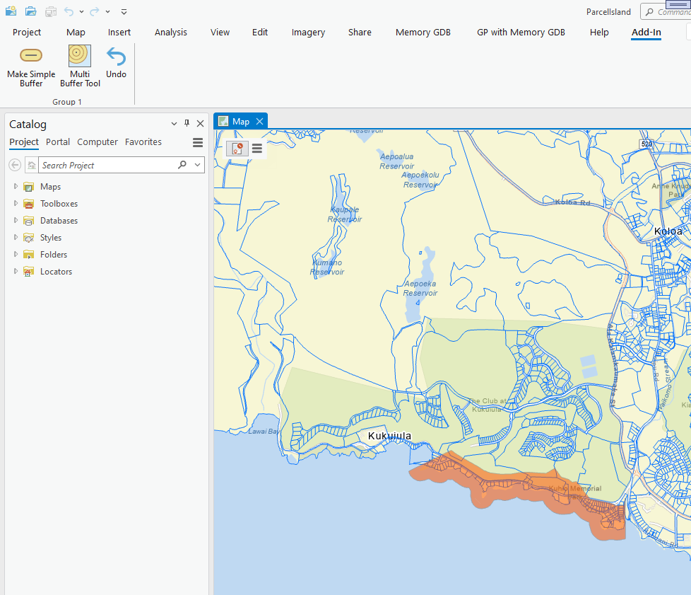
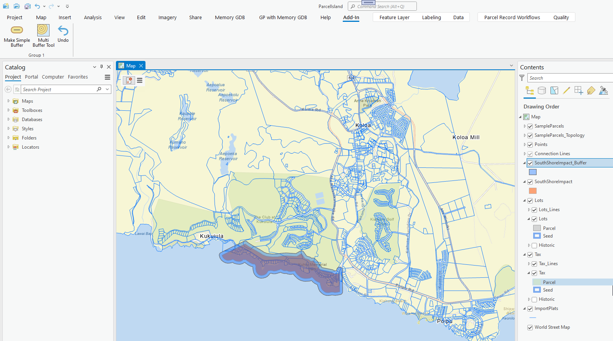
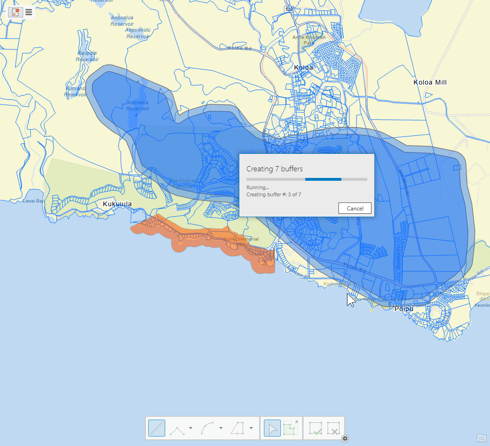
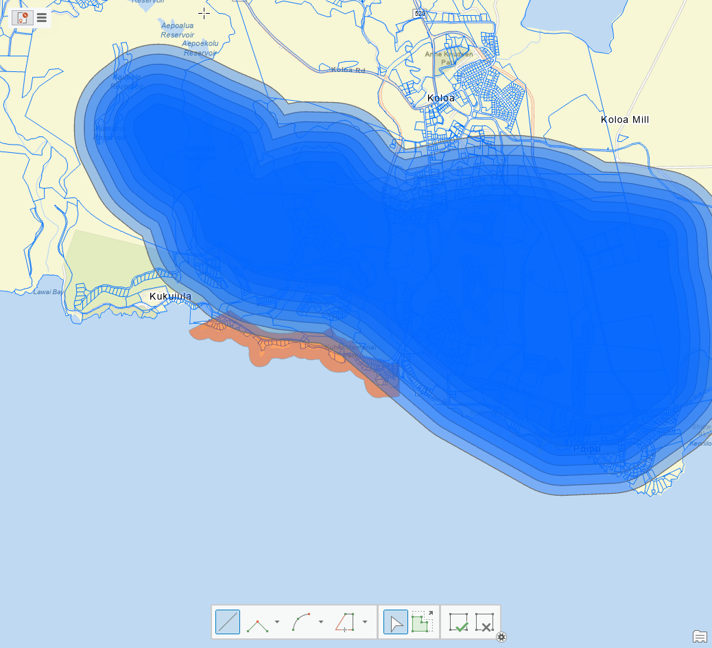

## SimpleBufferExample

<!-- TODO: Write a brief abstract explaining this sample -->
This sample shows how to call the 'Buffer' GP Tool from .Net.  It also calls the GP Tool in a loop to show the Progress dialog across multiple GP Tool calls.  
  


<a href="https://pro.arcgis.com/en/pro-app/sdk/" target="_blank">View it live</a>

<!-- TODO: Fill this section below with metadata about this sample-->
```
Language:              C#
Subject:               Geodatabase
Contributor:           ArcGIS Pro SDK Team <arcgisprosdk@esri.com>
Organization:          Esri, https://www.esri.com
Date:                  11/04/2024
ArcGIS Pro:            3.4
Visual Studio:         2022
.NET Target Framework: net8.0-windows
```

## Resources

[Community Sample Resources](https://github.com/Esri/arcgis-pro-sdk-community-samples#resources)

### Samples Data

* Sample data for ArcGIS Pro SDK Community Samples can be downloaded from the [Releases](https://github.com/Esri/arcgis-pro-sdk-community-samples/releases) page.  

## How to use the sample
<!-- TODO: Explain how this sample can be used. To use images in this section, create the image file in your sample project's screenshots folder. Use relative url to link to this image using this syntax:  -->
1. You will need CommunitySampleData-ParcelFabric-mm-dd-yyyy.zip down-loadable as an asset under the latest release.
2. In Visual studio rebuild the solution.  
3. Debug the add-in.  
4. When ArcGIS Pro opens open 'C:\Data\ParcelFabric\Island\ParcelIsland.aprx'.  
5. Select the "Simple Buffer" tab.  
  
6. Click the "Make Simple Buffer" button to create a buffer around the 'SouthShoreImpact' layer, the resulting buffer is called 'SouthShoreImpact_Buffer' and will be added to the map.   
  
7. In order to see the Progress Dialog being displayed you need to run ArcGIS Pro outside the Visual Studio debugger.  Running from with the VS Debugger will dispable the Progress Dialog display.  
8. Click the "Multi Buffer tool" and digitize a complex polygon onto the map.  Complete the polygon to start the 'Buffer GP Tool' loop.  
  
  
  

<!-- End -->

&nbsp;&nbsp;&nbsp;&nbsp;&nbsp;&nbsp;
&nbsp;&nbsp;&nbsp;&nbsp;&nbsp;&nbsp;&nbsp;&nbsp;&nbsp;&nbsp;&nbsp;&nbsp;
[Home](https://github.com/Esri/arcgis-pro-sdk/wiki) | <a href="https://pro.arcgis.com/en/pro-app/latest/sdk/api-reference" target="_blank">API Reference</a> | [Requirements](https://github.com/Esri/arcgis-pro-sdk/wiki#requirements) | [Download](https://github.com/Esri/arcgis-pro-sdk/wiki#installing-arcgis-pro-sdk-for-net) | <a href="https://github.com/esri/arcgis-pro-sdk-community-samples" target="_blank">Samples</a>
