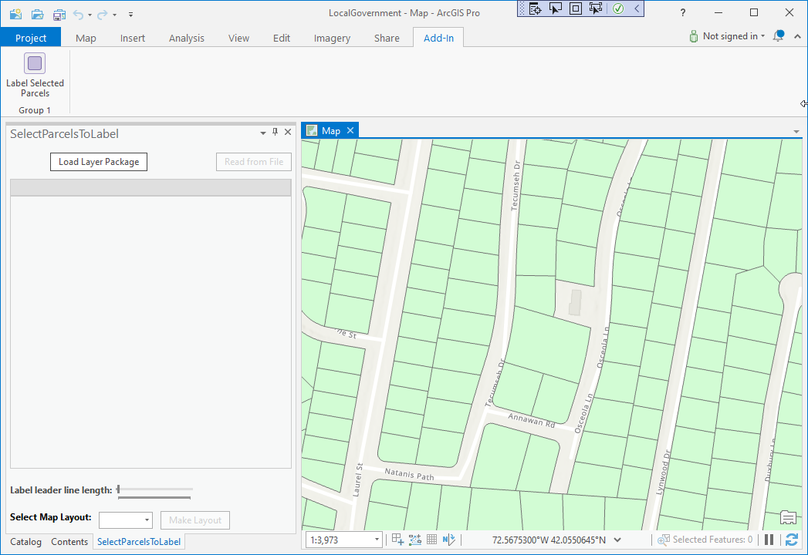
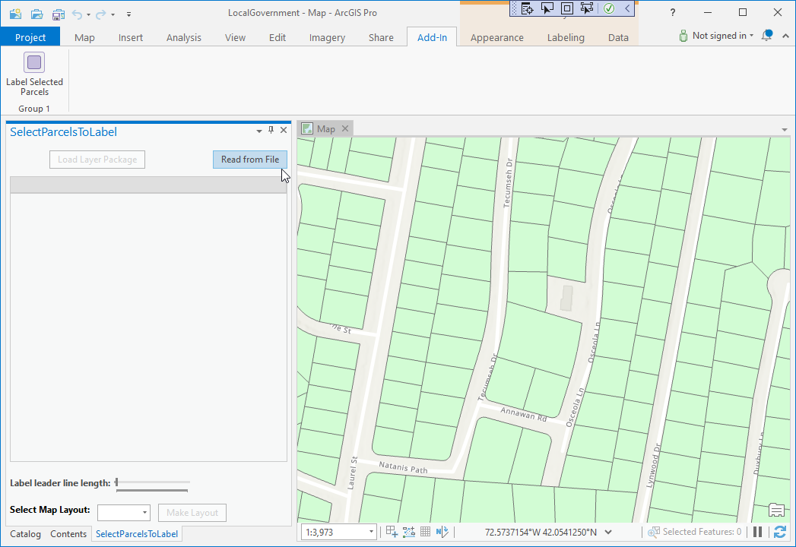
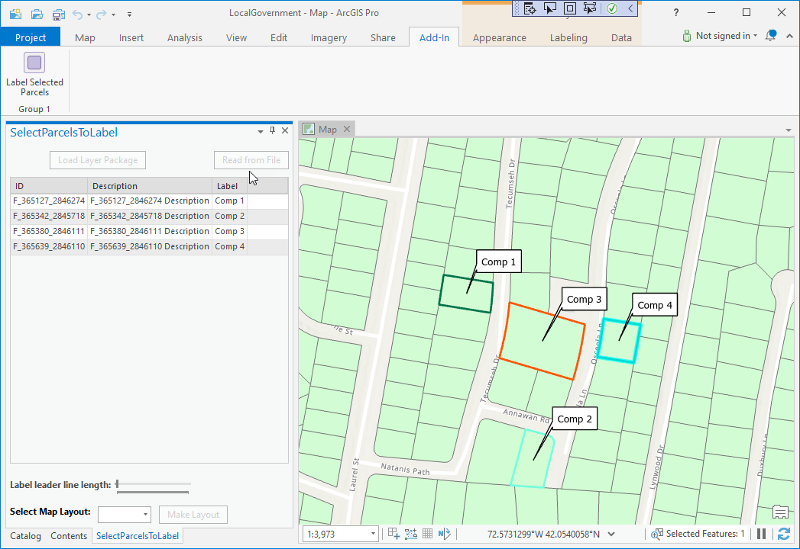
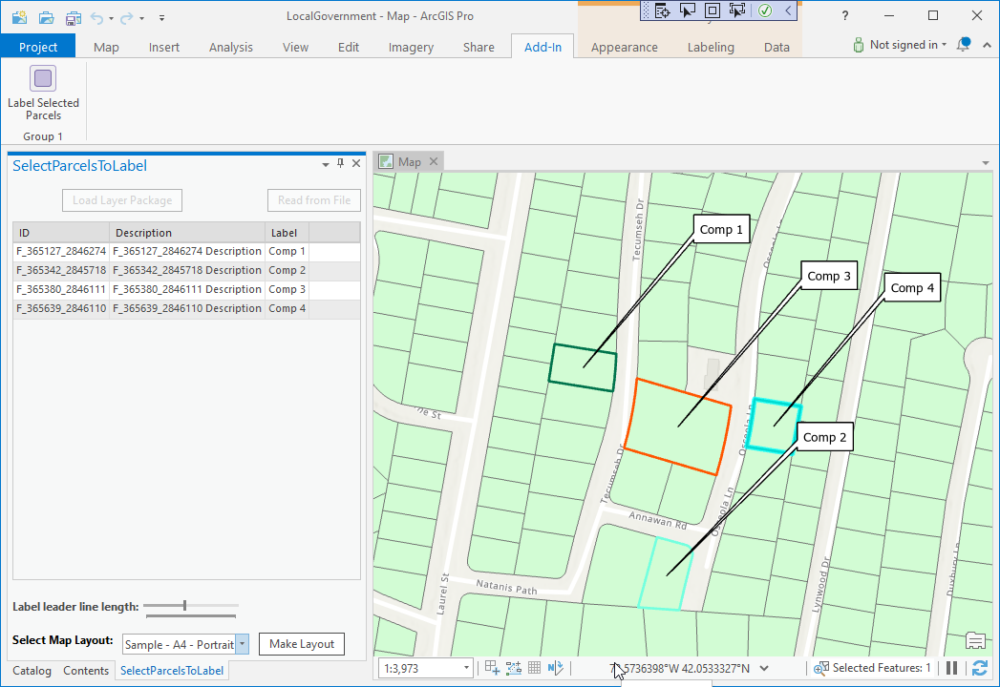

## LayoutWithLabels

<!-- TODO: Write a brief abstract explaining this sample -->
This sample shows how to create a layout with custom labeling for a selected set of polygon features.  In order to do this the sample is using the following functionality:  
* A layer file containing a 'labeled' polygon layer is loaded by the add-in and dynamically added to the map  
* The add-in then reads a csv file containing some Ids of polygon features that have to be labeled with 'customized' text strings  
* The labels (using call-out labels) are placed on the map (using the dynamically loaded 'labeled' polygon layer  
* A control can then be used to re-position the labels on the map  
* The add-in adds a layout that contains the labeled map and a tabular list of all labeled features.  
  


<a href="https://pro.arcgis.com/en/pro-app/sdk/" target="_blank">View it live</a>

<!-- TODO: Fill this section below with metadata about this sample-->
```
Language:              C#
Subject:               Layouts
Contributor:           ArcGIS Pro SDK Team <arcgisprosdk@esri.com>
Organization:          Esri, https://www.esri.com
Date:                  04/04/2024
ArcGIS Pro:            3.3
Visual Studio:         2022
.NET Target Framework: net8.0-windows
```

## Resources

[Community Sample Resources](https://github.com/Esri/arcgis-pro-sdk-community-samples#resources)

### Samples Data

* Sample data for ArcGIS Pro SDK Community Samples can be downloaded from the [Releases](https://github.com/Esri/arcgis-pro-sdk-community-samples/releases) page.  

## How to use the sample
<!-- TODO: Explain how this sample can be used. To use images in this section, create the image file in your sample project's screenshots folder. Use relative url to link to this image using this syntax:  -->
1. Download the Community Sample data (see under the 'Resources' section for downloading sample data)
2. Make sure that the Sample data is unzipped in c:\data   
3. The project used for this sample is 'C:\Data\LocalGovernment\LocalGovernment.aprx'  
4. In Visual Studio click the Build menu. Then select Build Solution.  
5. Launch the debugger to open ArcGIS Pro.  
6. ArcGIS Pro will open, select the LocalGovernment.aprx project  
7. Click on the Add-In tab and the click the 'Label Selected Parcels' button.  
  
8. Click the "load Layer Package" button on the "SelectParcelsToLabel" dockpane.  This loads a layer file  containing a 'labeled' polygon layer and dynamically adds it to the map  
  
9. Now that the "Read from File" button is enabled, click the "Read from File" button in order to load a sample csv file that contains records that are identified by using a unique parcel Id field.  
10. The loaded features are displayed in a table on the "SelectParcelsToLabel" dockpane and highlighted and labeled on the map using the 'labeled' polygon layer.  
  
11. You can use the "Label leader line length" control on the "SelectParcelsToLabel" dockpane to manipulate the leader line length.  
  
12. Finally to generate the layout select a 'Map Layout" and click the "Make Layout" button.  
  
  

<!-- End -->

&nbsp;&nbsp;&nbsp;&nbsp;&nbsp;&nbsp;
&nbsp;&nbsp;&nbsp;&nbsp;&nbsp;&nbsp;&nbsp;&nbsp;&nbsp;&nbsp;&nbsp;&nbsp;
[Home](https://github.com/Esri/arcgis-pro-sdk/wiki) | <a href="https://pro.arcgis.com/en/pro-app/latest/sdk/api-reference" target="_blank">API Reference</a> | [Requirements](https://github.com/Esri/arcgis-pro-sdk/wiki#requirements) | [Download](https://github.com/Esri/arcgis-pro-sdk/wiki#installing-arcgis-pro-sdk-for-net) | <a href="https://github.com/esri/arcgis-pro-sdk-community-samples" target="_blank">Samples</a>
