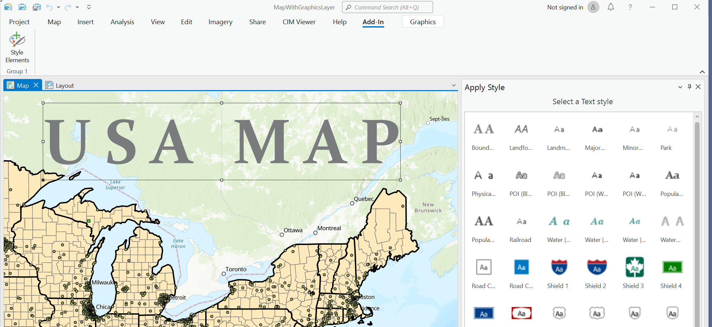
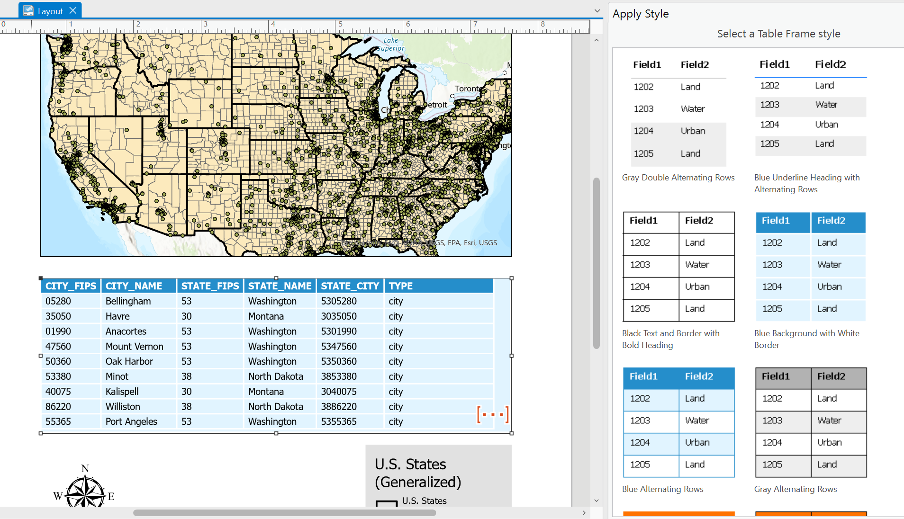
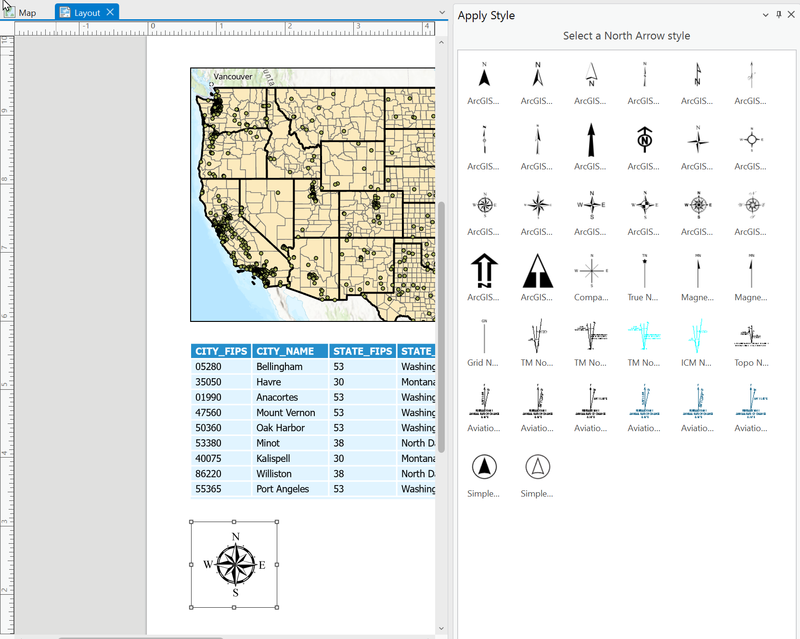

## StyleElements

<!-- TODO: Write a brief abstract explaining this sample -->
This sample illustrates how apply a style to graphic elements in a MapView or layout elements in a Layout View. Graphics in a Map View can be point, line, polygon and text graphics. In the Layout view, additional graphics such as North Arrow, Scale bar, table frame and Grids and Graticule can be changed using the Pro SDK.  
  


<a href="https://pro.arcgis.com/en/pro-app/sdk/" target="_blank">View it live</a>

<!-- TODO: Fill this section below with metadata about this sample-->
```
Language:              C#
Subject:               Framework
Contributor:           ArcGIS Pro SDK Team <arcgisprosdk@esri.com>
Organization:          Esri, https://www.esri.com
Date:                  05/06/2025
ArcGIS Pro:            3.5
Visual Studio:         2022
.NET Target Framework: net8.0-windows
```

## Resources

[Community Sample Resources](https://github.com/Esri/arcgis-pro-sdk-community-samples#resources)

### Samples Data

* Sample data for ArcGIS Pro SDK Community Samples can be downloaded from the [Releases](https://github.com/Esri/arcgis-pro-sdk-community-samples/releases) page.  

## How to use the sample
<!-- TODO: Explain how this sample can be used. To use images in this section, create the image file in your sample project's screenshots folder. Use relative url to link to this image using this syntax:  -->
1. In Visual Studio, build the solution.
2. Click Start button to open ArcGIS Pro.  
3. In Pro, open any project with Map Graphics and Layout graphic elements such as north arrow, scale bar, etc.  
4. Activate the map so that there is an active map view.  
5. Select any graphics in the MapView using the Select tool on the Graphics tab.  
6. In the Add-In tab, click the Style Elements button.  
  
7. The "Apply Styles" custom dockpane is displayed, hosting all the style items for the selected graphic. In the screen shot above, Text graphic element is selected on the map.  The custom dockpane displays all the text style items available for this selected element.  
8. Click any text style in the Apply Style dockpane. The style is applied to the selected text graphic.  
9. Open a layout with various layout elements such as a map frame, legend, table, scale bar, north arrow.  
10. When you select any of these layout elements, the Apply Style  dockpane will update with the style items available for that selected layout element.In the screen shot below, you can see the Table Frame layout elements is selected. Notice the dockpane is updated with all the table frame styles. Selecting a table style in the dockpane will apply this style to the selected table.  
      
11. Select the North Arrow element on the layout. Notice that the dockpane is updated with all the North Arrow style items. You can change the North Arrow style in the layout by selecting any one of the displayed North Arrow styles in the Apply Style dockpane.  
     
  

<!-- End -->

&nbsp;&nbsp;&nbsp;&nbsp;&nbsp;&nbsp;
&nbsp;&nbsp;&nbsp;&nbsp;&nbsp;&nbsp;&nbsp;&nbsp;&nbsp;&nbsp;&nbsp;&nbsp;
[Home](https://github.com/Esri/arcgis-pro-sdk/wiki) | <a href="https://pro.arcgis.com/en/pro-app/latest/sdk/api-reference" target="_blank">API Reference</a> | [Requirements](https://github.com/Esri/arcgis-pro-sdk/wiki#requirements) | [Download](https://github.com/Esri/arcgis-pro-sdk/wiki#installing-arcgis-pro-sdk-for-net) | <a href="https://github.com/esri/arcgis-pro-sdk-community-samples" target="_blank">Samples</a>
