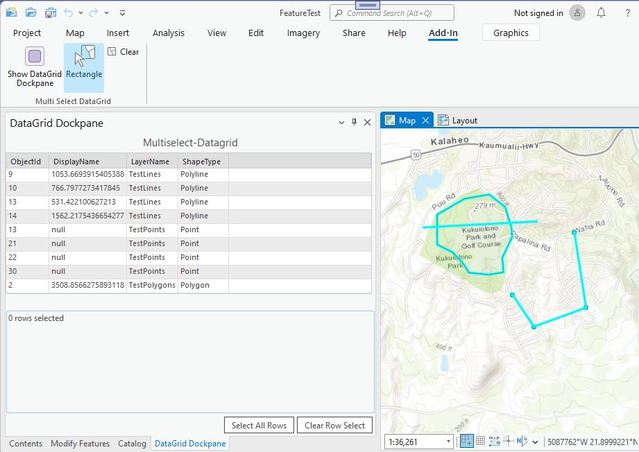
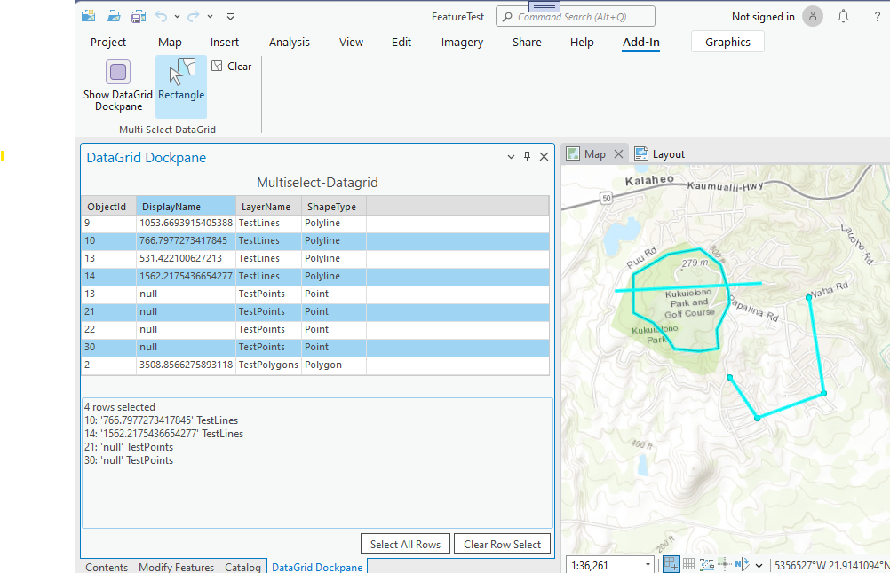

## DatagridMultiSelect

<!-- TODO: Write a brief abstract explaining this sample -->
This sample shows how to use the WPF DataGrid's 'Multi-Select' feature to select multiple rows from a DataGrid in MVVM.  The DataGrid is displayed in a DockPane.  
  


<a href="https://pro.arcgis.com/en/pro-app/sdk/" target="_blank">View it live</a>

<!-- TODO: Fill this section below with metadata about this sample-->
```
Language:              C#
Subject:               MVVM-XAML
Contributor:           ArcGIS Pro SDK Team <arcgisprosdk@esri.com>
Organization:          Esri, https://www.esri.com
Date:                  11/04/2024
ArcGIS Pro:            3.4
Visual Studio:         2022
.NET Target Framework: net8.0-windows7.0
```

## Resources

[Community Sample Resources](https://github.com/Esri/arcgis-pro-sdk-community-samples#resources)

### Samples Data

* Sample data for ArcGIS Pro SDK Community Samples can be downloaded from the [Releases](https://github.com/Esri/arcgis-pro-sdk-community-samples/releases) page.  

## How to use the sample
<!-- TODO: Explain how this sample can be used. To use images in this section, create the image file in your sample project's screenshots folder. Use relative url to link to this image using this syntax:  -->
1. Download the Community Sample data (see under the "Resources" section for downloading sample data).  The sample data contains a project called "FeatureTest.aprx" with data suitable for this sample.  Make sure that the Sample data is unzipped in c:\data and "C:\Data\FeatureTest\FeatureTest.aprx" is available.
2. Open this solution in Visual Studio.  
3. Click the build menu and select Build Solution.  
4. Launch the debugger to open ArCGIS Pro. ArcGIS Pro will open.    
5. Open the "C:\Data\FeatureTest\FeatureTest.aprx" project.  
6. Open the Add-in Tab and click on the 'Show DataGrid Dockpane' button to open the DataGrid Dockpane.  
7. Click the 'Select by Rectangle' button and draw a rectangle around the features in the map.  You will see the selected features listed in the DataGrid Dockpane.  
  
8. Now use the DataGrid's 'Multi-Select' feature to select multiple features from different layers.  You will see the selected features listed in the DataGrid Dockpane by using the 'Control key' while click rows to be selected.  
  
9. The multi selection result is displayed on the bottom of the Dockpane.  
  

<!-- End -->

&nbsp;&nbsp;&nbsp;&nbsp;&nbsp;&nbsp;
&nbsp;&nbsp;&nbsp;&nbsp;&nbsp;&nbsp;&nbsp;&nbsp;&nbsp;&nbsp;&nbsp;&nbsp;
[Home](https://github.com/Esri/arcgis-pro-sdk/wiki) | <a href="https://pro.arcgis.com/en/pro-app/latest/sdk/api-reference" target="_blank">API Reference</a> | [Requirements](https://github.com/Esri/arcgis-pro-sdk/wiki#requirements) | [Download](https://github.com/Esri/arcgis-pro-sdk/wiki#installing-arcgis-pro-sdk-for-net) | <a href="https://github.com/esri/arcgis-pro-sdk-community-samples" target="_blank">Samples</a>
