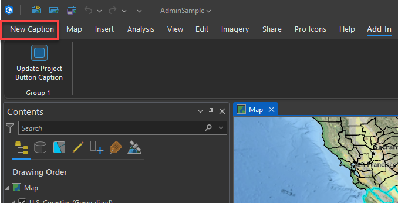

## InteractWithWPF

<!-- TODO: Write a brief abstract explaining this sample -->
This sample demonstrates how to interact with WPF controls in ArcGIS Pro's UI.  Sometimes ArcGIS Pro UI elements are not accessible via the ArcGIS Pro API and in some of those cases WPF controls can be used to modify the UI.    
Indeed the "Project" button is not a standard Framework Plugin (button) like the other tabs on the ArcGIS Pro ribbon.  But, since ArcGIS Pro is a WPF application, and we can 'spy' the WPF visual tree (use Visual Studio to do so) to find which control implements the "Project" button.   It turns out that the "Project" control's name is "appButton" and the type of the control is "ActiproSoftware.Windows.Controls.Bars.RibbonApplicationButton".  Once ArcGIS Pro is open you can use the code in this add-in to update the "Project" button to "New Caption".  
Note: since we can't access any ActiProSoftware resources the code is using reflection to make the .Content property update.  
  


<a href="https://pro.arcgis.com/en/pro-app/sdk/" target="_blank">View it live</a>

<!-- TODO: Fill this section below with metadata about this sample-->
```
Language:              C#
Subject:               Framework
Contributor:           ArcGIS Pro SDK Team <arcgisprosdk@esri.com>
Organization:          Esri, https://www.esri.com
Date:                  05/06/2025
ArcGIS Pro:            3.5
Visual Studio:         2022
.NET Target Framework: net8.0-windows
```

## Resources

[Community Sample Resources](https://github.com/Esri/arcgis-pro-sdk-community-samples#resources)

### Samples Data

* Sample data for ArcGIS Pro SDK Community Samples can be downloaded from the [Releases](https://github.com/Esri/arcgis-pro-sdk-community-samples/releases) page.  

## How to use the sample
<!-- TODO: Explain how this sample can be used. To use images in this section, create the image file in your sample project's screenshots folder. Use relative url to link to this image using this syntax:  -->
1. In Visual studio rebuild the solution.
2. Debug the add-in.  
3. Load any ArcGIS project.  
4. Click on the "Add-in" tab.   
5. Click on the "Update Project Button Caption" button to change the caption of the "Project" button to "New Caption".  
  
  

<!-- End -->

&nbsp;&nbsp;&nbsp;&nbsp;&nbsp;&nbsp;
&nbsp;&nbsp;&nbsp;&nbsp;&nbsp;&nbsp;&nbsp;&nbsp;&nbsp;&nbsp;&nbsp;&nbsp;
[Home](https://github.com/Esri/arcgis-pro-sdk/wiki) | <a href="https://pro.arcgis.com/en/pro-app/latest/sdk/api-reference" target="_blank">API Reference</a> | [Requirements](https://github.com/Esri/arcgis-pro-sdk/wiki#requirements) | [Download](https://github.com/Esri/arcgis-pro-sdk/wiki#installing-arcgis-pro-sdk-for-net) | <a href="https://github.com/esri/arcgis-pro-sdk-community-samples" target="_blank">Samples</a>
