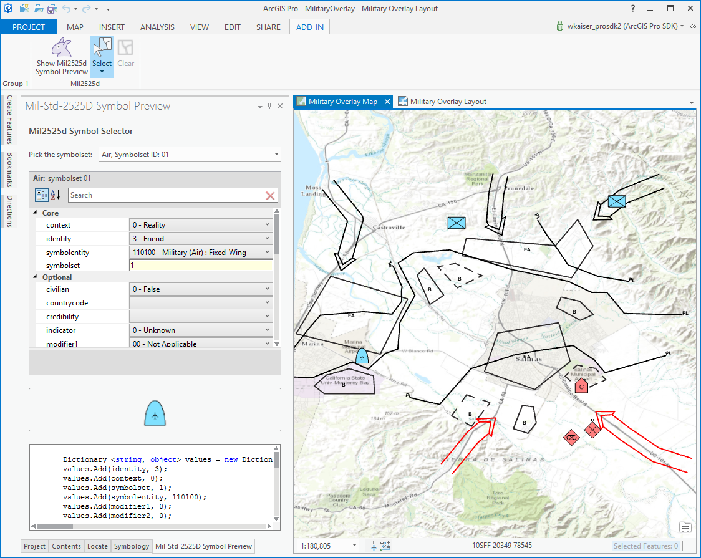
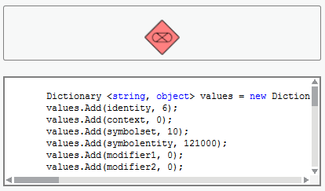
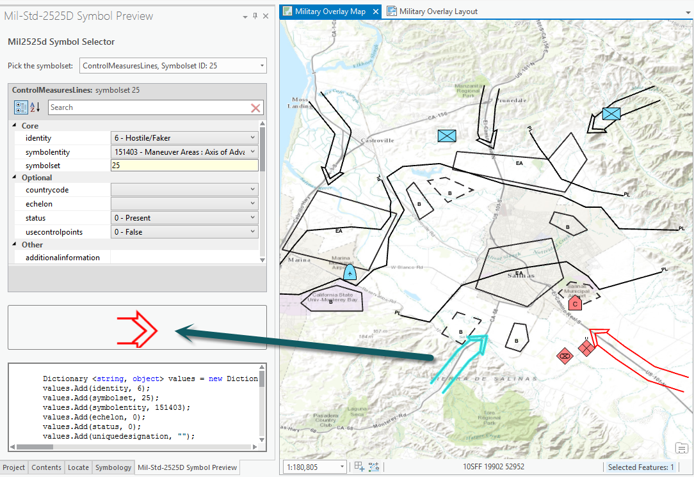

## DictionarySymbolPreview

<!-- TODO: Write a brief abstract explaining this sample -->
Preview the Mil2525d symbol set that ships with ArcGIS Pro. Includes the  entities, modifiers, and coded domains exported from the <a href="https://github.com/Esri/joint-military-symbology-xml">JMSML</a>   
(joint military symbology library) schema. These values are used to configure the symbol preview sample.  
  


<a href="http://pro.arcgis.com/en/pro-app/sdk/" target="_blank">View it live</a>

<!-- TODO: Fill this section below with metadata about this sample-->
```
Language:              C#
Subject:               Map-Authoring
Contributor:           ArcGIS Pro SDK Team <arcgisprosdk@esri.com>
Organization:          Esri, http://www.esri.com
Date:                  7/10/2020
ArcGIS Pro:            2.6
Visual Studio:         2017, 2019
.NET Target Framework: 4.8
```

## Resources

* [API Reference online](https://pro.arcgis.com/en/pro-app/sdk/api-reference)
* <a href="https://pro.arcgis.com/en/pro-app/sdk/" target="_blank">ArcGIS Pro SDK for .NET (pro.arcgis.com)</a>
* [arcgis-pro-sdk-community-samples](https://github.com/Esri/arcgis-pro-sdk-community-samples)
* [ArcGIS Pro DAML ID Reference](https://github.com/Esri/arcgis-pro-sdk/wiki/ArcGIS-Pro-DAML-ID-Reference)
* [FAQ](https://github.com/Esri/arcgis-pro-sdk/wiki/FAQ)
* [ArcGIS Pro SDK icons](https://github.com/Esri/arcgis-pro-sdk/releases/tag/2.4.0.19948)


### Samples Data

* Sample data for ArcGIS Pro SDK Community Samples can be downloaded from the [repo releases](https://github.com/Esri/arcgis-pro-sdk-community-samples/releases) page.  

## How to use the sample
<!-- TODO: Explain how this sample can be used. To use images in this section, create the image file in your sample project's screenshots folder. Use relative url to link to this image using this syntax:  -->
1. Download the Community Sample data (see under the 'Resources' section for downloading sample data).  The sample data contains a dataset called 'MilitaryOverlay' with sample data for use by this sample.  Make sure that the Sample data is unzipped in c:\data and "C:\Data\MilitaryOverlay" is available.  
1. Open this solution in Visual Studio.    
1. Click the build menu and select Build Solution.  
1. This solution is using the **Extended.Wpf.Toolkit Nuget**.  If needed, you can install the Nuget from the "Nuget Package Manager Console" by using this script: "Install-Package Extended.Wpf.Toolkit".  
1. Click the Start button to open ArCGIS Pro.  ArcGIS Pro will open.  
1. Open the project "MilitaryOverlay.aprx" in the "C:\Data\MilitaryOverlay" folder since this project some military symbolgy sample data.  
1. You can also add layers using the feature classes in the <i>MilitaryOverlay.gdb</i> that is distributed with the SDK sample data.  
1. Change the 'Appearance'->'Symbology' to "Dictionary" if it is not automatically set.  
1. Click on the ADD-IN tab  
1. Click on the "Show Mil2525d Symbol Preview" button.  
1. The Mil2525d Symbol Preview dockpane opens.  
1. Pick from the available symbol sets and change symbol attributes to preview different Mil2525d symbols  
  
  
1. The code window at the bottom shows the CSharp code you would need to make the corresponding CIMSymbol in your code.  
  
  
1. Use the selection tool to select a feature from any of the layers.  
1. The selected feature's attributes will be used to configure the Symbol Preview.  
   
  
TODO: o Support 256x256 Preview area for the symbol o Support editing the selected feature attributes with the Symbol Preview settings  
  
  
  <b>Note:</b>  

  
The JMSML schema and associated tools to generate the Mil2525d data can be found online  
<a href="https://github.com/Esri/joint-military-symbology-xml">here</a> on github.   
The sample can be used against any ESRI military features data set for the MIL2525d specification. Sample  data is included with the Pro samples but other example data can be found   
<a href="https://github.com/Esri/military-features-data">here</a>.  
  
  


<!-- End -->

&nbsp;&nbsp;&nbsp;&nbsp;&nbsp;&nbsp;
&nbsp;&nbsp;&nbsp;&nbsp;&nbsp;&nbsp;&nbsp;&nbsp;&nbsp;&nbsp;&nbsp;&nbsp;
[Home](https://github.com/Esri/arcgis-pro-sdk/wiki) | <a href="https://pro.arcgis.com/en/pro-app/sdk/api-reference" target="_blank">API Reference</a> | [Requirements](https://github.com/Esri/arcgis-pro-sdk/wiki#requirements) | [Download](https://github.com/Esri/arcgis-pro-sdk/wiki#installing-arcgis-pro-sdk-for-net) | <a href="https://github.com/esri/arcgis-pro-sdk-community-samples" target="_blank">Samples</a>
