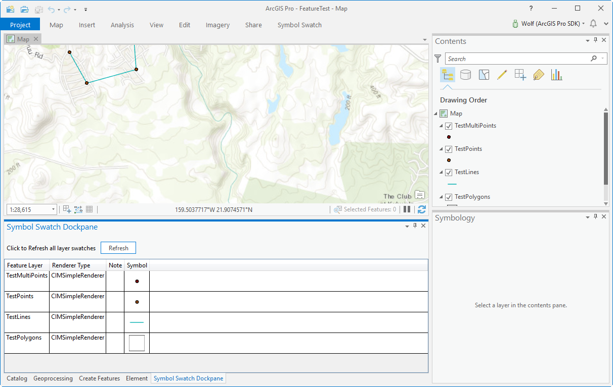
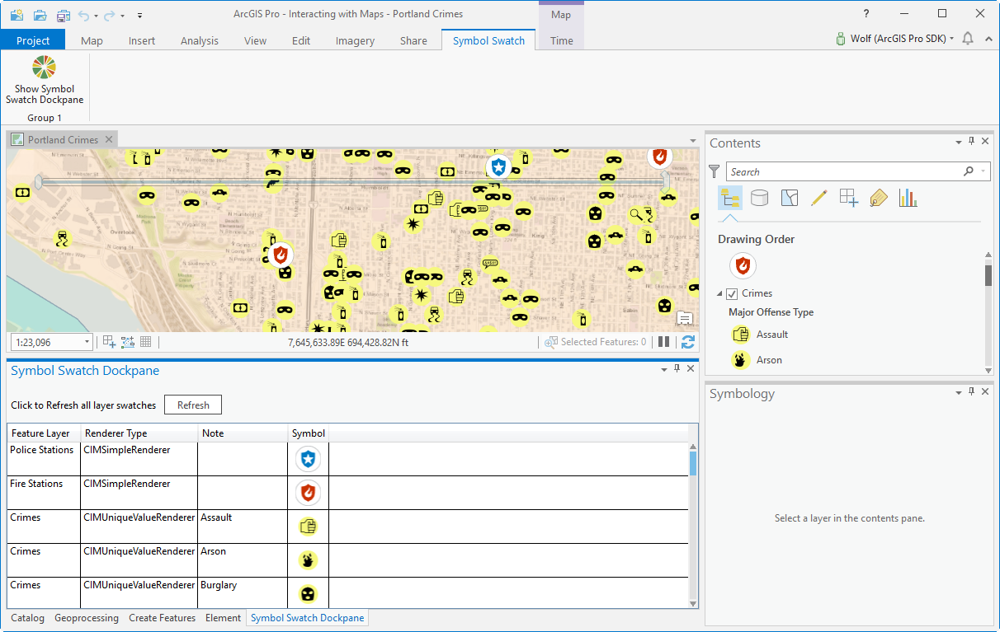
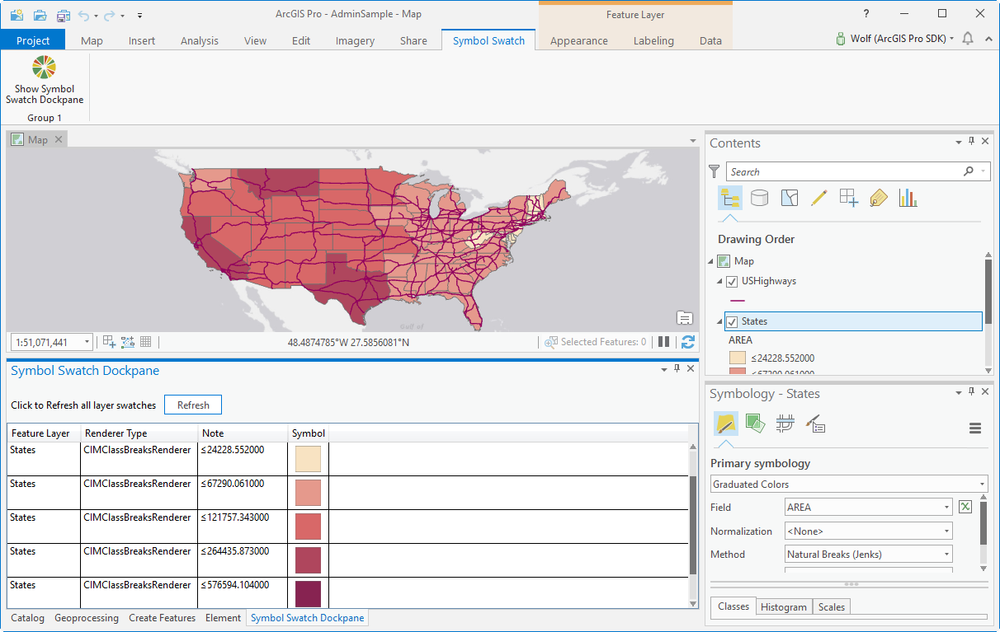

## GetSymbolSwatch

<!-- TODO: Write a brief abstract explaining this sample -->
This sample shows how to create the swatches for different types of Symbology for use in WPF  
  


<a href="http://pro.arcgis.com/en/pro-app/sdk/" target="_blank">View it live</a>

<!-- TODO: Fill this section below with metadata about this sample-->
```
Language:              C#
Subject:               Map-Authoring
Contributor:           ArcGIS Pro SDK Team <arcgisprosdk@esri.com>
Organization:          Esri, http://www.esri.com
Date:                  1/10/2019
ArcGIS Pro:            2.3
Visual Studio:         2017
.NET Target Framework: 4.6.1
```

## Resources

* [API Reference online](https://pro.arcgis.com/en/pro-app/sdk/api-reference)
* <a href="https://pro.arcgis.com/en/pro-app/sdk/" target="_blank">ArcGIS Pro SDK for .NET (pro.arcgis.com)</a>
* [arcgis-pro-sdk-community-samples](https://github.com/Esri/arcgis-pro-sdk-community-samples)
* [ArcGIS Pro DAML ID Reference](https://github.com/Esri/arcgis-pro-sdk/wiki/ArcGIS-Pro-DAML-ID-Reference)
* [FAQ](https://github.com/Esri/arcgis-pro-sdk/wiki/FAQ)
* [ArcGIS Pro SDK icons](https://github.com/Esri/arcgis-pro-sdk/releases/tag/2.3.0.15769)


### Samples Data

* Sample data for ArcGIS Pro SDK Community Samples can be downloaded from the [repo releases](https://github.com/Esri/arcgis-pro-sdk-community-samples/releases) page.  

## How to use the sample
<!-- TODO: Explain how this sample can be used. To use images in this section, create the image file in your sample project's screenshots folder. Use relative url to link to this image using this syntax:  -->
1. Download the Community Sample data (see under the 'Resources' section for downloading sample data)  
1. Make sure that the Sample data is unzipped in c:\data   
1. The projects used for this sample are 'C:\Data\FeatureTest\FeatureTest.aprx', 'C:\Data\Interacting with Maps\Interacting with Maps.aprx', and 'C:\Data\Admin\AdminSample.aprx'  
1. In Visual Studio click the Build menu. Then select Build Solution.  
1. Click Start button to open ArcGIS Pro.  
1. ArcGIS Pro opens, select the FeatureTest.aprx project  
1. After the Map View is displayed, click on the 'Symbol Swatch' tab, and then click the 'Show Symbol Swatch Dockpane' button to show the 'Symbol Swatch Dockpane' dockpane    
1. Position and size the dockpane to see all columns in the symbol swatch grid  
  
  
1. Click the 'Refresh' button on the 'Show Symbol Swatch Dockpane' dockpane to see symbol swatches in the grid    
  
  
1. Open the 'Interacting with Maps.aprx' project  
1. Click the 'Refresh' button on the 'Show Symbol Swatch Dockpane' dockpane to see symbol swatches in the grid    
  
  
1. Open the AdminSample.aprx project  
1. In the 'Contents' dockpane change the symbology for the 'States' layer to 'Graduated Colors'  
1. Click the 'Refresh' button on the 'Show Symbol Swatch Dockpane' dockpane to see symbol swatches in the grid    
  
  


<!-- End -->

&nbsp;&nbsp;&nbsp;&nbsp;&nbsp;&nbsp;
&nbsp;&nbsp;&nbsp;&nbsp;&nbsp;&nbsp;&nbsp;&nbsp;&nbsp;&nbsp;&nbsp;&nbsp;
[Home](https://github.com/Esri/arcgis-pro-sdk/wiki) | <a href="https://pro.arcgis.com/en/pro-app/sdk/api-reference" target="_blank">API Reference</a> | [Requirements](https://github.com/Esri/arcgis-pro-sdk/wiki#requirements) | [Download](https://github.com/Esri/arcgis-pro-sdk/wiki#installing-arcgis-pro-sdk-for-net) | <a href="https://github.com/esri/arcgis-pro-sdk-community-samples" target="_blank">Samples</a>
