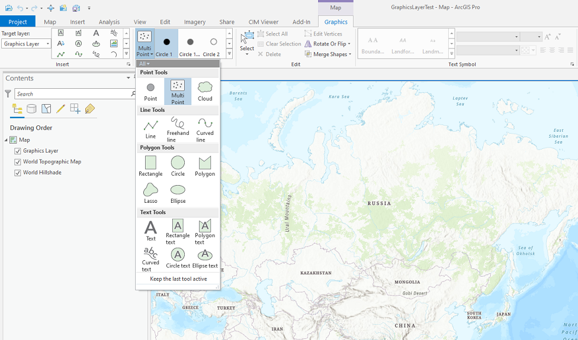
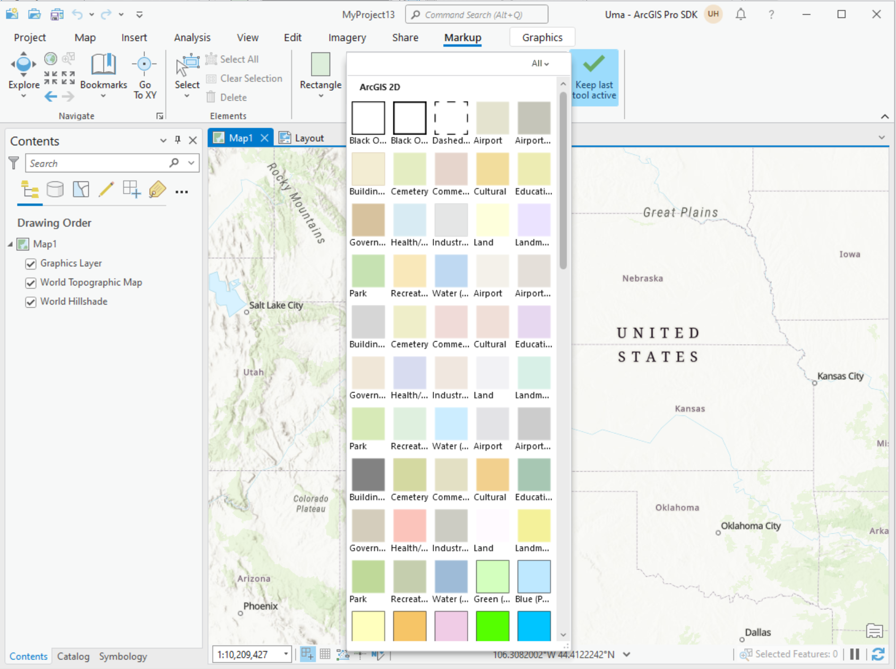
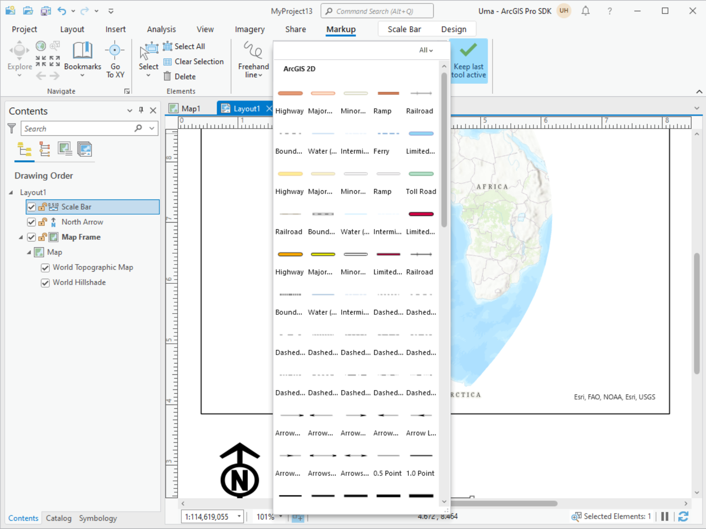
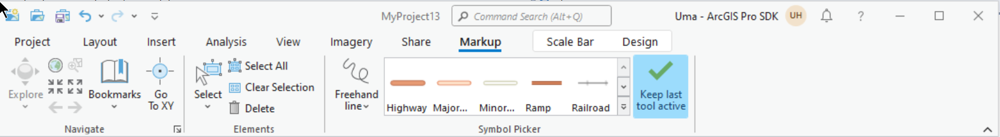

## GraphicElementSymbolPicker

<!-- TODO: Write a brief abstract explaining this sample -->
This sample demonstrates creating graphic elements in a map and a layout.  
  


<a href="https://pro.arcgis.com/en/pro-app/sdk/" target="_blank">View it live</a>

<!-- TODO: Fill this section below with metadata about this sample-->
```
Language:              C#
Subject:               Map Authoring
Contributor:           ArcGIS Pro SDK Team <arcgisprosdk@esri.com>
Organization:          Esri, https://www.esri.com
Date:                  06/10/2022
ArcGIS Pro:            3.0
Visual Studio:         2022
.NET Target Framework: net6.0-windows
```

## Resources

[Community Sample Resources](https://github.com/Esri/arcgis-pro-sdk-community-samples#resources)

### Samples Data

* Sample data for ArcGIS Pro SDK Community Samples can be downloaded from the [Releases](https://github.com/Esri/arcgis-pro-sdk-community-samples/releases) page.  

## How to use the sample
<!-- TODO: Explain how this sample can be used. To use images in this section, create the image file in your sample project's screenshots folder. Use relative url to link to this image using this syntax:  -->
1. In Visual Studio click the Build menu. Then select Build Solution.  
1. Launch the debugger to open ArcGIS Pro.   
1. Open any project that contains a Map with a graphics layer and/or layout.  
1. You will need a Graphics Layer in the map to work with this sample.  If the map doesn't have a Graphics Layer, click the Map tab and use the Add Graphics layer button to insert a new layer in the map.  
1. In the Markup tab on the Pro ribbon, this add-in adds a new "Symbol Picker" group.  
        
  
1. In the graphic elements creation tool gallery, activate the point, line, polygon or a text graphic element creation tool in order to create graphics elements.  
1. In the Symbol selector gallery, select the point, line, polygon or text symbol you want to use.  
        
  
1. Using the activated tool, sketch the point, line, polygon or text. The graphics elements are created using the selected symbol.  
1. Open a Layout view.    
1. The Markup tab on the ribbon is available for creating graphics elements for layouts also.  
        
  
1. To create multiple graphic elements one after the other using the same active tool, you can click the "Keep Last Tool active" button.  
        
  


<!-- End -->

&nbsp;&nbsp;&nbsp;&nbsp;&nbsp;&nbsp;
&nbsp;&nbsp;&nbsp;&nbsp;&nbsp;&nbsp;&nbsp;&nbsp;&nbsp;&nbsp;&nbsp;&nbsp;
[Home](https://github.com/Esri/arcgis-pro-sdk/wiki) | <a href="https://pro.arcgis.com/en/pro-app/latest/sdk/api-reference" target="_blank">API Reference</a> | [Requirements](https://github.com/Esri/arcgis-pro-sdk/wiki#requirements) | [Download](https://github.com/Esri/arcgis-pro-sdk/wiki#installing-arcgis-pro-sdk-for-net) | <a href="https://github.com/esri/arcgis-pro-sdk-community-samples" target="_blank">Samples</a>
