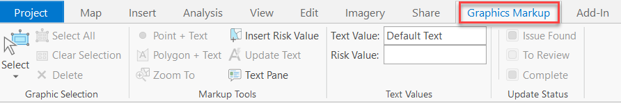
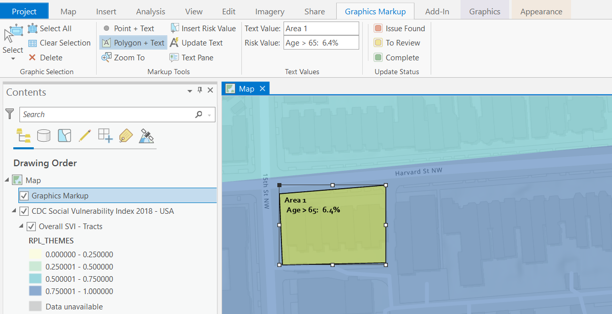

## GraphicTools

<!-- TODO: Write a brief abstract explaining this sample -->
This sample demonstrates tools that can be created around a graphic element creation workflow using map 'markups' for identifying and managing status of field inspection or survey locations.  
  


<a href="https://pro.arcgis.com/en/pro-app/sdk/" target="_blank">View it live</a>

<!-- TODO: Fill this section below with metadata about this sample-->
```
Language:              C#
Subject:               Map Authoring
Contributor:           ArcGIS Pro SDK Team <arcgisprosdk@esri.com>
Organization:          Esri, https://www.esri.com
Date:                  10/01/2023
ArcGIS Pro:            3.2
Visual Studio:         2022
.NET Target Framework: net6.0-windows
```

## Resources

[Community Sample Resources](https://github.com/Esri/arcgis-pro-sdk-community-samples#resources)

### Samples Data

* Sample data for ArcGIS Pro SDK Community Samples can be downloaded from the [Releases](https://github.com/Esri/arcgis-pro-sdk-community-samples/releases) page.  

## How to use the sample
<!-- TODO: Explain how this sample can be used. To use images in this section, create the image file in your sample project's screenshots folder. Use relative url to link to this image using this syntax:  -->
1. Download the Community Sample data(see under the 'Resources' section for downloading sample data). The sample data contains a dataset called GraphicTools.Make sure that the Sample data is unzipped under C:\Data and the folder "C:\Data\GraphicTools" is available.
2. Open the solution in Visual Studio.  
3. Click the Build menu and select Build Solution.  
4. Launch the debugger to open ArcGIS Pro.   
5. Open the project "GraphicTools.aprx" found in folder: "C:\data\GraphicTools. The project opens in a 2D map view, at the Washington, DC bookmark.  In the Contents pane, you can see the two layers, Graphics Markup and Overall SVI - Tracts, along with several layers included in the larger CDC Social Vulnerability Index 2018 - USA group layer dataset.   
6. Click on the Survey Site bookmark and notice that street level blocks are clearly visible.This area will be the center of the survey, and planning using the map graphics markup tools.Click on the Graphics Markup tab on the ribbon.  The add-in divides tools into four groups on the tab:  
   * Graphic Selection – Standard Pro tools for working with graphic selections.  
   * Markup Tools – Tools for creating and interacting with survey markups on the map.  
   * Text Values – Text strings that are combined with point and polygon markup graphics.  
   * Update Status – Tools for updating the status color of the selected markups.  
   * These tools, will be used for creating map graphic markups for a field survey.  
  
7. In the Contents pane, select the graphics layer named Graphics Markup in the Map view.Notice that the Point + Text and Polygon + Text tools have become activated in the Markup Tools group on the tab.  
8. Populate the edit boxes in the Text Values group.  The text in these two edit boxes will accompany the point or polygon markup tool you choose from the Markup Tools group.Your first polygon markup area will be "Area 1", so type this into the Text Value edit box.    
9. Populate the Risk Value edit box with an attribute value from the Overall SVI – Tracts layer, which is the percentage of adults in the tract that are over 65 years in age.Select the Insert Risk Value tool from the Markup Tools group.Move the cursor to the Tract 37 area in purple and click the mouse.  You should see the text "Age > 65: 6.4%" in the Risk Value edit box.  
10. You will now create a polygon markup with these text values.Zoom into the area seen in the screenshot below.Select the Polygon + Text tool and sketch a polygon in the area shown below.  You will see a polygon graphic in yellow with the text.  The yellow color shows that this is an area that is designated "To Review".  
  
<br /> Additional things you can try:  
   *	Using the Point + Text and Polygon + Text tools to create graphic markups on the map.  
   *	Use the Update Text button to bulk update the text of all selected text graphics.  
   *	Click on the Text Pane button in the Markup Tools group on the tab.The Graphic Text pane will open.  Add text and risk values as you did in the steps above, and use the buttons to create point and polygon text values.  
   *	Select one or more point and polygon markups, and use the Issue Found and Complete buttons in the Update Status group to update the status color of selected graphics.  
  

<!-- End -->

&nbsp;&nbsp;&nbsp;&nbsp;&nbsp;&nbsp;
&nbsp;&nbsp;&nbsp;&nbsp;&nbsp;&nbsp;&nbsp;&nbsp;&nbsp;&nbsp;&nbsp;&nbsp;
[Home](https://github.com/Esri/arcgis-pro-sdk/wiki) | <a href="https://pro.arcgis.com/en/pro-app/latest/sdk/api-reference" target="_blank">API Reference</a> | [Requirements](https://github.com/Esri/arcgis-pro-sdk/wiki#requirements) | [Download](https://github.com/Esri/arcgis-pro-sdk/wiki#installing-arcgis-pro-sdk-for-net) | <a href="https://github.com/esri/arcgis-pro-sdk-community-samples" target="_blank">Samples</a>
