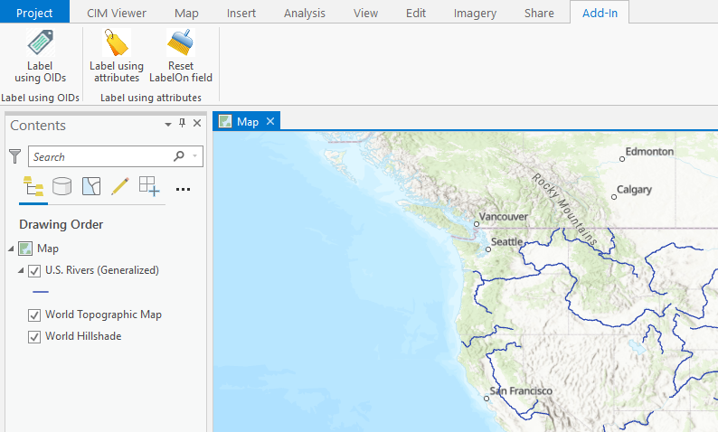
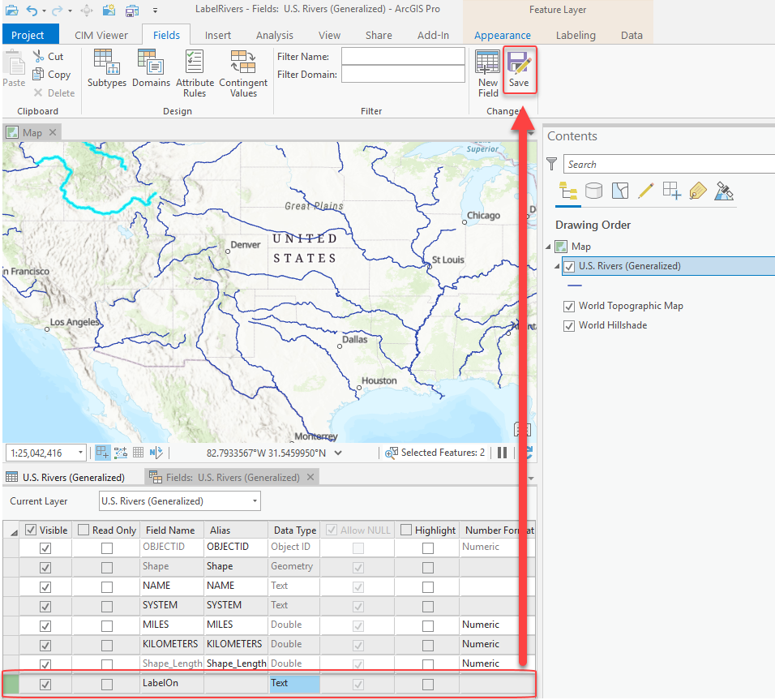
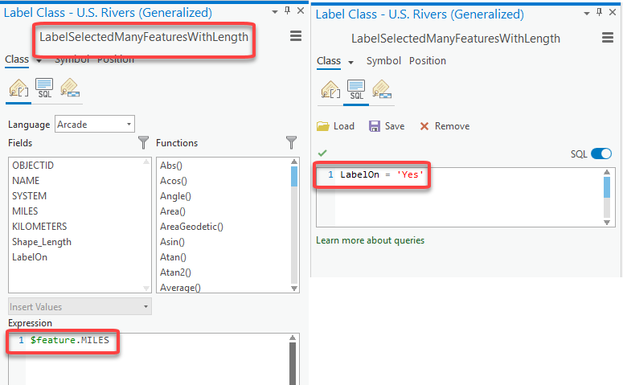

## LabelLineFeatures

<!-- TODO: Write a brief abstract explaining this sample -->
This sample demonstrates how to select line features and label them. New label classes are created in code that are used to label the selected features. Two methods to label selected features are demonstrated.  
  


<a href="https://pro.arcgis.com/en/pro-app/sdk/" target="_blank">View it live</a>

<!-- TODO: Fill this section below with metadata about this sample-->
```
Language:              C#
Subject:               Map Authoring
Contributor:           ArcGIS Pro SDK Team <arcgisprosdk@esri.com>
Organization:          Esri, https://www.esri.com
Date:                  02/22/2023
ArcGIS Pro:            3.1
Visual Studio:         2022
.NET Target Framework: net6.0-windows
```

## Resources

[Community Sample Resources](https://github.com/Esri/arcgis-pro-sdk-community-samples#resources)

### Samples Data

* Sample data for ArcGIS Pro SDK Community Samples can be downloaded from the [Releases](https://github.com/Esri/arcgis-pro-sdk-community-samples/releases) page.  

## How to use the sample
<!-- TODO: Explain how this sample can be used. To use images in this section, create the image file in your sample project's screenshots folder. Use relative url to link to this image using this syntax:  -->
Using the sample:  
  
1. Download the Community Sample data (see under the 'Resources' section for downloading sample data). The sample data contains a dataset called 'USA'. Make sure that the Sample data is unzipped in C:\data and "C:\Data\Admin\AdminData.gdb" is available.  
1. In Visual Studio click the Build menu. Then select Build Solution.  
1. Click Start button to open ArcGIS Pro.  
1. ArcGIS Pro will open.   
1. Open a new Map project.   
1. Add the US Rivers feature class from USA dataset.  
1. In the Add-in tab, notice the two groups created: Label using OIDs and Label using attributes.  
  
  
1. **Label using OIDs:** Click the "Label using OIDs" tool to activate it. Select River features in the map using the tool. This will label the selected features with the River feature class' "Miles" field. A new Label class (LabelSelectedFeaturesWithLength) is created for this. This Label class' SQL Query is updated to use the OIDs of the selected features. This method cannot be used if you select large datasets. The SQL Query that uses the selected OIDs could exceed the SQL string length limit if too many features are selected.   
  
  
1. **Label using attributes:**  
1. The following workflow requires a new field to be added to the "U.S. Rivers (Generalized)" feature class.  Right click on "U.S. Rivers (Generalized)" on the map's TOC and chose "Design | Fields".  Now add the 'LabelOn' field as shown below:  
  
  
1. Click the "Label using attributes" tool to activate it. Select River features in the map using this tool.  This will label the selected features with the River feature class' "Miles" field. The tool first edits the "LabelOn" field. The selected features will have the LabelOn attribute value changed to Yes. A new label class (LabelSelectedManyFeaturesWithLength) is created. This Label class' SQL Query queries for features with the LabelOn attribute value of "Yes".  The advantage of this method is that you can use this to label large datasets.  The SQL Query on the Label Class will not change since this method edits the attribute table. The selected features will have their LabelOn attribute set to Yes.  
  
  
1. The "Reset LabelOn field" button can be used to change all the features with LabelOn value set to Yes to be No. This will clear all the labels for the Rivers feature class.  
  


<!-- End -->

&nbsp;&nbsp;&nbsp;&nbsp;&nbsp;&nbsp;
&nbsp;&nbsp;&nbsp;&nbsp;&nbsp;&nbsp;&nbsp;&nbsp;&nbsp;&nbsp;&nbsp;&nbsp;
[Home](https://github.com/Esri/arcgis-pro-sdk/wiki) | <a href="https://pro.arcgis.com/en/pro-app/latest/sdk/api-reference" target="_blank">API Reference</a> | [Requirements](https://github.com/Esri/arcgis-pro-sdk/wiki#requirements) | [Download](https://github.com/Esri/arcgis-pro-sdk/wiki#installing-arcgis-pro-sdk-for-net) | <a href="https://github.com/esri/arcgis-pro-sdk-community-samples" target="_blank">Samples</a>
