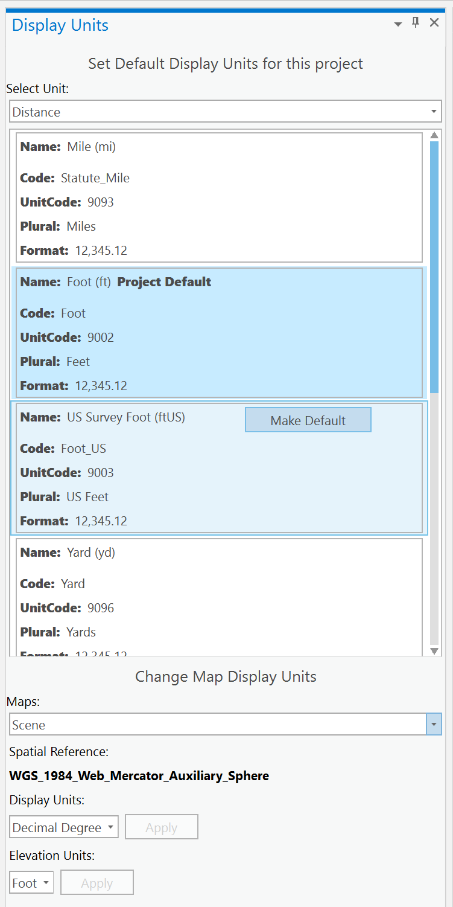

## MapDisplayUnits

<!-- TODO: Write a brief abstract explaining this sample -->
This sample demonstrates Map Display Units. The Pro SDK allows you can change the defaults for the current Project Units.  You can also change the Display Units used by a Map or Scene and the Elevation units used by a Scene.  
  


<a href="http://pro.arcgis.com/en/pro-app/sdk/" target="_blank">View it live</a>

<!-- TODO: Fill this section below with metadata about this sample-->
```
Language:              C#
Subject:               Framework
Contributor:           ArcGIS Pro SDK Team <arcgisprosdk@esri.com>
Organization:          Esri, http://www.esri.com
Date:                  5/12/2021
ArcGIS Pro:            2.8
Visual Studio:         2019
.NET Target Framework: 4.8
```

## Resources

[Community Sample Resources](https://github.com/Esri/arcgis-pro-sdk-community-samples#resources)

### Samples Data

* Sample data for ArcGIS Pro SDK Community Samples can be downloaded from the [Releases](https://github.com/Esri/arcgis-pro-sdk-community-samples/releases) page.  

## How to use the sample
<!-- TODO: Explain how this sample can be used. To use images in this section, create the image file in your sample project's screenshots folder. Use relative url to link to this image using this syntax:  -->
1. In Visual Studio click the Build menu. Then select Build Solution.    
1. Click Start button to open ArcGIS Pro.  
1. ArcGIS Pro will open.   
1. Open any project with Maps and Scenes.  
1. Click the Add-in tab  
1. In the Add-in tab, click the "Show Project Units" button.  
1. The dockpane that is displayed allows you to:  
    * Change the current project's default Unit Format Types. Unit Format Types are Distance Units, Angular Units, Area Units, Location Units, Direction Units,  Page Units, 2D Symbol Display Units and 3D Symbol Display Units.   
    * Change the Display Units for a Map or Scene in the given project. Display Units for a map uses "Location Units" UnitFormatType.  
    * Change the Elevation Units for a Scene. Elevation Units for a Scene uses "Distance Units" UnitFormatType.  
  
#### Change Project Default Units:  
  
1. For a given UnitFormatType such as "Distance", "Location", etc., you can see the available DisplayUnitFormats available. The project default is specified in the dockpane.  
1. If you want to change the default DisplayUnitFormatType for a given UnitFormatType, use the "Make Default" button.  
#### Change Display and Elevation Units for Maps and Scenes  
  
1. Using the available maps combo box drop down, select any map or scene in the project.  
1. Notice the Spatial Reference of the Map shown.  
1. The map/scene's current Display Unit is selected by default. The other Display Units avaialble for the map is listed in the combox box below.    
1. Select any other Display Unit you want to use for the selected Map.  Click the Apply Button. The map/scene's Display Unit will be changed to the selected DisplayUnitFormat.  
1. If a scene is selected, you can change its Elevation Units.  
1. The Elevation Unit for a given scene is selected by default.    
1. Select any other Elevation Unit you want to use for the selected Scene.  Click the Apply Button. The scene's Elevation Unit will be changed to the selected DisplayUnitFormat.  
  


<!-- End -->

&nbsp;&nbsp;&nbsp;&nbsp;&nbsp;&nbsp;
&nbsp;&nbsp;&nbsp;&nbsp;&nbsp;&nbsp;&nbsp;&nbsp;&nbsp;&nbsp;&nbsp;&nbsp;
[Home](https://github.com/Esri/arcgis-pro-sdk/wiki) | <a href="https://pro.arcgis.com/en/pro-app/latest/sdk/api-reference" target="_blank">API Reference</a> | [Requirements](https://github.com/Esri/arcgis-pro-sdk/wiki#requirements) | [Download](https://github.com/Esri/arcgis-pro-sdk/wiki#installing-arcgis-pro-sdk-for-net) | <a href="https://github.com/esri/arcgis-pro-sdk-community-samples" target="_blank">Samples</a>
