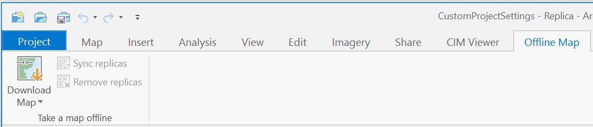
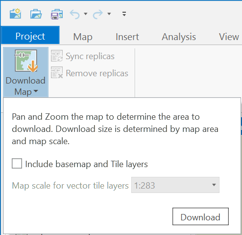
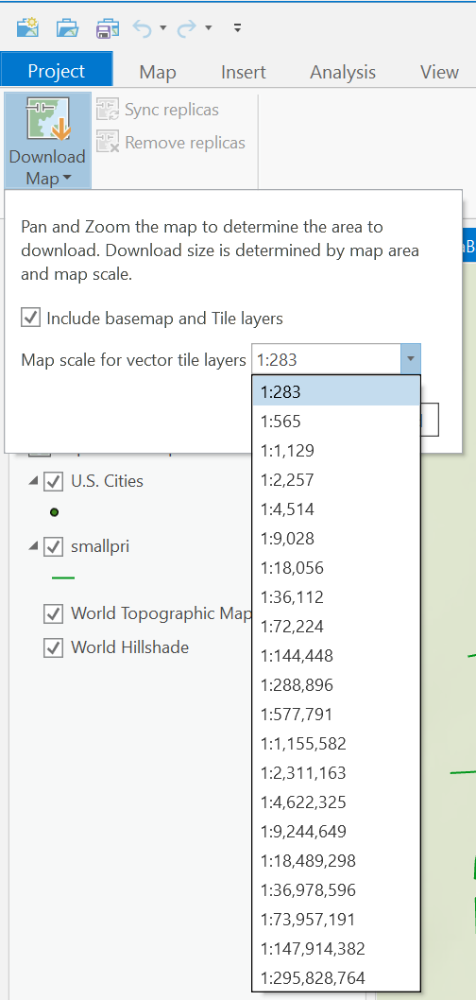
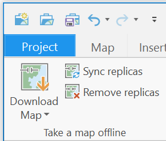

## OfflineMapping

<!-- TODO: Write a brief abstract explaining this sample -->
This sample demonstrates how maps in Pro containing sync-enabled feature service content can be taken "offline".  
  


<a href="https://pro.arcgis.com/en/pro-app/sdk/" target="_blank">View it live</a>

<!-- TODO: Fill this section below with metadata about this sample-->
```
Language:              C#
Subject:               Map Authoring
Contributor:           ArcGIS Pro SDK Team <arcgisprosdk@esri.com>
Organization:          Esri, https://www.esri.com
Date:                  04/04/2024
ArcGIS Pro:            3.3
Visual Studio:         2022
.NET Target Framework: net8.0-windows
```

## Resources

[Community Sample Resources](https://github.com/Esri/arcgis-pro-sdk-community-samples#resources)

### Samples Data

* Sample data for ArcGIS Pro SDK Community Samples can be downloaded from the [Releases](https://github.com/Esri/arcgis-pro-sdk-community-samples/releases) page.  

## How to use the sample
<!-- TODO: Explain how this sample can be used. To use images in this section, create the image file in your sample project's screenshots folder. Use relative url to link to this image using this syntax:  -->
Using the sample:  
  
1. In Visual Studio click the Build menu. Then select Build Solution.
2. Launch the debugger to open ArcGIS Pro.  
3. Open a new Map project.   
4. Add any sync enabled feature service to the map.  
5. In the Offline Map tab, notice there is a group created: Take a map offline. It contains the Download Map custom control and two disabled buttons - Sync Replicas and Remove Replicas.  
  
6. Click the Download Map button to display its contents.   
  
7. Turn on the check box to "Include basemaps". Pick any scale you want to use.  
  
8. Click the Download button. This will make a local copy (replica) of your feature service. You can make any edits you need to this feature service.  
9. The Sync replica button on the group is now enabled. This button allows you to sync your local replica to the feature service.  
  
10. After you are done with the edits to the replica, you can click the "Remove Replica" button to remove all the replicas from the local map content.  
  

<!-- End -->

&nbsp;&nbsp;&nbsp;&nbsp;&nbsp;&nbsp;
&nbsp;&nbsp;&nbsp;&nbsp;&nbsp;&nbsp;&nbsp;&nbsp;&nbsp;&nbsp;&nbsp;&nbsp;
[Home](https://github.com/Esri/arcgis-pro-sdk/wiki) | <a href="https://pro.arcgis.com/en/pro-app/latest/sdk/api-reference" target="_blank">API Reference</a> | [Requirements](https://github.com/Esri/arcgis-pro-sdk/wiki#requirements) | [Download](https://github.com/Esri/arcgis-pro-sdk/wiki#installing-arcgis-pro-sdk-for-net) | <a href="https://github.com/esri/arcgis-pro-sdk-community-samples" target="_blank">Samples</a>
