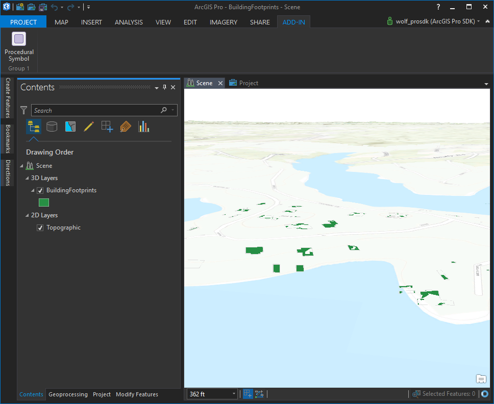
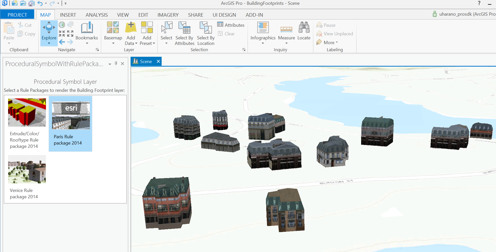
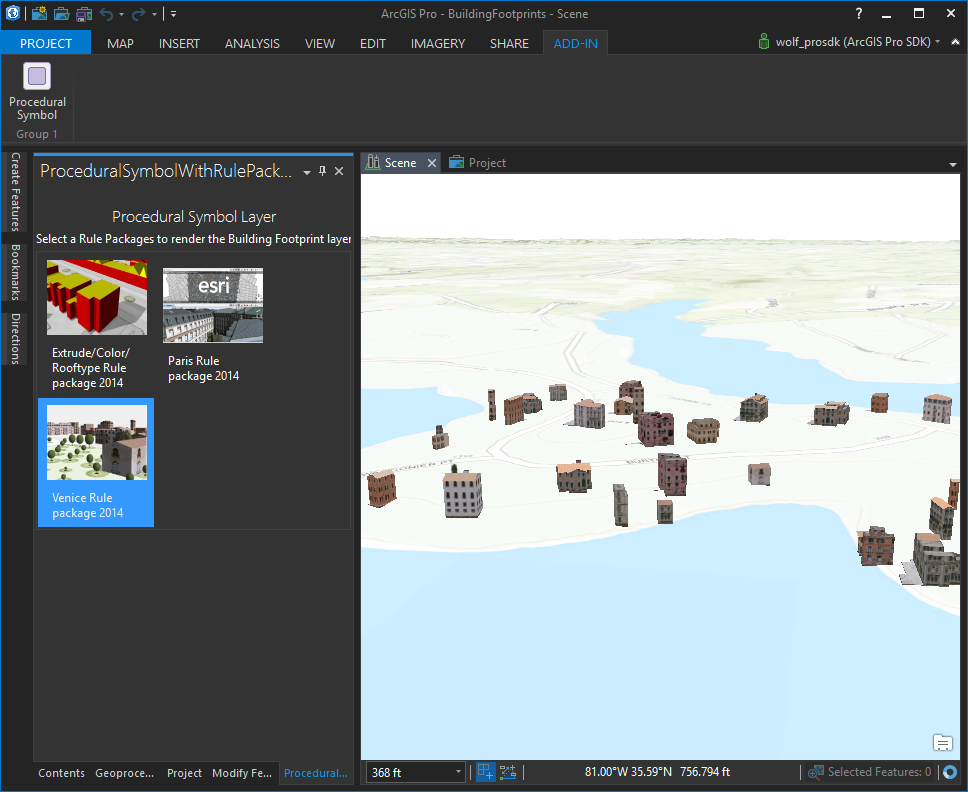

## ProceduralSymbolLayersWithRulePackages

<!-- TODO: Write a brief abstract explaining this sample -->
This sample demonstrates rendering a polygon feature layer with a City Engine rule package. The procedural symbol layer that is created is then saved as an item in a personal style in the project.  
  


<a href="http://pro.arcgis.com/en/pro-app/sdk/" target="_blank">View it live</a>

<!-- TODO: Fill this section below with metadata about this sample-->
```
Language:              C# 6.0
Subject:               Framework
Contributor:           ArcGIS Pro SDK Team <arcgisprosdk@esri.com>
Organization:          Esri, http://www.esri.com
Date:                  6/28/2017
ArcGIS Pro:            2.0
Visual Studio:         2015, 2017
.NET Target Framework: 4.6.1
```

## Resources

* [API Reference online](http://pro.arcgis.com/en/pro-app/sdk/api-reference)
* <a href="http://pro.arcgis.com/en/pro-app/sdk/" target="_blank">ArcGIS Pro SDK for .NET (pro.arcgis.com)</a>
* [arcgis-pro-sdk-community-samples](http://github.com/Esri/arcgis-pro-sdk-community-samples)
* [ArcGISPro Registry Keys](http://github.com/Esri/arcgis-pro-sdk/wiki/ArcGIS-Pro-Registry-Keys)
* [FAQ](http://github.com/Esri/arcgis-pro-sdk/wiki/FAQ)
* [ArcGIS Pro SDK icons](https://github.com/Esri/arcgis-pro-sdk/releases/tag/1.4.0.7198)
* [ProConcepts: ArcGIS Pro Add in Samples](https://github.com/Esri/arcgis-pro-sdk-community-samples/wiki/ProConcepts-ArcGIS-Pro-Add-in-Samples)


* [ProSnippets: 2.0 Migration](http://github.com/Esri/arcgis-pro-sdk/wiki/ProSnippets-Migrating-to-2.0)  
* [ProSnippets: 2.0 Migration Samples](http://github.com/Esri/arcgis-pro-sdk/wiki/ProSnippets-2.0-Migration-Samples)  
* [ProConcepts: 2.0 Migration](http://github.com/Esri/arcgis-pro-sdk/wiki/ProConcepts-2.0-Migration-Guide)  

### Samples Data

* Sample data for ArcGIS Pro SDK Community Samples can be downloaded from the [repo releases](https://github.com/Esri/arcgis-pro-sdk-community-samples/releases) page.  

## How to use the sample
<!-- TODO: Explain how this sample can be used. To use images in this section, create the image file in your sample project's screenshots folder. Use relative url to link to this image using this syntax:  -->
1. This sample requires the Building Footprint layer.   
1. Download the [ArcGISProSampleBuildings.ppkx Project package from ArcGIS Online](http://www.arcgis.com/sharing/rest/content/items/a0aa60303a39476688b599a6ce842afb/data).  
1. In Visual Studio click the Build menu. Then select Build Solution.  
1. This solution is using the Newtonsoft.Json Nuget. If needed, you can install the Nuget from the "Nuget Package Manager Console" by using this script: "Install-Package Newtonsoft.Json".  
1. Click Start button to open ArcGIS Pro.  
1. Open the downloaded ArcGISProSampleBuildings.ppkx Project package.  
  
  
1. Click the ADD-IN tab in ArcGIS Pro.  
1. Click the Procedural Symbol button. This will open the ProceduralSymbol dockpane.  
1. There are 3 City Engine rule packages available in this dockpane. Select any rule package thumbnail in the gallery.  
  
  
1. The building footprint feature layer will be rendered with this rule package.    
  
  
1. In your project, a BuildingStyles Style project item will be created. This will contain the procedural symbol used to render the feature layer.  
Note: In the TOC, you will notice that the Building Footprint layer will not have a thumbnail for the generated symbol.   
You can fix this by using the Symbology Dockpane and clicking the camera button to create a Thumbnail. Click Apply to apply the image to the TOC.  
  


<!-- End -->

&nbsp;&nbsp;&nbsp;&nbsp;&nbsp;&nbsp;
&nbsp;&nbsp;&nbsp;&nbsp;&nbsp;&nbsp;&nbsp;&nbsp;&nbsp;&nbsp;&nbsp;&nbsp;
[Home](https://github.com/Esri/arcgis-pro-sdk/wiki) | <a href="http://pro.arcgis.com/en/pro-app/sdk/api-reference" target="_blank">API Reference</a> | [Requirements](https://github.com/Esri/arcgis-pro-sdk/wiki#requirements) | [Download](https://github.com/Esri/arcgis-pro-sdk/wiki#installing-arcgis-pro-sdk-for-net) | <a href="http://github.com/esri/arcgis-pro-sdk-community-samples" target="_blank">Samples</a>
