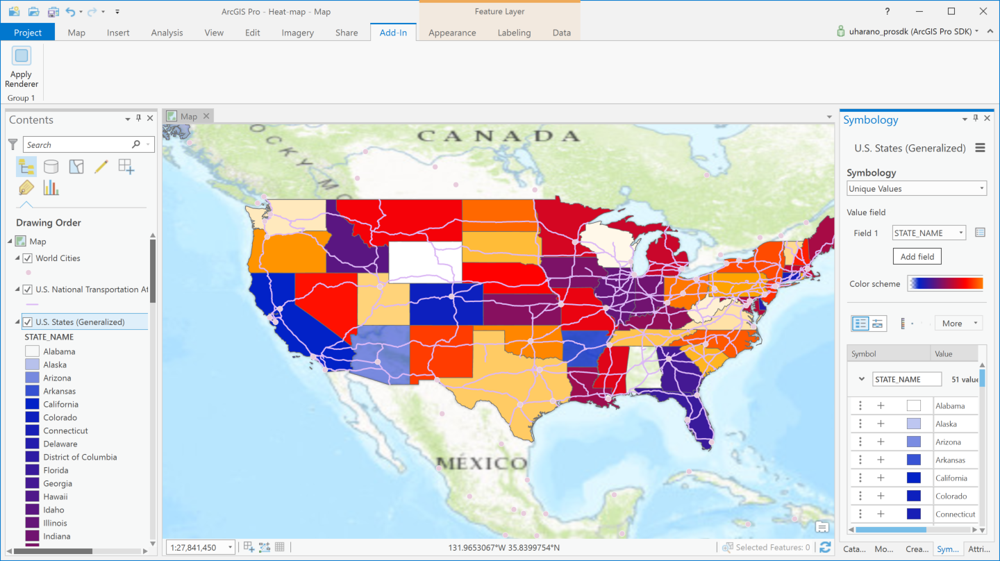
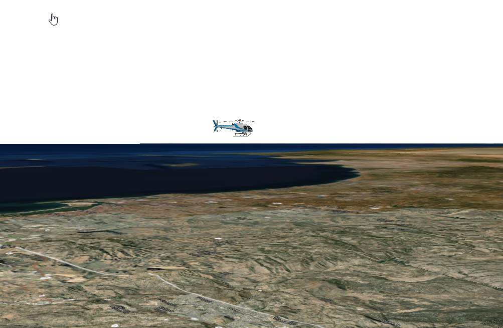
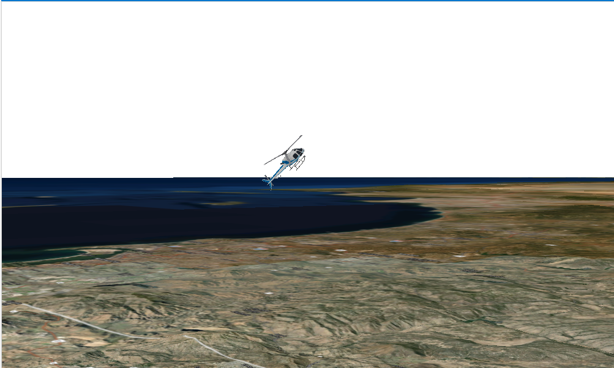

## Renderer

<!-- TODO: Write a brief abstract explaining this sample -->
This sample renders feature layers with various types of renderers. There are examples for the following types of renderers in this sample:  
  * Simple Renderers  
  * Unique Value Renderer  
  * Class breaks renderers  
      * Graduated color to define quantities  
      * Graduated symbols to define quantities  
      * Unclassed color gradient to define quantities  
  * Proportional Renderer  
  * Heat map renderer  
  * Chart renderer  
  * Dot Density Renderer  
  * Attribute driven symbology  
  


<a href="https://pro.arcgis.com/en/pro-app/sdk/" target="_blank">View it live</a>

<!-- TODO: Fill this section below with metadata about this sample-->
```
Language:              C#
Subject:               Map Authoring
Contributor:           ArcGIS Pro SDK Team <arcgisprosdk@esri.com>
Organization:          Esri, https://www.esri.com
Date:                  11/04/2024
ArcGIS Pro:            3.4
Visual Studio:         2022
.NET Target Framework: net8.0-windows
```

## Resources

[Community Sample Resources](https://github.com/Esri/arcgis-pro-sdk-community-samples#resources)

### Samples Data

* Sample data for ArcGIS Pro SDK Community Samples can be downloaded from the [Releases](https://github.com/Esri/arcgis-pro-sdk-community-samples/releases) page.  

## How to use the sample
<!-- TODO: Explain how this sample can be used. To use images in this section, create the image file in your sample project's screenshots folder. Use relative url to link to this image using this syntax:  -->
1. Download the Community Sample data (see under the 'Resources' section for downloading sample data).  The sample data contains a folder called 'C:\Data\Renderers' with sample data required for this solution.  Make sure that the Sample data is unzipped in c:\data and "C:\Data\Renderers" is available.
2. In Visual Studio click the Build menu. Then select Build Solution.    
3. Launch the debugger to open ArcGIS Pro.  
4. Create a new blank Map project.   
5. Add the C:\Data\Renderers\USDemographics.lpkx layer file to the map.   
6. In Add-in tab, click the "Apply Renderer" button.  
7. The first point feature layer in your project's TOC will be rendered with an "Unique Value Renderer".  
To experiment with the various renderers available with this sample, follow the steps below:  
8. Stop debugging Pro.  
9. In Visual Studio's solution explorer, open the ApplyRenderer.cs file. This is the class file for the Apply Renderer button.  
10. The OnClick method in the ApplyRenderer.cs file uncomment the method that calls the renderer you want to use.<br />  
   **You can modify the code in the OnClick method in this file to use one of the various renderers available in this sample.**  
    ```c#  
    protected async override void OnClick()  
    {  
         //TODO: Modify this line below to experiment with the different renderers  
         //await DotDensityRenderer.DotDensityRendererAsync();
         //Charts
         //await ChartRenderers.BarChartRendererAsync();
         //etc
    }  
    ```
11. After modifying the OnClickMethod build the solution and click the start button to open Pro.    
12. Open any project and test the Apply Renderer button again.  
  
Note: Use the US Cities layer available with the sample data to the Heat map renderer. This feature class is available in the C:\Data\Admin\AdminData.gdb file geodatabase.  
#### Attribute Driven Symbology  
13. Create a new Local Scene. Add the C:\Data\Renderers\FlightPathPoints.lyrx layer file to the scene.  This layer draws a point geometry rendered with a helicopter symbol.  The data for this layer holds the Tilt angles (X, Y and Z) for the helicopter.  
14. Use the Navigate button to tilt the view so that you can see the helicopter to display it over the map.  
  
15. Click the AttributeDriverSymbology button on the Add-In tab.  
16. Notice that the helicopter is now displayed using the Tilt fields.  
  
  

<!-- End -->

&nbsp;&nbsp;&nbsp;&nbsp;&nbsp;&nbsp;
&nbsp;&nbsp;&nbsp;&nbsp;&nbsp;&nbsp;&nbsp;&nbsp;&nbsp;&nbsp;&nbsp;&nbsp;
[Home](https://github.com/Esri/arcgis-pro-sdk/wiki) | <a href="https://pro.arcgis.com/en/pro-app/latest/sdk/api-reference" target="_blank">API Reference</a> | [Requirements](https://github.com/Esri/arcgis-pro-sdk/wiki#requirements) | [Download](https://github.com/Esri/arcgis-pro-sdk/wiki#installing-arcgis-pro-sdk-for-net) | <a href="https://github.com/esri/arcgis-pro-sdk-community-samples" target="_blank">Samples</a>
