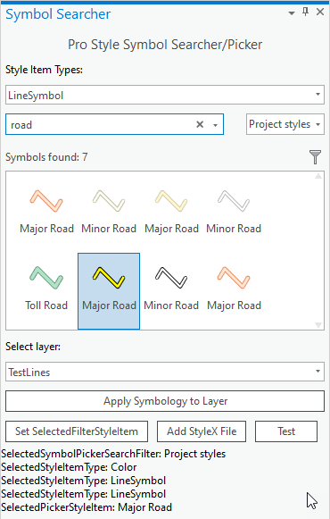
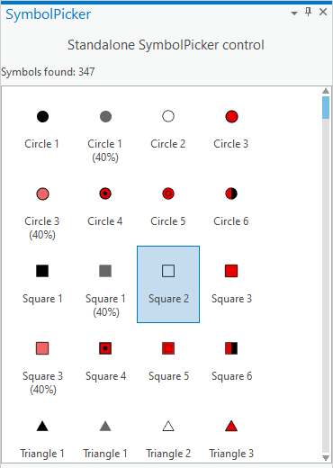

## SymbolSearcherControl

<!-- TODO: Write a brief abstract explaining this sample -->
SymbolSearcherControl exercises both the SymbolSearcherControl and the SymbolPickerControl controls.  Both controls can be used to provide a Pro like user interface experience when searching and selecting symbology and/or as standalone controls.  
  


<a href="http://pro.arcgis.com/en/pro-app/sdk/" target="_blank">View it live</a>

<!-- TODO: Fill this section below with metadata about this sample-->
```
Language:              C#
Subject:               Map Authoring
Contributor:           ArcGIS Pro SDK Team <arcgisprosdk@esri.com>
Organization:          Esri, http://www.esri.com
Date:                  11/01/2021
ArcGIS Pro:            2.9
Visual Studio:         2019
.NET Target Framework: 4.8
```

## Resources

[Community Sample Resources](https://github.com/Esri/arcgis-pro-sdk-community-samples#resources)

### Samples Data

* Sample data for ArcGIS Pro SDK Community Samples can be downloaded from the [Releases](https://github.com/Esri/arcgis-pro-sdk-community-samples/releases) page.  

## How to use the sample
<!-- TODO: Explain how this sample can be used. To use images in this section, create the image file in your sample project's screenshots folder. Use relative url to link to this image using this syntax:  -->
1. Download the Community Sample data (see under the 'Resources' section for downloading sample data)  
1. Open this solution in Visual Studio.    
1. Click the build menu and select Build Solution.    
1. Click the Start button to open ArCGIS Pro. ArcGIS Pro will open.      
1. Open the "C:\Data\FeatureTest\FeatureTest.aprx" project.    
1. The Add-in tab contains four buttons to exercise the SymbolSearchControl and the SymbolPickerControl controls in four dockpanes:  
1. The "Pro Symbol Searcher" shows a Pro like user interface that combines symbol searcher and symbol picker:  
  
  
1. The "Pro Symbol Searcher" shows a simplified user interface that combines symbol searcher and symbol picker by using default settings:  
  
  
1. The "Simple Symbol Searcher" shows a user interface that uses the symbol searcher control and a listbox for symbol selection:  
  
  
1. The "Show Symbol Picker" shows a user interface that contains the symbol picker as a standalone control:  
  
  


<!-- End -->

&nbsp;&nbsp;&nbsp;&nbsp;&nbsp;&nbsp;
&nbsp;&nbsp;&nbsp;&nbsp;&nbsp;&nbsp;&nbsp;&nbsp;&nbsp;&nbsp;&nbsp;&nbsp;
[Home](https://github.com/Esri/arcgis-pro-sdk/wiki) | <a href="https://pro.arcgis.com/en/pro-app/latest/sdk/api-reference" target="_blank">API Reference</a> | [Requirements](https://github.com/Esri/arcgis-pro-sdk/wiki#requirements) | [Download](https://github.com/Esri/arcgis-pro-sdk/wiki#installing-arcgis-pro-sdk-for-net) | <a href="https://github.com/esri/arcgis-pro-sdk-community-samples" target="_blank">Samples</a>
